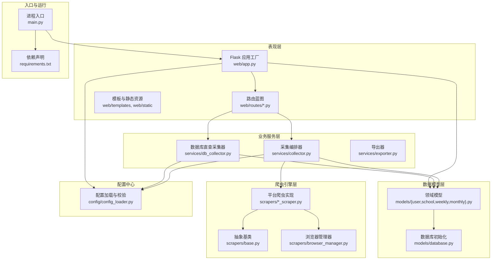
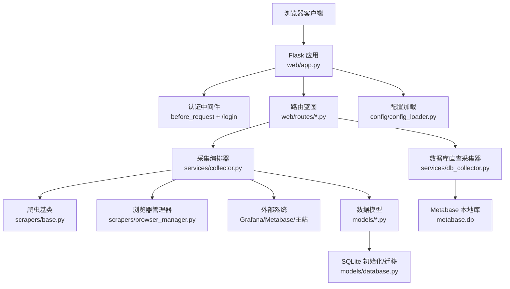
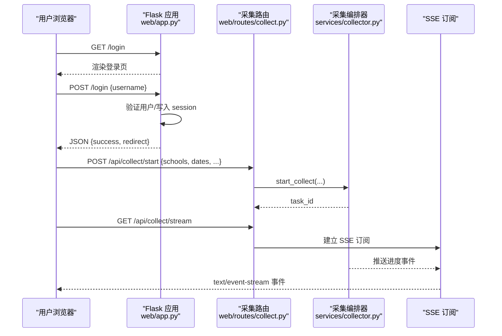
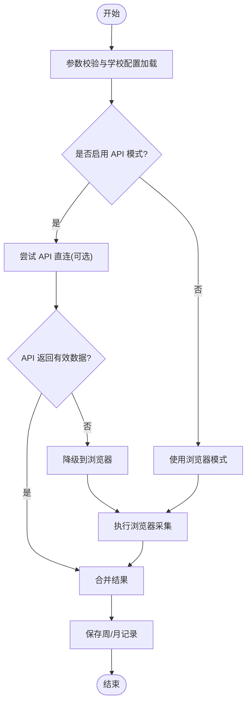
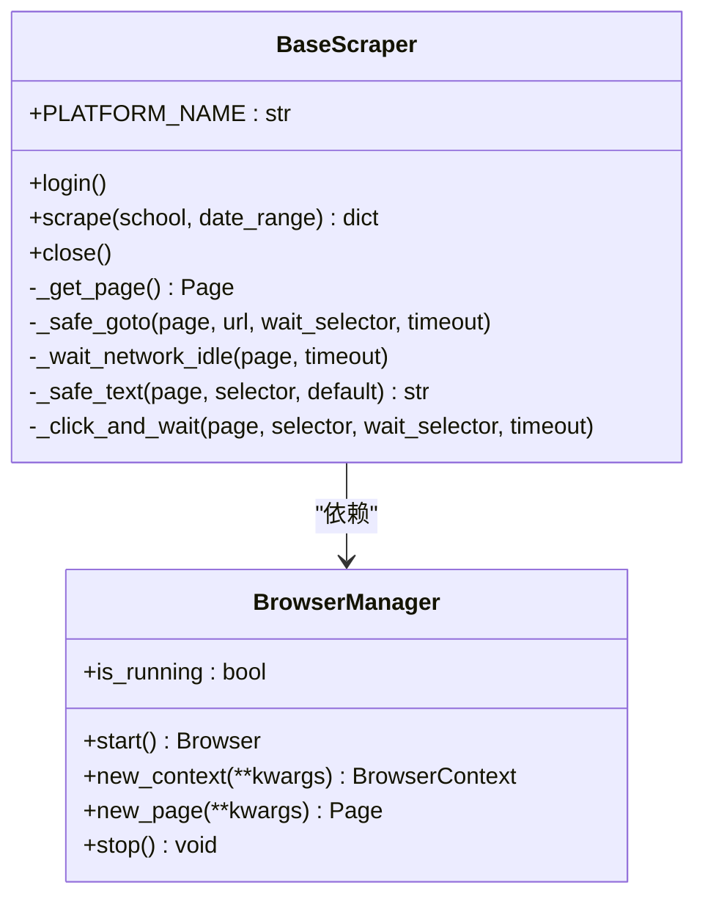
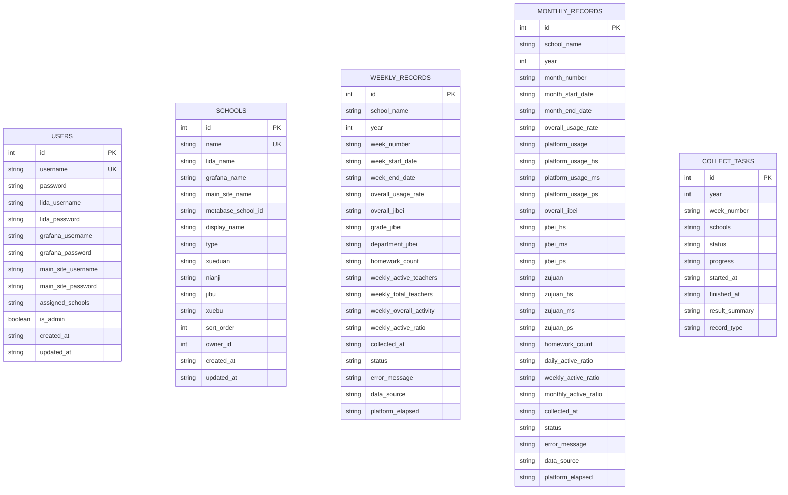
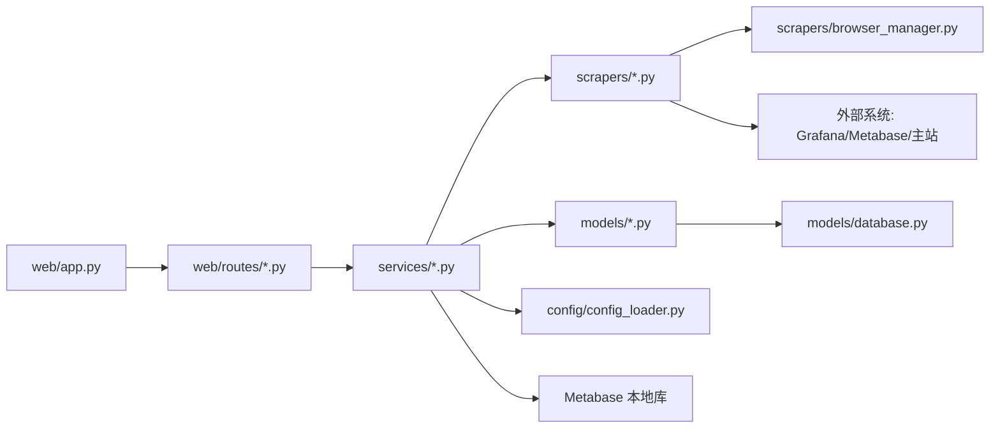
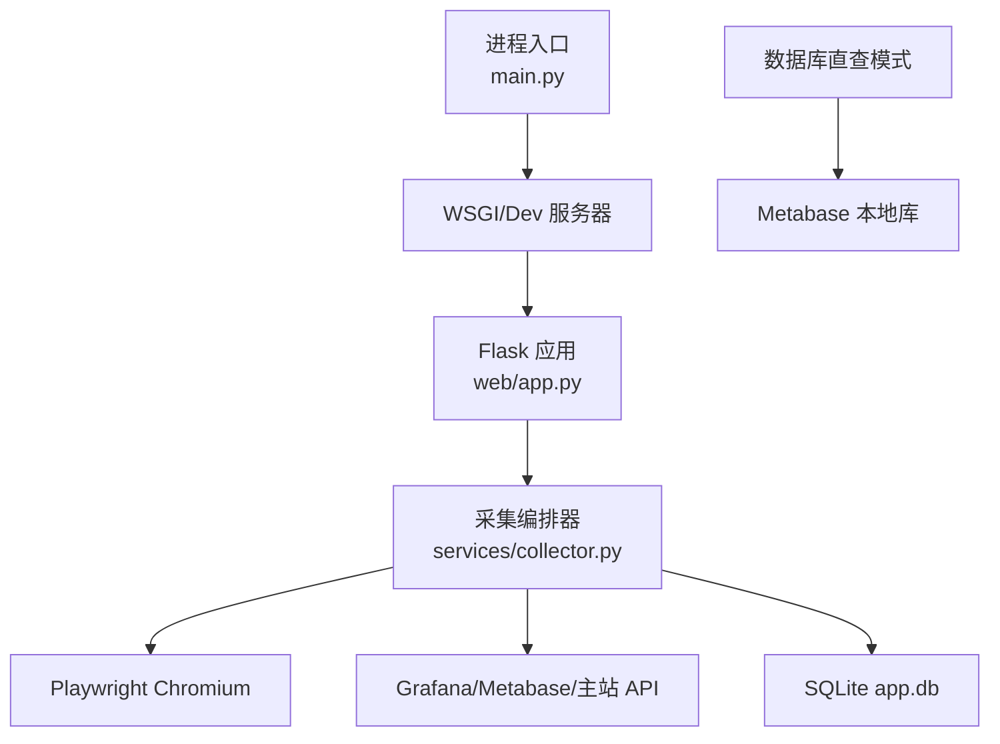

# 整体架构概览

<cite>
**本文引用的文件**   
- [main.py](file://main.py)
- [web/app.py](file://web/app.py)
- [config/config_loader.py](file://config/config_loader.py)
- [models/database.py](file://models/database.py)
- [services/collector.py](file://services/collector.py)
- [scrapers/base.py](file://scrapers/base.py)
- [scrapers/browser_manager.py](file://scrapers/browser_manager.py)
- [web/routes/collect.py](file://web/routes/collect.py)
- [models/user.py](file://models/user.py)
- [models/school.py](file://models/school.py)
- [requirements.txt](file://requirements.txt)
</cite>

## 目录
1. [引言](#引言)
2. [项目结构](#项目结构)
3. [核心组件](#核心组件)
4. [架构总览](#架构总览)
5. [详细组件分析](#详细组件分析)
6. [依赖关系分析](#依赖关系分析)
7. [性能与可扩展性](#性能与可扩展性)
8. [故障排查指南](#故障排查指南)
9. [结论](#结论)
10. [附录：部署拓扑与基础设施](#附录部署拓扑与基础设施)

## 引言
本文件面向教育平台数据自动采集系统的整体架构，聚焦分层设计（表现层、业务服务层、爬虫引擎层、数据模型层）、MVC 应用工厂模式、模块化组织、组件依赖与数据流向，以及与外部系统（Grafana API、Metabase API、浏览器自动化）的集成点。文档同时给出技术选型权衡与部署拓扑建议，帮助读者快速理解并扩展系统。

## 项目结构
系统采用按功能域划分的模块化结构：
- 表现层（Web）：Flask 蓝图路由、模板与静态资源
- 业务服务层：采集编排器、数据库直查采集器、导出器
- 爬虫引擎层：抽象基类、浏览器生命周期管理、各平台爬虫实现
- 数据模型层：SQLite 连接与表初始化、领域模型（用户、学校、周/月记录）
- 配置中心：YAML 配置加载、校验、凭证覆盖机制
- 工具脚本：辅助开发与运维

图表来源
- [main.py:1-42](file://main.py#L1-L42)
- [web/app.py:306-337](file://web/app.py#L306-L337)
- [services/collector.py:1-120](file://services/collector.py#L1-L120)
- [scrapers/base.py:1-104](file://scrapers/base.py#L1-L104)
- [scrapers/browser_manager.py:1-76](file://scrapers/browser_manager.py#L1-L76)
- [models/database.py:201-372](file://models/database.py#L201-L372)
- [config/config_loader.py:1-147](file://config/config_loader.py#L1-L147)
- [requirements.txt:1-7](file://requirements.txt#L1-L7)

章节来源
- [main.py:1-42](file://main.py#L1-L42)
- [web/app.py:306-337](file://web/app.py#L306-L337)
- [requirements.txt:1-7](file://requirements.txt#L1-L7)

## 核心组件
- Flask 应用工厂与认证中间件：集中创建应用实例、注册蓝图、注入认证上下文与登录流程
- 采集编排器：统一调度多平台采集任务，支持 API 直连与浏览器降级、SSE 进度推送、暂停/继续控制
- 数据库直查采集器：轻量模式，直接查询 Metabase 本地 SQLite 计算活跃度指标
- 爬虫抽象基类与浏览器管理器：封装 Playwright 生命周期、页面导航与等待策略
- 数据模型与迁移：SQLite 表结构定义、增量迁移、默认管理员与初始数据导入
- 配置加载与凭证覆盖：YAML 配置校验、用户级凭证覆盖、Metabase 数据库路径解析

章节来源
- [web/app.py:253-337](file://web/app.py#L253-L337)
- [services/collector.py:65-176](file://services/collector.py#L65-L176)
- [services/db_collector.py:51-116](file://services/db_collector.py#L51-L116)
- [scrapers/base.py:12-104](file://scrapers/base.py#L12-L104)
- [scrapers/browser_manager.py:11-76](file://scrapers/browser_manager.py#L11-L76)
- [models/database.py:201-372](file://models/database.py#L201-L372)
- [config/config_loader.py:21-147](file://config/config_loader.py#L21-L147)

## 架构总览
系统遵循 MVC 与工厂模式：
- 表现层：Flask 蓝图作为控制器，模板作为视图，静态资源提供前端交互
- 业务服务层：编排器协调多源采集，负责状态机、并发与持久化
- 爬虫引擎层：基于 Playwright 的异步浏览器自动化与可选 HTTP API 直连
- 数据模型层：SQLite 持久化，包含迁移与默认数据

图表来源
- [web/app.py:253-337](file://web/app.py#L253-L337)
- [web/routes/collect.py:22-170](file://web/routes/collect.py#L22-L170)
- [services/collector.py:214-730](file://services/collector.py#L214-L730)
- [services/db_collector.py:143-216](file://services/db_collector.py#L143-L216)
- [scrapers/base.py:12-104](file://scrapers/base.py#L12-L104)
- [scrapers/browser_manager.py:11-76](file://scrapers/browser_manager.py#L11-L76)
- [models/database.py:201-372](file://models/database.py#L201-L372)
- [config/config_loader.py:21-147](file://config/config_loader.py#L21-L147)

## 详细组件分析

### 表现层（Web）与 MVC 应用工厂
- 应用工厂 create_app：初始化日志、模板/静态目录、SECRET_KEY、注册蓝图、初始化数据库、注入认证
- 认证中间件：before_request 拦截未登录请求；/login 页面渲染与提交；context_processor 注入当前用户到模板
- 路由蓝图：采集启动、状态查询、暂停/继续、SSE 进度流等

图表来源
- [web/app.py:253-337](file://web/app.py#L253-L337)
- [web/routes/collect.py:22-170](file://web/routes/collect.py#L22-L170)
- [services/collector.py:133-176](file://services/collector.py#L133-L176)

章节来源
- [web/app.py:253-337](file://web/app.py#L253-L337)
- [web/routes/collect.py:22-170](file://web/routes/collect.py#L22-L170)

### 业务服务层：采集编排器
- 任务生命周期：创建任务、后台线程执行、异步主循环、结果合并与持久化
- 平台优先级与降级：优先 API 直连，失败或空数据时自动降级至浏览器
- 并行与共享上下文：主站 API 与浏览器复用同一 context，避免重复登录导致会话冲突
- 进度与可观测性：SSE 事件广播、耗时统计、错误聚合

图表来源
- [services/collector.py:214-730](file://services/collector.py#L214-L730)

章节来源
- [services/collector.py:65-176](file://services/collector.py#L65-L176)
- [services/collector.py:214-730](file://services/collector.py#L214-L730)

### 爬虫引擎层：抽象基类与浏览器管理
- 抽象基类：统一 login/scrape/close 接口，提供安全导航、网络空闲等待、文本提取等通用方法
- 浏览器管理器：Playwright 生命周期管理、上下文与页面创建、超时与视口设置、清理策略

图表来源
- [scrapers/base.py:12-104](file://scrapers/base.py#L12-L104)
- [scrapers/browser_manager.py:11-76](file://scrapers/browser_manager.py#L11-L76)

章节来源
- [scrapers/base.py:12-104](file://scrapers/base.py#L12-L104)
- [scrapers/browser_manager.py:11-76](file://scrapers/browser_manager.py#L11-L76)

### 数据模型层：SQLite 初始化与领域模型
- 数据库初始化：建表、增量迁移、默认管理员账户、首次从 YAML 导入学校
- 领域模型：User、School、WeeklyRecord、MonthlyRecord 提供 CRUD 与序列化

图表来源
- [models/database.py:201-372](file://models/database.py#L201-L372)

章节来源
- [models/database.py:201-372](file://models/database.py#L201-L372)
- [models/user.py:1-113](file://models/user.py#L1-L113)
- [models/school.py:1-165](file://models/school.py#L1-L165)

### 配置中心：加载、校验与凭证覆盖
- 配置文件：YAML 必填字段校验（browser、credentials、可选 metabase）
- 凭证覆盖：用户级覆盖优先于全局配置，便于多租户场景
- Metabase 数据库路径：环境变量 > 配置项 > 默认路径

章节来源
- [config/config_loader.py:21-147](file://config/config_loader.py#L21-L147)

## 依赖关系分析
- 模块耦合：
  - 表现层通过路由调用服务层，服务层依赖爬虫引擎与数据模型
  - 爬虫引擎依赖浏览器管理器与配置中心
  - 数据模型依赖数据库初始化模块
- 外部集成点：
  - Grafana API（可选直连）
  - Metabase API（纯 API 模式）
  - 主站（API 或浏览器）
  - 浏览器自动化（Playwright）
  - Metabase 本地 SQLite（数据库直查模式）

图表来源
- [web/app.py:306-337](file://web/app.py#L306-L337)
- [web/routes/collect.py:22-170](file://web/routes/collect.py#L22-L170)
- [services/collector.py:214-730](file://services/collector.py#L214-L730)
- [scrapers/browser_manager.py:11-76](file://scrapers/browser_manager.py#L11-L76)
- [models/database.py:201-372](file://models/database.py#L201-L372)
- [config/config_loader.py:21-147](file://config/config_loader.py#L21-L147)

章节来源
- [requirements.txt:1-7](file://requirements.txt#L1-L7)
- [web/app.py:306-337](file://web/app.py#L306-L337)
- [services/collector.py:214-730](file://services/collector.py#L214-L730)

## 性能与可扩展性
- 并发与异步：采集编排器在后台线程中运行 asyncio 事件循环，平台内顺序、平台间并行，减少总体耗时
- 浏览器优化：共享 context 避免重复登录；无头模式固定视口；网络空闲等待提升稳定性
- 降级策略：API 失败或空数据自动回退浏览器，提高鲁棒性
- 存储与迁移：SQLite WAL 模式提升并发读写；增量迁移保证版本演进
- 可扩展点：新增平台只需实现 BaseScraper 并在编排器中注册；新增数据源可通过数据库直查模式接入

[本节为通用指导，不直接分析具体文件]

## 故障排查指南
- 登录问题：检查 before_request 拦截逻辑与 session 注入；确认用户存在且凭据正确
- 采集失败：查看 SSE 事件中的错误消息与耗时；确认 API 可用性与浏览器环境
- 数据库异常：检查 SQLite 文件权限与 WAL 模式；核对迁移是否成功
- 配置缺失：确保 config.yaml 存在且 credentials 完整；必要时设置环境变量覆盖路径

章节来源
- [web/app.py:253-337](file://web/app.py#L253-L337)
- [web/routes/collect.py:137-170](file://web/routes/collect.py#L137-L170)
- [services/collector.py:214-730](file://services/collector.py#L214-L730)
- [models/database.py:201-372](file://models/database.py#L201-L372)
- [config/config_loader.py:21-147](file://config/config_loader.py#L21-L147)

## 结论
本系统以 Flask 应用工厂为核心，结合 MVC 与模块化组织，实现了跨平台数据采集的统一编排。通过 API 直连与浏览器降级的混合策略、SSE 实时反馈、SQLite 增量迁移与配置覆盖机制，系统在可用性、可维护性与可扩展性之间取得良好平衡。后续可在更多平台适配、缓存与队列化方面进一步增强。

[本节为总结，不直接分析具体文件]

## 附录：部署拓扑与基础设施
- 进程入口：main.py 根据参数选择开发服务器或生产 WSGI 服务器
- 运行时依赖：playwright、flask、pyyaml、openpyxl、aiohttp、waitress
- 外部依赖：
  - Grafana API（可选）
  - Metabase API（可选）
  - 主站（API 或浏览器）
  - Metabase 本地 SQLite（数据库直查模式）
- 浏览器环境：Chromium（Playwright），支持无头模式
- 端口与服务：默认监听 0.0.0.0:5000

图表来源
- [main.py:10-42](file://main.py#L10-L42)
- [web/app.py:306-337](file://web/app.py#L306-L337)
- [services/collector.py:214-730](file://services/collector.py#L214-L730)
- [scrapers/browser_manager.py:11-76](file://scrapers/browser_manager.py#L11-L76)
- [models/database.py:201-372](file://models/database.py#L201-L372)

章节来源
- [main.py:10-42](file://main.py#L10-L42)
- [requirements.txt:1-7](file://requirements.txt#L1-L7)