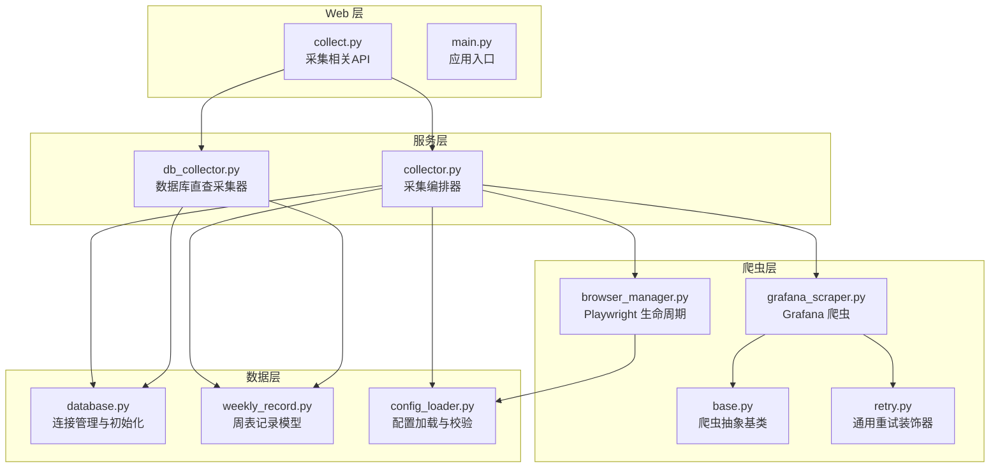
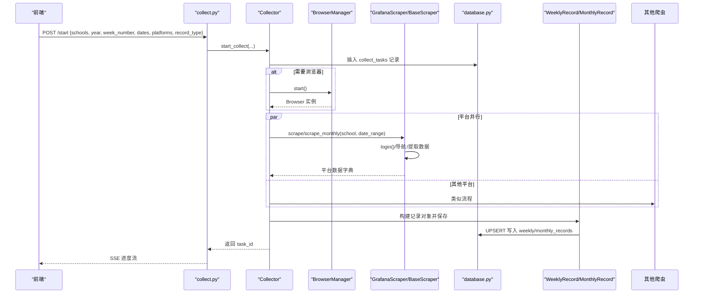
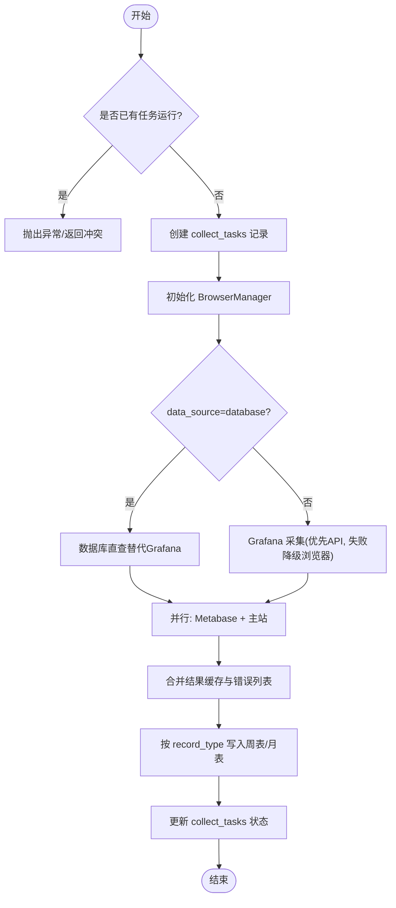
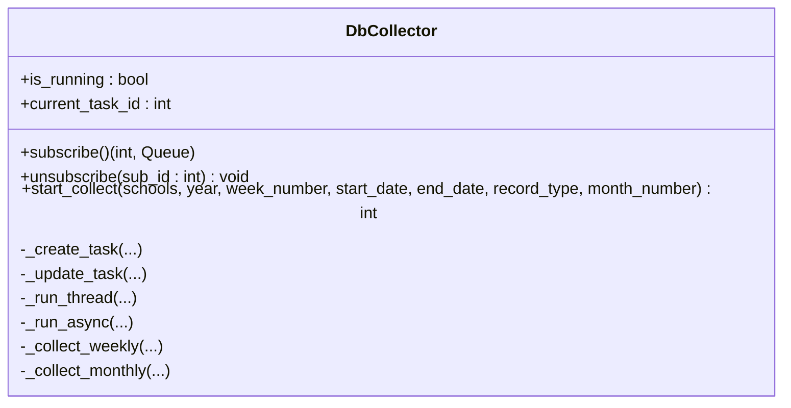
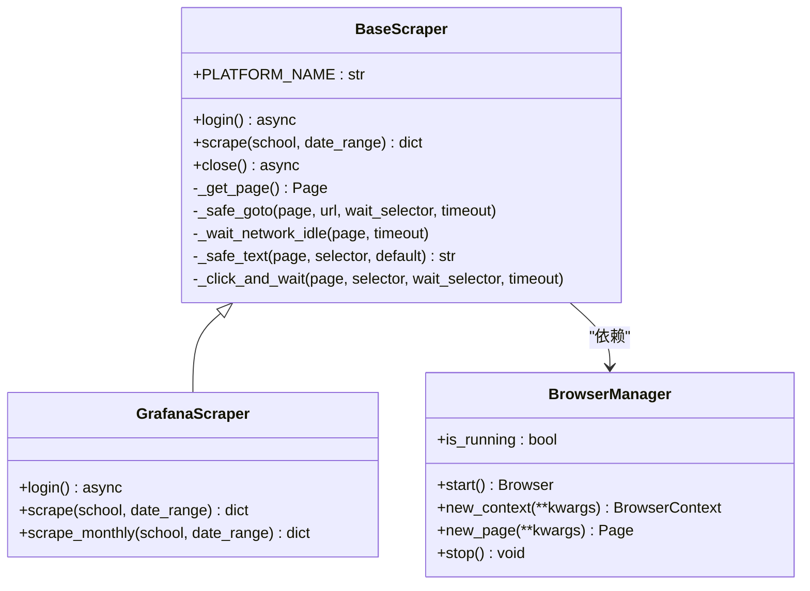
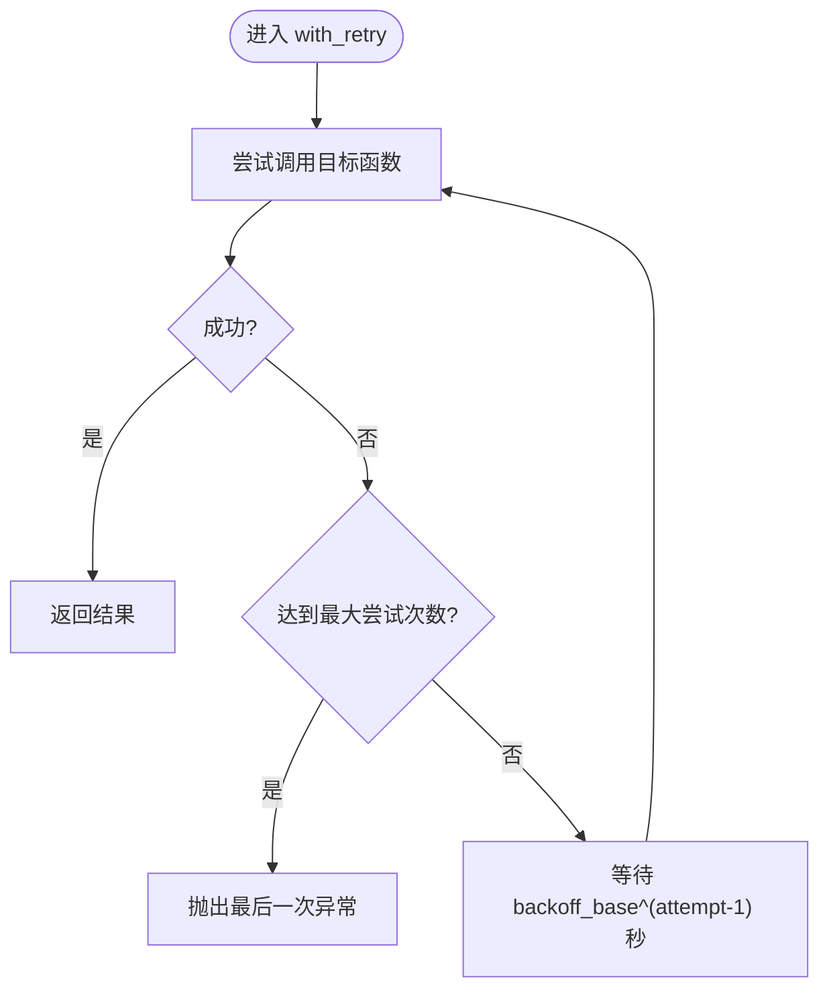
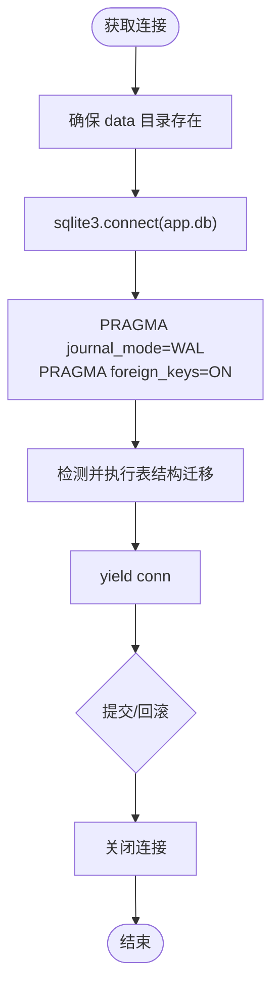
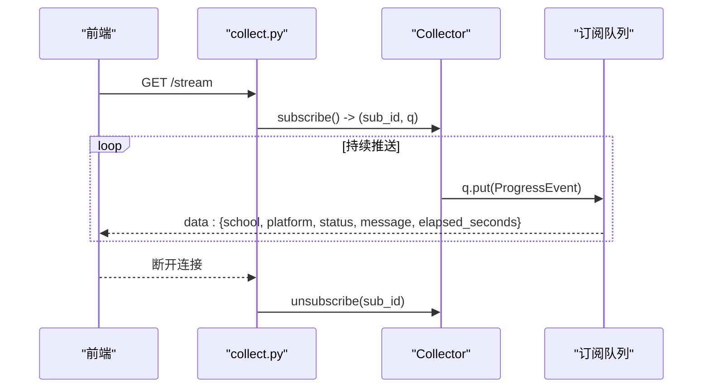
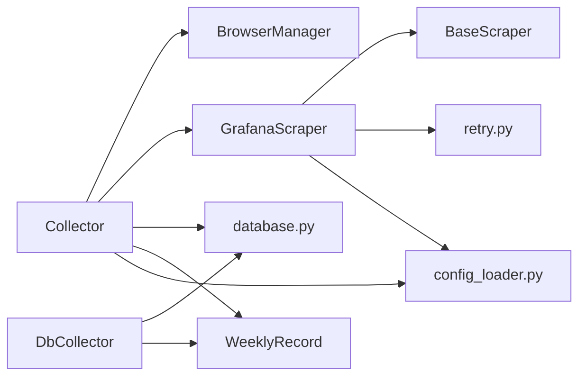

# 核心组件设计

<cite>
**本文引用的文件**   
- [main.py](file://main.py)
- [collector.py](file://services/collector.py)
- [db_collector.py](file://services/db_collector.py)
- [base.py](file://scrapers/base.py)
- [browser_manager.py](file://scrapers/browser_manager.py)
- [grafana_scraper.py](file://scrapers/grafana_scraper.py)
- [retry.py](file://scrapers/retry.py)
- [database.py](file://models/database.py)
- [weekly_record.py](file://models/weekly_record.py)
- [config_loader.py](file://config/config_loader.py)
- [collect.py](file://web/routes/collect.py)
</cite>

## 目录
1. [引言](#引言)
2. [项目结构](#项目结构)
3. [核心组件](#核心组件)
4. [架构总览](#架构总览)
5. [详细组件分析](#详细组件分析)
6. [依赖关系分析](#依赖关系分析)
7. [性能考量](#性能考量)
8. [故障排查指南](#故障排查指南)
9. [结论](#结论)
10. [附录](#附录)

## 引言
本设计文档面向教育平台数据自动采集系统的核心组件，聚焦以下目标：
- 采集器（Collector）的并发控制机制与任务编排策略
- 爬虫抽象基类（BaseScraper）的设计模式与扩展机制
- 数据库连接管理的设计原理
- 组件间协作关系、接口定义与参数传递机制
- 关键业务流程的交互图与时序图
- 配置选项与性能优化建议
- 错误处理与重试策略

## 项目结构
系统采用分层组织方式：
- Web 层：Flask 路由提供启动采集、状态查询、暂停/继续、SSE 进度流等接口
- 服务层：编排器（Collector）负责多平台并行采集、降级与结果合并；轻量直查采集器（DbCollector）直接读取 Metabase 数据库
- 爬虫层：基于 Playwright 的浏览器管理与各平台爬虫实现，统一继承自 BaseScraper
- 模型与数据层：SQLite 连接管理、表结构初始化与迁移、记录模型封装
- 配置层：YAML 配置加载、校验、用户凭证覆盖、浏览器与数据库路径解析

图表来源
- [main.py:1-42](file://main.py#L1-L42)
- [collect.py:1-170](file://web/routes/collect.py#L1-L170)
- [collector.py:1-862](file://services/collector.py#L1-L862)
- [db_collector.py:1-332](file://services/db_collector.py#L1-L332)
- [browser_manager.py:1-76](file://scrapers/browser_manager.py#L1-L76)
- [base.py:1-104](file://scrapers/base.py#L1-L104)
- [grafana_scraper.py:1-800](file://scrapers/grafana_scraper.py#L1-L800)
- [retry.py:1-82](file://scrapers/retry.py#L1-L82)
- [database.py:1-372](file://models/database.py#L1-L372)
- [weekly_record.py:1-163](file://models/weekly_record.py#L1-L163)
- [config_loader.py:1-147](file://config/config_loader.py#L1-L147)

章节来源
- [main.py:1-42](file://main.py#L1-L42)
- [collect.py:1-170](file://web/routes/collect.py#L1-L170)

## 核心组件
- 采集编排器（Collector）
  - 负责按“平台优先”策略串联多个平台爬虫，支持 API 直连与浏览器模式，失败自动降级
  - 通过后台线程 + 事件循环运行异步采集逻辑，支持暂停/继续、SSE 进度广播
  - 维护任务状态（collect_tasks），并合并各平台结果写入周表/月表
- 数据库直查采集器（DbCollector）
  - 不启动浏览器，直接查询 Metabase SQLite 数据库计算活跃度指标
  - 与 Collector 共享互斥语义（同一时间仅一个采集器运行）
- 爬虫抽象基类（BaseScraper）
  - 定义登录、采集、关闭等抽象方法，提供页面获取、网络空闲等待、文本提取、点击等待等通用辅助
  - 支持共享 BrowserContext 复用，避免重复登录
- 浏览器管理器（BrowserManager）
  - 管理 Playwright 实例生命周期，创建上下文与页面，设置超时与视口
- 重试装饰器（with_retry）
  - 指数退避重试，支持同步/异步函数，可配置最大尝试次数与退避基数
- 数据库连接管理（database.py）
  - 提供上下文管理器 get_connection，启用 WAL 与外键约束，执行表结构初始化与增量迁移
- 配置加载（config_loader.py）
  - YAML 配置加载与校验，用户级凭证覆盖，浏览器与数据库路径解析

章节来源
- [collector.py:1-862](file://services/collector.py#L1-L862)
- [db_collector.py:1-332](file://services/db_collector.py#L1-L332)
- [base.py:1-104](file://scrapers/base.py#L1-L104)
- [browser_manager.py:1-76](file://scrapers/browser_manager.py#L1-L76)
- [retry.py:1-82](file://scrapers/retry.py#L1-L82)
- [database.py:1-372](file://models/database.py#L1-L372)
- [config_loader.py:1-147](file://config/config_loader.py#L1-L147)

## 架构总览
系统以 Flask 为入口，Web 路由接收采集请求后调用 Collector 或 DbCollector。Collector 内部使用 asyncio.gather 并行调度不同平台的采集流程，并在需要时启动 BrowserManager 与具体爬虫（如 GrafanaScraper）。所有采集结果经模型层写入 SQLite，并通过 SSE 向前端推送实时进度。

图表来源
- [collect.py:22-102](file://web/routes/collect.py#L22-L102)
- [collector.py:133-213](file://services/collector.py#L133-L213)
- [browser_manager.py:18-56](file://scrapers/browser_manager.py#L18-L56)
- [base.py:24-72](file://scrapers/base.py#L24-L72)
- [grafana_scraper.py:48-143](file://scrapers/grafana_scraper.py#L48-L143)
- [database.py:24-48](file://models/database.py#L24-L48)
- [weekly_record.py:32-68](file://models/weekly_record.py#L32-L68)

## 详细组件分析

### 采集编排器（Collector）
- 并发控制
  - 单例 Collector 持有 _running 标志与后台线程，防止并发启动
  - 使用 Event 实现暂停/继续，在每校采集前检查暂停状态
  - 通过 asyncio.gather 并行调度不同平台（如 Lida 与主站），平台内学校顺序执行
- 任务编排策略
  - Phase 1：Grafana 或数据库直查（按 data_source 选择）
  - Phase 2+3：Metabase（Lida）与主站并行，各自内部按学校顺序执行
  - API 模式优先，失败自动降级到浏览器模式；主站 API 与浏览器共享 BrowserContext 以避免重复登录
- 进度事件与订阅
  - 每个 SSE 客户端获得独立队列，Collector 通过 _push_event 广播 ProgressEvent
  - 支持心跳与完成信号，便于前端展示实时进度
- 结果合并与持久化
  - 根据 record_type 选择 WeeklyRecord 或 MonthlyRecord，填充字段并保存
  - 记录 platform_elapsed 用于统计各平台耗时

图表来源
- [collector.py:133-213](file://services/collector.py#L133-L213)
- [collector.py:214-730](file://services/collector.py#L214-L730)
- [collector.py:731-862](file://services/collector.py#L731-L862)

章节来源
- [collector.py:1-862](file://services/collector.py#L1-L862)

### 数据库直查采集器（DbCollector）
- 轻量模式，无需浏览器，直接连接 Metabase SQLite 数据库
- 按学校顺序执行周表/月表计算，保存绝对数值或比例
- 与 Collector 共享互斥语义（同一时间仅一个采集器运行）

图表来源
- [db_collector.py:51-216](file://services/db_collector.py#L51-L216)
- [db_collector.py:217-332](file://services/db_collector.py#L217-L332)

章节来源
- [db_collector.py:1-332](file://services/db_collector.py#L1-L332)

### 爬虫抽象基类（BaseScraper）与浏览器管理（BrowserManager）
- BaseScraper
  - 定义抽象方法 login、scrape、close
  - 提供 _get_page 自动管理 Page/Context，支持外部共享 Context
  - 通用辅助：_safe_goto、_wait_network_idle、_safe_text、_click_and_wait
- BrowserManager
  - 管理 Playwright 实例，创建 Context 与 Page，设置默认超时与视口
  - 清理 Cookie 避免旧数据干扰

图表来源
- [base.py:12-104](file://scrapers/base.py#L12-L104)
- [browser_manager.py:11-76](file://scrapers/browser_manager.py#L11-L76)
- [grafana_scraper.py:48-143](file://scrapers/grafana_scraper.py#L48-L143)

章节来源
- [base.py:1-104](file://scrapers/base.py#L1-L104)
- [browser_manager.py:1-76](file://scrapers/browser_manager.py#L1-L76)
- [grafana_scraper.py:1-800](file://scrapers/grafana_scraper.py#L1-L800)

### 重试策略（with_retry）
- 指数退避重试，支持同步/异步函数
- 可配置最大尝试次数、退避基数、可重试异常类型与回调
- 适用于登录、网络请求等易失败操作

图表来源
- [retry.py:13-82](file://scrapers/retry.py#L13-L82)

章节来源
- [retry.py:1-82](file://scrapers/retry.py#L1-L82)

### 数据库连接管理（database.py）
- get_connection 上下文管理器
  - 启用 WAL 模式与外键约束，确保并发读写与一致性
  - 自动执行表结构初始化与增量迁移（添加缺失列、类型迁移）
  - 首次启动从 config.yaml 导入学校数据到数据库
- 表结构
  - weekly_records、monthly_records、collect_tasks、schools、users 等
  - 支持 data_source、platform_elapsed 等字段标记数据来源与耗时

图表来源
- [database.py:24-48](file://models/database.py#L24-L48)
- [database.py:90-137](file://models/database.py#L90-L137)
- [database.py:201-372](file://models/database.py#L201-L372)

章节来源
- [database.py:1-372](file://models/database.py#L1-L372)

### 配置加载与用户凭证覆盖（config_loader.py）
- 加载与校验
  - 强制校验 credentials 必填项（url、username/password）
  - browser 配置默认值与可选 metabase 校验
- 用户凭证覆盖
  - set_user_creds_override 允许按用户覆盖平台用户名/密码
  - get_credentials 优先使用用户覆盖，否则回退到配置文件
- 浏览器与数据库路径解析
  - get_browser_config 返回浏览器配置
  - get_metabase_db_path 优先级：环境变量 > config.yaml > 默认路径

章节来源
- [config_loader.py:1-147](file://config/config_loader.py#L1-L147)

### Web 接口与参数传递（collect.py）
- 启动采集
  - 校验输入（学校、周次/月次、日期范围、record_type、data_source）
  - 设置用户凭证覆盖，调用 Collector.start_collect
- 状态与控制
  - /status 返回运行状态、暂停状态、当前任务ID与用户ID
  - /pause 与 /resume 控制采集暂停/继续
- SSE 进度流
  - /stream 为每个客户端分配独立队列，推送 ProgressEvent JSON
  - 支持心跳与完成信号

图表来源
- [collect.py:104-170](file://web/routes/collect.py#L104-L170)
- [collector.py:102-132](file://services/collector.py#L102-L132)

章节来源
- [collect.py:1-170](file://web/routes/collect.py#L1-L170)

## 依赖关系分析
- Collector 依赖
  - BrowserManager（浏览器生命周期）
  - GrafanaScraper/MainSiteScraper/LidaScraper（平台爬虫）
  - database.py（连接管理与迁移）
  - WeeklyRecord/MonthlyRecord（记录模型）
  - config_loader.py（配置与凭证）
- GrafanaScraper 依赖
  - BaseScraper（抽象基类）
  - retry.py（重试装饰器）
  - config_loader.py（凭证）
- DbCollector 依赖
  - database.py（连接管理）
  - WeeklyRecord/MonthlyRecord（记录模型）

图表来源
- [collector.py:1-862](file://services/collector.py#L1-L862)
- [grafana_scraper.py:1-800](file://scrapers/grafana_scraper.py#L1-L800)
- [base.py:1-104](file://scrapers/base.py#L1-L104)
- [retry.py:1-82](file://scrapers/retry.py#L1-L82)
- [database.py:1-372](file://models/database.py#L1-L372)
- [weekly_record.py:1-163](file://models/weekly_record.py#L1-L163)
- [config_loader.py:1-147](file://config/config_loader.py#L1-L147)

章节来源
- [collector.py:1-862](file://services/collector.py#L1-L862)
- [grafana_scraper.py:1-800](file://scrapers/grafana_scraper.py#L1-L800)
- [base.py:1-104](file://scrapers/base.py#L1-L104)
- [retry.py:1-82](file://scrapers/retry.py#L1-L82)
- [database.py:1-372](file://models/database.py#L1-L372)
- [weekly_record.py:1-163](file://models/weekly_record.py#L1-L163)
- [config_loader.py:1-147](file://config/config_loader.py#L1-L147)

## 性能考量
- 并发与并行
  - 使用 asyncio.gather 并行调度不同平台，提升整体吞吐
  - 平台内学校顺序执行，避免资源竞争与登录态冲突
- 浏览器复用
  - 主站 API 与浏览器共享 BrowserContext，减少重复登录开销
  - 每校完成后清理多余标签页，保留运维页面，降低上下文切换成本
- 数据库直查模式
  - 跳过浏览器，直接查询 Metabase SQLite，显著降低资源占用与延迟
- 超时与等待
  - BrowserManager 设置默认超时，BaseScraper 提供网络空闲等待，避免过早抓取未渲染数据
- 日志与监控
  - 记录各平台耗时（platform_elapsed），便于定位瓶颈

[本节为通用指导，不涉及具体文件分析]

## 故障排查指南
- 常见错误
  - 配置缺失：credentials 缺少必填项或 URL 为空
  - 登录失败：Grafana 登录检测多重策略仍失败
  - 数据为空：API 返回空数据，触发降级到浏览器模式
  - 数据库路径错误：METABASE_DB_PATH 或 config.yaml 中路径不正确
- 调试建议
  - 开启 debug 模式查看详细日志
  - 检查 collect_tasks 表状态与 result_summary
  - 验证 schools 表是否存在对应学校名称
  - 确认浏览器 headless 模式与视口设置

章节来源
- [config_loader.py:39-74](file://config/config_loader.py#L39-L74)
- [grafana_scraper.py:56-143](file://scrapers/grafana_scraper.py#L56-L143)
- [collector.py:237-244](file://services/collector.py#L237-L244)
- [config_loader.py:122-147](file://config/config_loader.py#L122-L147)

## 结论
本设计通过分层架构与清晰的组件职责划分，实现了高可用、可扩展的教育平台数据采集系统。Collector 的并发控制与任务编排策略确保了多平台并行采集的效率与稳定性；BaseScraper 提供了统一的扩展点，便于新增平台爬虫；数据库连接管理保障了数据一致性与可维护性。结合重试策略与错误处理机制，系统在复杂网络环境下具备较强的鲁棒性。

[本节为总结，不涉及具体文件分析]

## 附录
- 配置选项
  - browser.headless：无头模式开关
  - browser.slow_mo：模拟速度（毫秒）
  - browser.default_timeout：默认超时（毫秒）
  - credentials.*.url/username/password：平台凭证
  - database.metabase_db_path：Metabase 数据库路径
- 最佳实践
  - 优先使用 API 模式，失败再降级到浏览器
  - 合理设置超时与等待，避免误判
  - 定期清理浏览器存储，避免缓存干扰
  - 使用用户凭证覆盖，实现多租户隔离

[本节为补充信息，不涉及具体文件分析]