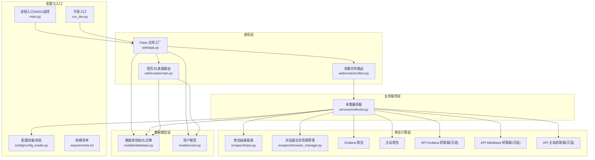
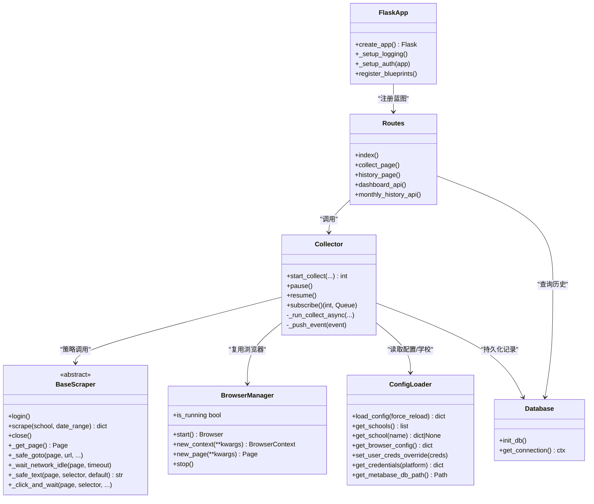
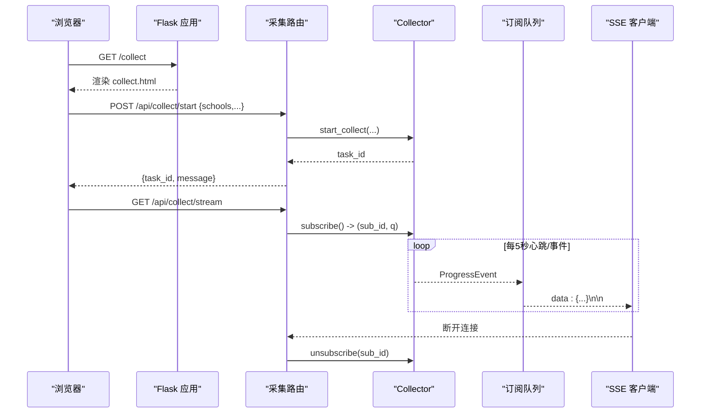
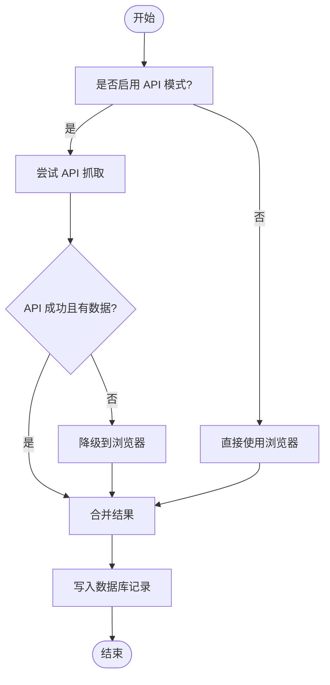
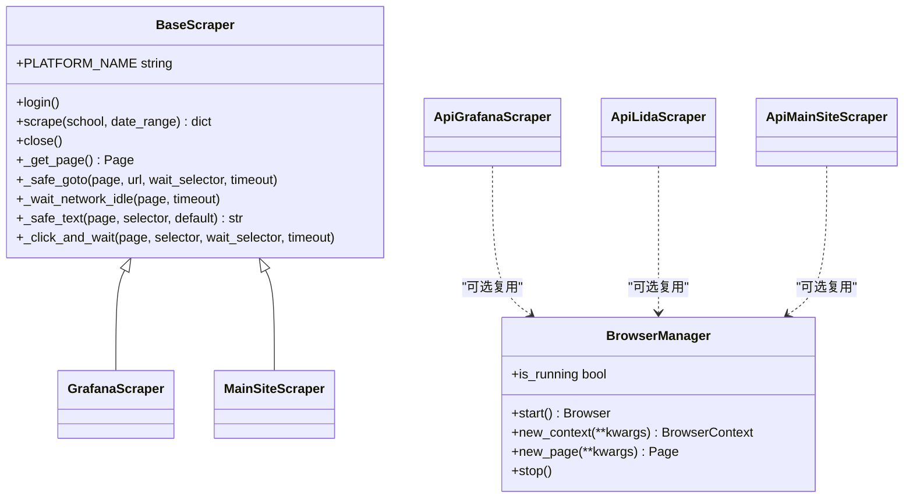
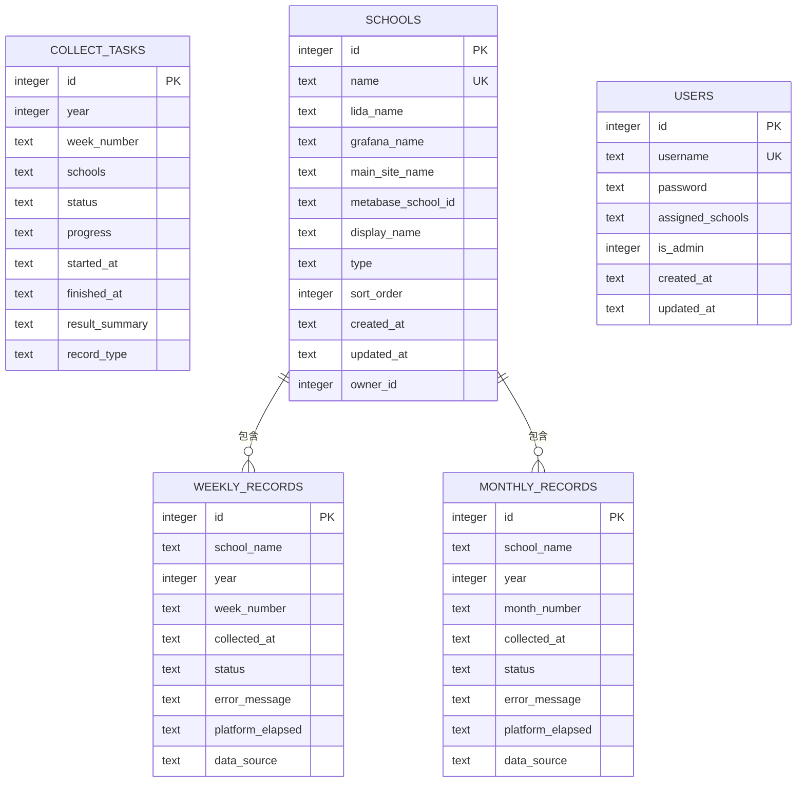
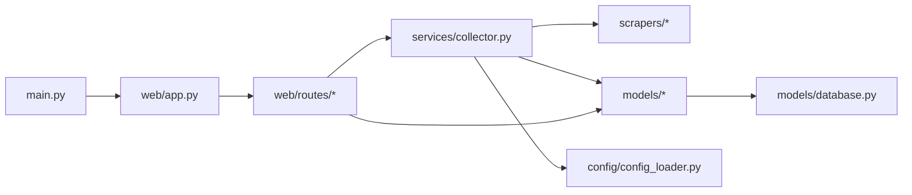
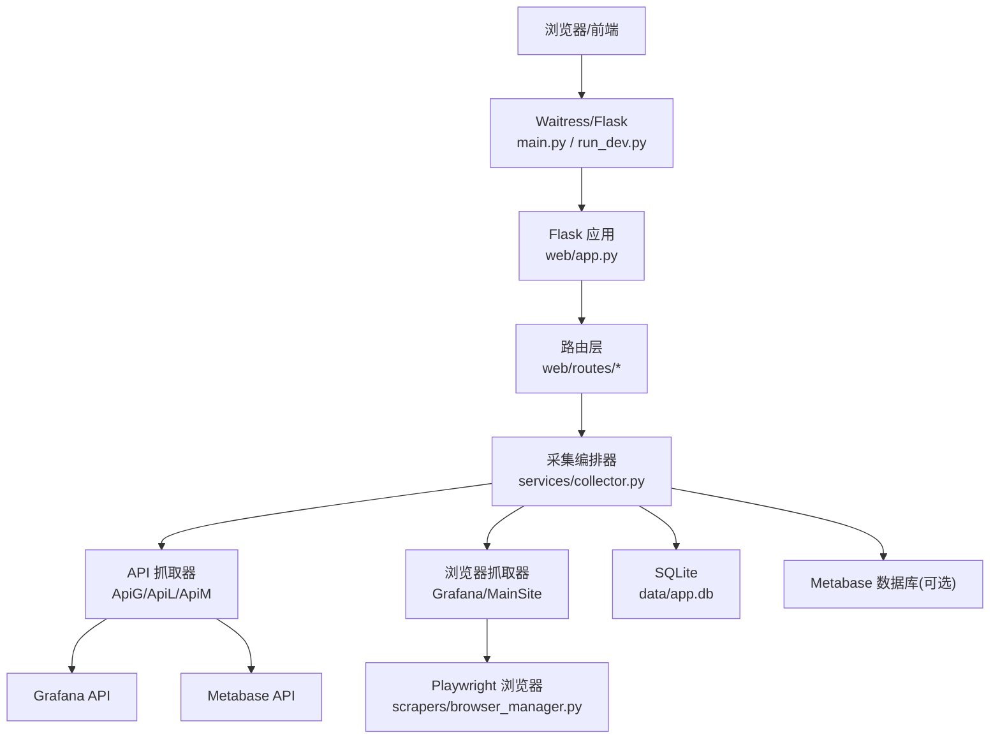

# 系统架构

<cite>
**本文引用的文件**   
- [main.py](file://main.py)
- [web/app.py](file://web/app.py)
- [run_dev.py](file://run_dev.py)
- [requirements.txt](file://requirements.txt)
- [models/database.py](file://models/database.py)
- [models/user.py](file://models/user.py)
- [services/collector.py](file://services/collector.py)
- [scrapers/base.py](file://scrapers/base.py)
- [scrapers/browser_manager.py](file://scrapers/browser_manager.py)
- [config/config_loader.py](file://config/config_loader.py)
- [web/routes/main.py](file://web/routes/main.py)
- [web/routes/collect.py](file://web/routes/collect.py)
</cite>

## 目录
1. [引言](#引言)
2. [项目结构](#项目结构)
3. [核心组件](#核心组件)
4. [架构总览](#架构总览)
5. [详细组件分析](#详细组件分析)
6. [依赖关系分析](#依赖关系分析)
7. [性能与并发](#性能与并发)
8. [部署拓扑与基础设施](#部署拓扑与基础设施)
9. [故障排查指南](#故障排查指南)
10. [结论](#结论)

## 引言
本文件面向教育平台数据自动采集系统的架构文档，覆盖分层架构（表现层、业务服务层、爬虫引擎层、数据模型层）、MVC 应用工厂模式、策略模式在多平台爬虫中的实现、异步编排与 SSE 实时通信、并发控制与降级策略、外部系统集成点（Grafana API、Metabase API、浏览器自动化），以及扩展性与性能优化建议。

## 项目结构
系统采用模块化分层组织：
- 表现层（Web）：Flask 蓝图路由、模板与静态资源
- 业务服务层：采集编排器、导出等
- 爬虫引擎层：抽象基类、浏览器管理、各平台抓取器
- 数据模型层：SQLite 初始化、ORM 风格模型
- 配置与工具：配置加载、开发启动脚本、依赖清单

图表来源
- [main.py:1-42](file://main.py#L1-L42)
- [web/app.py:306-337](file://web/app.py#L306-L337)
- [web/routes/main.py:1-143](file://web/routes/main.py#L1-L143)
- [web/routes/collect.py:1-170](file://web/routes/collect.py#L1-L170)
- [services/collector.py:1-862](file://services/collector.py#L1-L862)
- [scrapers/base.py:1-104](file://scrapers/base.py#L1-L104)
- [scrapers/browser_manager.py:1-76](file://scrapers/browser_manager.py#L1-L76)
- [models/database.py:1-372](file://models/database.py#L1-L372)
- [models/user.py:1-113](file://models/user.py#L1-L113)
- [config/config_loader.py:1-147](file://config/config_loader.py#L1-L147)
- [requirements.txt:1-7](file://requirements.txt#L1-L7)

章节来源
- [main.py:1-42](file://main.py#L1-L42)
- [web/app.py:306-337](file://web/app.py#L306-L337)
- [run_dev.py:1-15](file://run_dev.py#L1-L15)
- [requirements.txt:1-7](file://requirements.txt#L1-L7)

## 核心组件
- Flask 应用工厂：集中创建应用实例、注册蓝图、初始化日志与数据库、注入认证中间件。
- 采集编排器：串联多平台爬虫，支持 API 直连优先与浏览器降级；按平台分阶段执行，跨平台并行；通过 pub/sub 推送进度事件，支持暂停/继续。
- 爬虫抽象基类：统一页面获取、网络空闲等待、文本提取、点击等待等通用能力。
- 浏览器管理器：Playwright 异步生命周期管理，上下文隔离与共享策略。
- 配置加载器：YAML 配置校验、缓存、用户级凭证覆盖、Metabase 数据库路径解析。
- 数据模型层：SQLite 连接池式上下文、表结构初始化与增量迁移、默认管理员账户创建、首次从 YAML 导入学校。
- Web 路由：首页/仪表盘、采集任务控制、SSE 进度流、历史记录查询。

章节来源
- [web/app.py:14-337](file://web/app.py#L14-337)
- [services/collector.py:65-862](file://services/collector.py#L65-L862)
- [scrapers/base.py:12-104](file://scrapers/base.py#L12-L104)
- [scrapers/browser_manager.py:11-76](file://scrapers/browser_manager.py#L11-L76)
- [config/config_loader.py:21-147](file://config/config_loader.py#L21-L147)
- [models/database.py:201-372](file://models/database.py#L201-L372)
- [web/routes/main.py:41-143](file://web/routes/main.py#L41-L143)
- [web/routes/collect.py:22-170](file://web/routes/collect.py#L22-L170)

## 架构总览
系统遵循 MVC 与工厂模式：
- 控制器（Controller）：Flask 蓝图路由处理请求参数、鉴权、调用服务层。
- 视图（View）：Jinja2 模板渲染页面。
- 模型（Model）：数据模型封装 SQLite 读写与迁移。
- 工厂模式：create_app 集中装配应用、蓝图、认证、数据库初始化。
- 策略模式：爬虫以“API 直连”或“浏览器自动化”为策略，运行时根据配置与可用性动态切换。

图表来源
- [web/app.py:306-337](file://web/app.py#L306-L337)
- [web/routes/main.py:41-143](file://web/routes/main.py#L41-L143)
- [services/collector.py:65-862](file://services/collector.py#L65-L862)
- [scrapers/base.py:12-104](file://scrapers/base.py#L12-L104)
- [scrapers/browser_manager.py:11-76](file://scrapers/browser_manager.py#L11-L76)
- [config/config_loader.py:21-147](file://config/config_loader.py#L21-L147)
- [models/database.py:201-372](file://models/database.py#L201-L372)

## 详细组件分析

### 表现层（Web）
- 应用工厂 create_app：初始化日志、模板/静态目录、SECRET_KEY、数据库初始化、蓝图注册、认证中间件。
- 认证中间件：before_request 拦截未登录访问，区分 /api/ 返回 401 JSON 与页面重定向到登录页；提供登录/登出与会话注入。
- 路由模块：
  - 首页/仪表盘：按用户权限过滤学校与记录，聚合周/月最近记录。
  - 采集任务：启动任务、状态查询、暂停/继续、SSE 进度流。
  - 历史记录：按年/月/校查询月度记录。

图表来源
- [web/app.py:253-304](file://web/app.py#L253-L304)
- [web/routes/collect.py:22-170](file://web/routes/collect.py#L22-L170)
- [services/collector.py:102-135](file://services/collector.py#L102-L135)

章节来源
- [web/app.py:14-337](file://web/app.py#L14-337)
- [web/routes/main.py:41-143](file://web/routes/main.py#L41-L143)
- [web/routes/collect.py:22-170](file://web/routes/collect.py#L22-L170)

### 业务服务层（采集编排器）
- 策略模式：
  - API 直连优先：当启用 api_mode 且对应抓取器可用时，先尝试 API 方式。
  - 浏览器降级：API 失败或返回空数据时，自动切换到浏览器自动化。
  - 平台分阶段：Phase1 为 Grafana 或数据库直查；Phase2+3 为 Metabase 与主站并行。
- 并发与并行：
  - 单平台内顺序执行（避免会话冲突）。
  - 不同平台间使用 asyncio.gather 并行。
  - 主站 API 与浏览器共享同一 BrowserContext，减少重复登录。
- 进度与可观测性：
  - 基于 queue.Queue 的 pub/sub 广播，每个 SSE 客户端独立队列。
  - 支持暂停/继续，通过 Event 在阶段间检查。
- 数据合并与落库：
  - 将多平台结果合并为 WeeklyRecord/MonthlyRecord，写入 SQLite。
  - 记录数据来源（grafana/database）、平台耗时统计。

图表来源
- [services/collector.py:214-730](file://services/collector.py#L214-L730)
- [services/collector.py:732-862](file://services/collector.py#L732-L862)

章节来源
- [services/collector.py:65-862](file://services/collector.py#L65-L862)

### 爬虫引擎层
- 抽象基类 BaseScraper：定义 login/scrape/close 接口，提供 _get_page/_safe_goto/_wait_network_idle/_safe_text/_click_and_wait 等通用方法。
- 浏览器管理器 BrowserManager：异步启动 Chromium，创建 Context/Page，清理 Cookie，设置超时与视口策略。
- 具体抓取器（示例）：
  - GrafanaScraper/MainSiteScraper：基于 Playwright 的页面交互与数据抽取。
  - ApiGrafanaScraper/ApiLidaScraper/ApiMainSiteScraper：HTTP 直连抓取（可选依赖 aiohttp）。

图表来源
- [scrapers/base.py:12-104](file://scrapers/base.py#L12-L104)
- [scrapers/browser_manager.py:11-76](file://scrapers/browser_manager.py#L11-L76)

章节来源
- [scrapers/base.py:12-104](file://scrapers/base.py#L12-L104)
- [scrapers/browser_manager.py:11-76](file://scrapers/browser_manager.py#L11-L76)

### 数据模型层
- 数据库初始化 init_db：创建周/月记录、任务、学校、用户等表；增量迁移添加缺失列；首次从 config.yaml 导入学校；创建默认管理员。
- 连接管理 get_connection：WAL 模式、外键约束、事务提交/回滚。
- 用户模型 User：CRUD、凭据字段、学校列表解析、字典序列化。

图表来源
- [models/database.py:51-372](file://models/database.py#L51-L372)
- [models/user.py:9-113](file://models/user.py#L9-L113)

章节来源
- [models/database.py:201-372](file://models/database.py#L201-L372)
- [models/user.py:9-113](file://models/user.py#L9-L113)

### 配置与外部集成
- 配置加载与校验：强制 credentials 中 lida/grafana/main_site 存在并含必要字段；browser 配置默认值；用户级凭证覆盖机制。
- Metabase 集成：
  - 可选 API 抓取器（ApiLidaScraper）用于拉取指标。
  - 数据库直查替代方案：直接查询本地 Metabase 数据库，计算活跃度比率。
- Grafana 集成：
  - API 直连抓取器（ApiGrafanaScraper）优先，失败则降级到浏览器。
- 浏览器自动化：
  - Playwright 无头/有头模式、视口策略、CSP 绕过、Cookie 清理、超时设置。

章节来源
- [config/config_loader.py:39-147](file://config/config_loader.py#L39-L147)
- [services/collector.py:407-550](file://services/collector.py#L407-L550)
- [scrapers/browser_manager.py:18-76](file://scrapers/browser_manager.py#L18-L76)

## 依赖关系分析
- 进程入口 main.py：根据命令行参数选择开发服务器或生产 WSGI（waitress）。
- 应用工厂 web/app.py：集中注册蓝图、初始化数据库、注入认证。
- 路由与业务：routes 调用 services.collector，后者组合 scrapers 与 models。
- 配置与模型：所有层均依赖 config_loader 与 database。

图表来源
- [main.py:1-42](file://main.py#L1-L42)
- [web/app.py:306-337](file://web/app.py#L306-L337)
- [web/routes/main.py:1-143](file://web/routes/main.py#L1-L143)
- [web/routes/collect.py:1-170](file://web/routes/collect.py#L1-L170)
- [services/collector.py:1-862](file://services/collector.py#L1-L862)
- [scrapers/base.py:1-104](file://scrapers/base.py#L1-L104)
- [scrapers/browser_manager.py:1-76](file://scrapers/browser_manager.py#L1-L76)
- [models/database.py:1-372](file://models/database.py#L1-L372)
- [config/config_loader.py:1-147](file://config/config_loader.py#L1-L147)

章节来源
- [main.py:1-42](file://main.py#L1-L42)
- [web/app.py:306-337](file://web/app.py#L306-L337)
- [requirements.txt:1-7](file://requirements.txt#L1-L7)

## 性能与并发
- 异步编排：后台线程运行 asyncio 事件循环，避免阻塞 Web 请求。
- 平台并行：不同平台之间使用 gather 并行，提升整体吞吐。
- 浏览器复用：主站 API 与浏览器共享 BrowserContext，减少重复登录开销。
- 降级策略：API 失败或空数据自动回退浏览器，提高鲁棒性。
- 数据库优化：SQLite WAL 模式、外键约束、增量迁移，降低锁竞争。
- 可扩展性：新增平台只需实现 BaseScraper 或 API 抓取器，并在编排器中注册策略。

[本节为通用指导，不直接分析具体文件]

## 部署拓扑与基础设施
- 进程入口：
  - 开发：run_dev.py 使用 Flask dev server（端口 5001）。
  - 生产：main.py 使用 waitress WSGI（端口 5000，多线程）。
- 依赖：
  - playwright、flask、pyyaml、openpyxl、aiohttp、waitress。
- 外部系统：
  - Grafana API（可选直连）
  - Metabase API（可选）与本地 Metabase 数据库（可选直查）
  - 目标平台主站（浏览器自动化）
- 存储：
  - SQLite 数据库文件位于 data/app.db
  - 可选 Metabase 数据库文件路径由环境变量或配置决定

图表来源
- [main.py:10-42](file://main.py#L10-L42)
- [run_dev.py:1-15](file://run_dev.py#L1-L15)
- [web/app.py:306-337](file://web/app.py#L306-L337)
- [services/collector.py:214-730](file://services/collector.py#L214-L730)
- [scrapers/browser_manager.py:18-76](file://scrapers/browser_manager.py#L18-L76)
- [models/database.py:201-372](file://models/database.py#L201-L372)
- [config/config_loader.py:122-147](file://config/config_loader.py#L122-L147)

章节来源
- [main.py:10-42](file://main.py#L10-L42)
- [run_dev.py:1-15](file://run_dev.py#L1-L15)
- [requirements.txt:1-7](file://requirements.txt#L1-L7)

## 故障排查指南
- 登录问题：
  - 确认 before_request 放行 static/login 相关端点；检查 session 中 user_id 是否存在。
- 采集任务冲突：
  - 若已有任务运行，start_collect 会抛出异常；可通过 /status 与 /pause 或 /resume 协调。
- API 不可用：
  - 检查 api_mode 与 aiohttp 安装；观察日志中“API 失败，降级到浏览器”提示。
- 浏览器异常：
  - 检查 headless 与视口设置；确保 CSP 绕过与默认超时合理；必要时增加 slow_mo。
- 数据库迁移：
  - 关注增量迁移逻辑，确认新增列已正确添加；查看 app.log 中的警告信息。
- 进度流中断：
  - SSE 客户端断开后会自动取消订阅；检查心跳与完成事件是否正常发送。

章节来源
- [web/app.py:253-304](file://web/app.py#L253-L304)
- [web/routes/collect.py:104-170](file://web/routes/collect.py#L104-L170)
- [services/collector.py:154-176](file://services/collector.py#L154-L176)
- [services/collector.py:337-406](file://services/collector.py#L337-L406)
- [scrapers/browser_manager.py:18-76](file://scrapers/browser_manager.py#L18-L76)
- [models/database.py:90-137](file://models/database.py#L90-L137)

## 结论
本系统通过 Flask 工厂模式与 MVC 分层清晰划分职责，结合策略模式实现多平台爬虫的可插拔与自动降级；以异步编排与 SSE 提供高响应性的采集体验；通过浏览器复用与平台并行提升性能；SQLite 与增量迁移保障数据一致性。未来可在以下方面持续优化：引入分布式任务队列、完善错误重试与告警、增强权限与审计、扩展更多数据源与可视化报表。