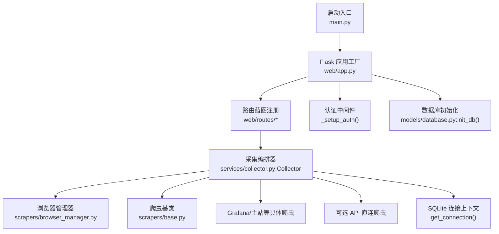
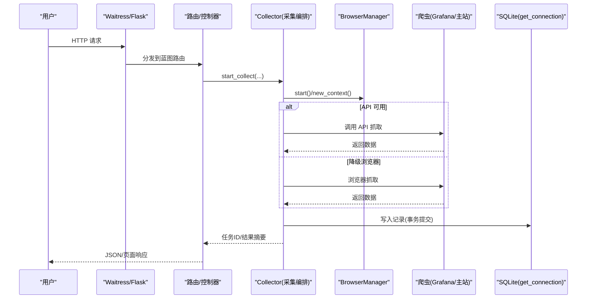
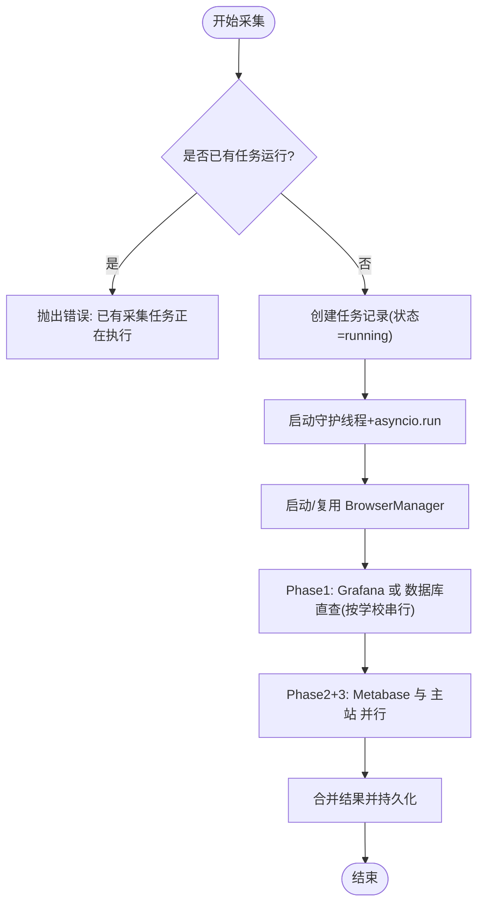
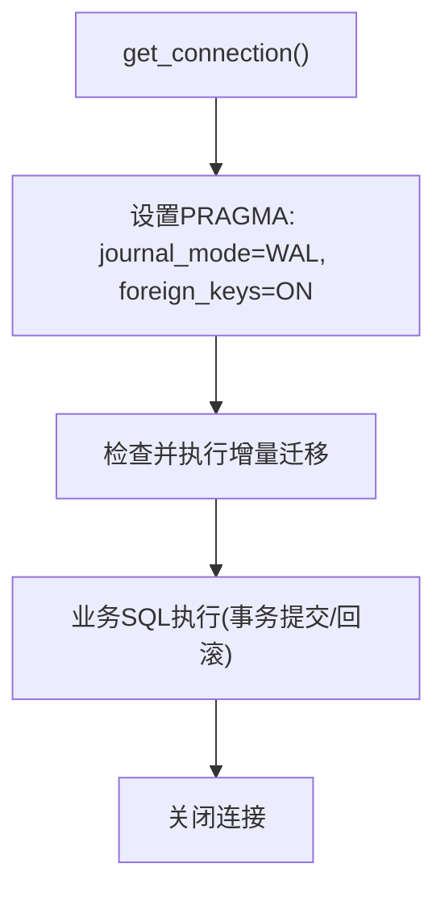
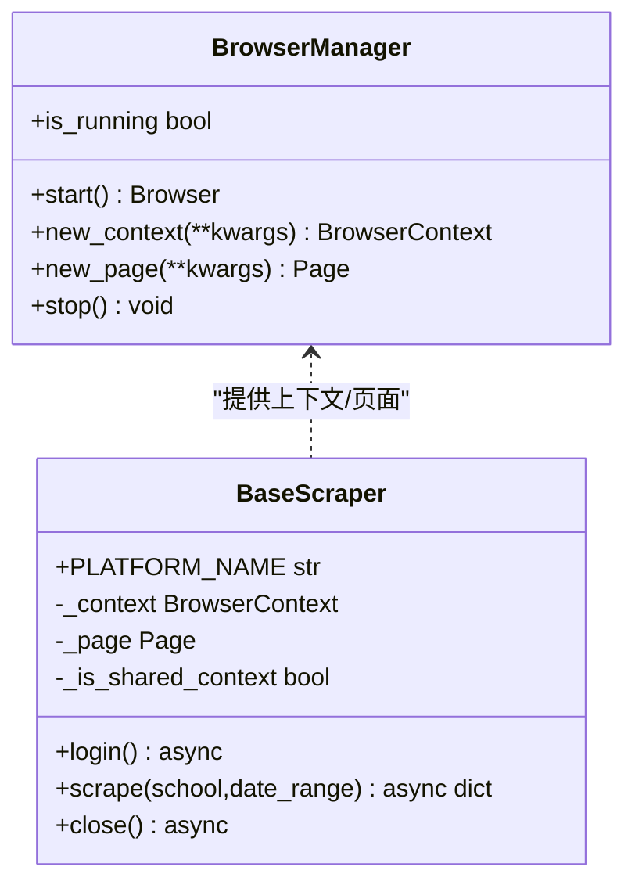
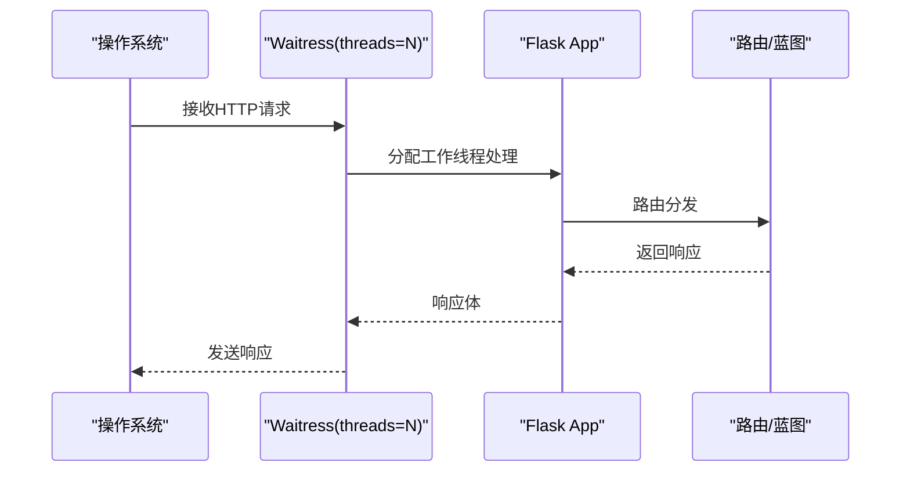
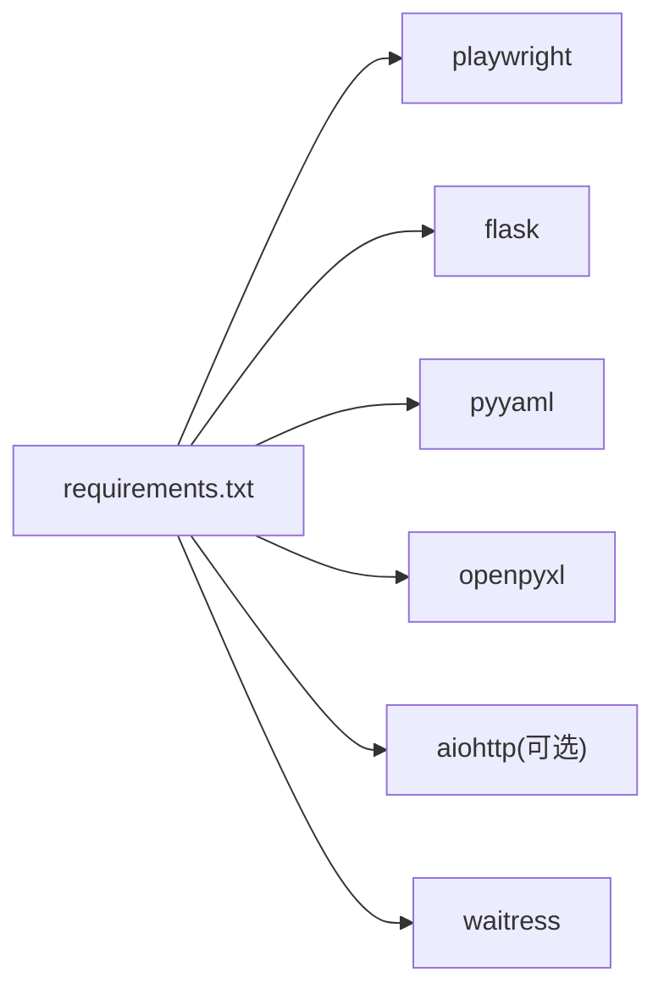

# 性能调优

<cite>
**本文引用的文件**   
- [main.py](file://middle-platform-data-collector-master/main.py)
- [web/app.py](file://middle-platform-data-collector-master/web/app.py)
- [models/database.py](file://middle-platform-data-collector-master/models/database.py)
- [scrapers/browser_manager.py](file://middle-platform-data-collector-master/scrapers/browser_manager.py)
- [services/collector.py](file://middle-platform-data-collector-master/services/collector.py)
- [config/config_loader.py](file://middle-platform-data-collector-master/config/config_loader.py)
- [scrapers/base.py](file://middle-platform-data-collector-master/scrapers/base.py)
- [requirements.txt](file://middle-platform-data-collector-master/requirements.txt)
</cite>

## 目录
1. [简介](#简介)
2. [项目结构](#项目结构)
3. [核心组件](#核心组件)
4. [架构总览](#架构总览)
5. [详细组件分析](#详细组件分析)
6. [依赖分析](#依赖分析)
7. [性能考虑](#性能考虑)
8. [故障排查指南](#故障排查指南)
9. [结论](#结论)
10. [附录](#附录)

## 简介
本指南面向数据采集与展示平台的生产环境，围绕采集并发、数据库（SQLite）、浏览器自动化（Playwright）以及 Web 服务（Flask + Waitress）四个维度，提供可操作的优化策略与最佳实践。文档同时给出监控指标建议、压力测试方法与瓶颈定位思路，帮助在真实负载下稳定提升吞吐并降低延迟。

## 项目结构
系统采用分层组织：Web 层（Flask 应用与蓝图）、服务编排层（异步采集器）、爬虫层（Playwright 与可选 API 直连）、数据层（SQLite 模型与迁移）。启动入口根据运行模式选择 Flask 开发服务器或 Waitress 生产服务器。

图示来源
- [main.py:10-41](file://middle-platform-data-collector-master/main.py#L10-L41)
- [web/app.py:306-336](file://middle-platform-data-collector-master/web/app.py#L306-L336)
- [models/database.py:204-372](file://middle-platform-data-collector-master/models/database.py#L204-L372)
- [services/collector.py:133-212](file://middle-platform-data-collector-master/services/collector.py#L133-L212)
- [scrapers/browser_manager.py:18-56](file://middle-platform-data-collector-master/scrapers/browser_manager.py#L18-L56)
- [scrapers/base.py:12-36](file://middle-platform-data-collector-master/scrapers/base.py#L12-L36)

章节来源
- [main.py:10-41](file://middle-platform-data-collector-master/main.py#L10-L41)
- [web/app.py:306-336](file://middle-platform-data-collector-master/web/app.py#L306-L336)

## 核心组件
- 启动与 WSGI 服务器：根据参数切换 Flask dev server 或 Waitress；生产默认使用多线程 Waitress。
- Flask 应用工厂：统一日志、蓝图注册、认证中间件、模板与静态资源路径。
- 采集编排器：按平台优先顺序调度 Grafana/Metabase/主站，支持 API 直连与浏览器降级，事件广播进度。
- 浏览器管理器：Playwright 生命周期管理，无头/有头视口、超时、CSP 绕过、共享上下文复用。
- SQLite 数据层：WAL 模式、外键约束、表结构与增量迁移、默认管理员创建。

章节来源
- [main.py:15-37](file://middle-platform-data-collector-master/main.py#L15-L37)
- [web/app.py:14-24](file://middle-platform-data-collector-master/web/app.py#L14-L24)
- [web/app.py:253-304](file://middle-platform-data-collector-master/web/app.py#L253-L304)
- [services/collector.py:65-176](file://middle-platform-data-collector-master/services/collector.py#L65-L176)
- [scrapers/browser_manager.py:11-76](file://middle-platform-data-collector-master/scrapers/browser_manager.py#L11-L76)
- [models/database.py:24-48](file://middle-platform-data-collector-master/models/database.py#L24-L48)
- [models/database.py:204-372](file://middle-platform-data-collector-master/models/database.py#L204-L372)

## 架构总览
下图展示了从请求到采集落库的关键路径，包括认证、任务编排、浏览器与数据库交互。

图示来源
- [main.py:20-37](file://middle-platform-data-collector-master/main.py#L20-L37)
- [web/app.py:306-336](file://middle-platform-data-collector-master/web/app.py#L306-L336)
- [services/collector.py:133-212](file://middle-platform-data-collector-master/services/collector.py#L133-L212)
- [scrapers/browser_manager.py:18-56](file://middle-platform-data-collector-master/scrapers/browser_manager.py#L18-L56)
- [models/database.py:24-48](file://middle-platform-data-collector-master/models/database.py#L24-L48)

## 详细组件分析

### 采集并发与线程池
- 后台执行模型：每个采集任务在独立守护线程中通过 asyncio.run 启动事件循环，避免阻塞 Web 线程。
- 并发边界：
  - 同一进程内仅允许一个采集任务运行（重复启动会抛错），防止多任务竞争浏览器与数据库资源。
  - 平台内学校串行执行，平台间可并行（如 Metabase 与主站并行），减少登录态冲突与外部限流风险。
  - 主站 API 与浏览器共享同一 BrowserContext，避免重复登录导致会话被顶下线。
- 可调参数与影响：
  - Waitress threads：控制并发处理 HTTP 请求的线程数，需结合 CPU 核数与 IO 密集程度调整。
  - 浏览器 slow_mo：调试时增大以观察流程，生产应设为 0 以降低额外等待。
  - 默认超时 default_timeout：影响页面等待网络空闲与元素出现的上限，过大易拖慢整体耗时。
  - channel_timeout：长连接超时，避免客户端挂起占用线程。

图示来源
- [services/collector.py:133-176](file://middle-platform-data-collector-master/services/collector.py#L133-L176)
- [services/collector.py:195-212](file://middle-platform-data-collector-master/services/collector.py#L195-L212)
- [services/collector.py:631-729](file://middle-platform-data-collector-master/services/collector.py#L631-L729)
- [scrapers/browser_manager.py:18-56](file://middle-platform-data-collector-master/scrapers/browser_manager.py#L18-L56)

章节来源
- [services/collector.py:133-176](file://middle-platform-data-collector-master/services/collector.py#L133-L176)
- [services/collector.py:195-212](file://middle-platform-data-collector-master/services/collector.py#L195-L212)
- [services/collector.py:631-729](file://middle-platform-data-collector-master/services/collector.py#L631-L729)
- [scrapers/browser_manager.py:18-56](file://middle-platform-data-collector-master/scrapers/browser_manager.py#L18-L56)

### 数据库性能优化（SQLite）
- 关键配置
  - WAL 模式：提高读写并发能力，减少写锁争用。
  - 外键约束：保证数据一致性。
  - 行工厂 Row：便于按列名访问，简化代码但略增开销。
- 索引与查询
  - 现有唯一约束：weekly_records/monthly_records/schools/users 等表存在 UNIQUE 约束，自动建立索引，利于去重与查找。
  - 建议新增索引：对高频过滤字段（如 school_name、year、week_number/month_number、status、collected_at）建立复合索引，以减少全表扫描。
  - 查询优化：尽量使用精确匹配与范围条件，避免在 WHERE 中对字段做函数计算；分页查询时使用 LIMIT/OFFSET 或游标式分页。
- 事务与批量写入
  - 采集落库已使用 get_connection 上下文，确保单条事务提交；大批量插入时可考虑批量化减少事务次数。
- 元数据与迁移
  - 启动时进行表结构检查与增量迁移，避免运行时 DDL 阻塞。

图示来源
- [models/database.py:24-48](file://middle-platform-data-collector-master/models/database.py#L24-L48)
- [models/database.py:204-372](file://middle-platform-data-collector-master/models/database.py#L204-L372)

章节来源
- [models/database.py:24-48](file://middle-platform-data-collector-master/models/database.py#L24-L48)
- [models/database.py:204-372](file://middle-platform-data-collector-master/models/database.py#L204-L372)

### 浏览器自动化性能优化（Playwright）
- 无头模式与视口
  - 无头模式启用标准视口，避免渲染差异导致的重试；有头模式关闭固定视口以便调试。
- 资源加载与等待
  - 导航使用 domcontentloaded，必要时等待 networkidle；合理设置 default_timeout，避免过长等待。
- 上下文与页面复用
  - 共享 BrowserContext 用于主站 API 与浏览器共用登录态，减少重复登录成本。
  - 每校之间清理多余标签页，保留必要页面，避免内存膨胀。
- 安全与稳定性
  - 跳过 CSP 限制以提升兼容性；清除 Cookie 避免旧会话干扰。
  - 两校之间短暂延时，降低触发目标站点风控的概率。

图示来源
- [scrapers/browser_manager.py:11-76](file://middle-platform-data-collector-master/scrapers/browser_manager.py#L11-L76)
- [scrapers/base.py:12-66](file://middle-platform-data-collector-master/scrapers/base.py#L12-L66)

章节来源
- [scrapers/browser_manager.py:18-56](file://middle-platform-data-collector-master/scrapers/browser_manager.py#L18-L56)
- [scrapers/base.py:24-36](file://middle-platform-data-collector-master/scrapers/base.py#L24-L36)
- [services/collector.py:676-716](file://middle-platform-data-collector-master/services/collector.py#L676-L716)

### Web 服务性能调优（Flask + Waitress）
- 服务器选择
  - 开发模式：Flask 内置服务器，开启 debug 与热重载，不适合生产。
  - 生产模式：Waitress WSGI 服务器，多线程、跨平台稳定。
- 线程与连接
  - threads：根据 CPU 核数与 IO 特性调整，通常设置为 2×CPU 核数起步，再压测微调。
  - channel_timeout：长连接超时，避免空闲连接长期占用线程。
- 静态资源与模板
  - 模板自动重载仅在开发阶段开启；生产建议关闭以减少开销。
  - 静态资源由 Flask 托管，生产建议前置 CDN/反向代理缓存。

图示来源
- [main.py:20-37](file://middle-platform-data-collector-master/main.py#L20-L37)
- [web/app.py:306-314](file://middle-platform-data-collector-master/web/app.py#L306-L314)

章节来源
- [main.py:15-37](file://middle-platform-data-collector-master/main.py#L15-L37)
- [web/app.py:306-314](file://middle-platform-data-collector-master/web/app.py#L306-L314)

## 依赖分析
- 运行时依赖
  - playwright：浏览器自动化
  - flask：Web 框架
  - pyyaml：配置解析
  - openpyxl：导出 Excel
  - aiohttp：可选 API 直连（若安装则启用）
  - waitress：生产 WSGI 服务器
- 可选加速路径
  - 当 aiohttp 可用且 api_mode=true 时，优先走 API 直连，失败再降级至浏览器模式，显著降低首包延迟与资源消耗。

图示来源
- [requirements.txt:1-7](file://middle-platform-data-collector-master/requirements.txt#L1-L7)

章节来源
- [requirements.txt:1-7](file://middle-platform-data-collector-master/requirements.txt#L1-L7)

## 性能考虑
- 采集并发数配置
  - 最大并发限制：当前实现为单任务串行（防竞态），平台内串行、平台间并行。如需更高并发，可在不破坏登录态的前提下拆分更多并行阶段，并对共享上下文加锁。
  - 线程池大小：Waitress threads 建议从 2×CPU 核数起步，逐步压测上调；若大量 IO 等待可适当增加。
  - 内存使用优化：
    - 浏览器：及时关闭多余页面，避免长时间持有大对象；按需创建 context，避免全局常驻过多上下文。
    - 数据库：WAL 模式下注意 wal 文件大小增长，定期 VACUUM 或归档。
- 数据库性能优化
  - SQLite 参数：保持 WAL 与外键开启；可按需调整 cache_size、mmap_size 等 PRAGMA（谨慎评估磁盘空间与内存）。
  - 索引策略：对高频查询字段建立合适索引，避免过度索引导致写入放大。
  - 查询优化：减少 SELECT *，只取必要列；使用覆盖索引；避免在 WHERE 中使用函数包裹字段。
- 浏览器自动化优化
  - 无头模式：生产务必启用 headless，关闭 GPU 与沙盒参数已在启动处设置。
  - 资源加载：合理设置 default_timeout，避免过长的网络空闲等待；必要时使用更精准的等待策略替代 networkidle。
  - 缓存策略：按需清除 Cookie/存储，避免旧数据污染；共享 context 复用登录态，减少重复登录。
- Web 服务优化
  - Flask：关闭 TEMPLATES_AUTO_RELOAD；生产前置 Nginx/Caddy 做静态资源缓存与压缩。
  - 响应时间：将耗时操作（采集）放入后台任务，接口尽快返回任务 ID，前端轮询或 SSE 获取进度。
- 监控指标建议
  - CPU 使用率：关注 Waitress 工作线程利用率与 Python 进程 CPU。
  - 内存占用：监控 Python RSS、浏览器进程内存、SQLite WAL 体积。
  - 网络 IO：统计对外请求成功率、平均延迟、超时比例；关注目标站点限流与验证码触发频率。
  - 数据库：SQLite 写入延迟、锁等待、事务回滚次数。
- 压力测试方法
  - 使用 wrk/httpie 对 /api/* 接口发起并发请求，观察 P50/P95/P99 延迟与错误率。
  - 模拟多次采集任务排队，验证线程池与任务队列行为。
  - 针对浏览器模式，构造不同学校规模与日期范围的用例，评估上下文复用效果。
- 瓶颈识别工具
  - 系统级：top/htop、perf、iostat、netstat/ss。
  - Python 级：cProfile/py-spy 定位热点函数；logging 输出各平台耗时与错误堆栈。
  - 浏览器级：Playwright trace 录制与分析。
  - 数据库级：sqlite3 .mode csv/.import 导出慢查询样本，或使用 EXPLAIN QUERY PLAN 分析执行计划。
- 调优最佳实践
  - 先稳后快：确保正确性与稳定性，再逐步放开并发与超时。
  - 渐进式压测：每次只改一个变量（如 threads、slow_mo、default_timeout），对比指标变化。
  - 灰度上线：先在低峰期小流量验证，再逐步放量。
  - 观测驱动：以日志与指标为依据，避免凭感觉调整。

[本节为通用指导，无需特定文件引用]

## 故障排查指南
- 常见问题
  - 重复启动采集任务：当前实现会拒绝并发任务，需等待前次完成或重启服务。
  - 浏览器登录态失效：主站共享 context 方案可减少此问题；必要时重新创建 context。
  - 数据库写入异常：检查 WAL 文件权限与磁盘空间；查看事务回滚日志。
  - 接口超时：检查 Waitress channel_timeout 与后端任务耗时，必要时拆分任务。
- 定位步骤
  - 查看应用日志：确认错误堆栈与耗时分布。
  - 检查浏览器上下文：确认页面是否打开成功、是否存在弹窗或验证码。
  - 分析数据库：确认索引是否命中、是否存在锁等待。
  - 复现最小用例：缩小学校数量与时间范围，快速定位根因。

章节来源
- [services/collector.py:161-162](file://middle-platform-data-collector-master/services/collector.py#L161-L162)
- [services/collector.py:676-716](file://middle-platform-data-collector-master/services/collector.py#L676-L716)
- [models/database.py:24-48](file://middle-platform-data-collector-master/models/database.py#L24-L48)

## 结论
通过合理的并发控制、SQLite 参数与索引优化、浏览器上下文复用与超时调优，以及 Waitress 线程数与静态资源缓存策略，可以在保障稳定性的前提下显著提升系统的吞吐与响应速度。建议以指标为导向，持续压测与回归，形成稳定的性能基线与调优闭环。

[本节为总结性内容，无需特定文件引用]

## 附录
- 配置文件要点（来自配置加载器）
  - browser.headless：生产建议 True
  - browser.slow_mo：生产建议 0
  - browser.default_timeout：根据目标站点响应情况设定
  - credentials.*：确保 url/username/password 完整
  - database.metabase_db_path：可通过环境变量覆盖

章节来源
- [config/config_loader.py:39-96](file://middle-platform-data-collector-master/config/config_loader.py#L39-L96)
- [config/config_loader.py:122-147](file://middle-platform-data-collector-master/config/config_loader.py#L122-L147)