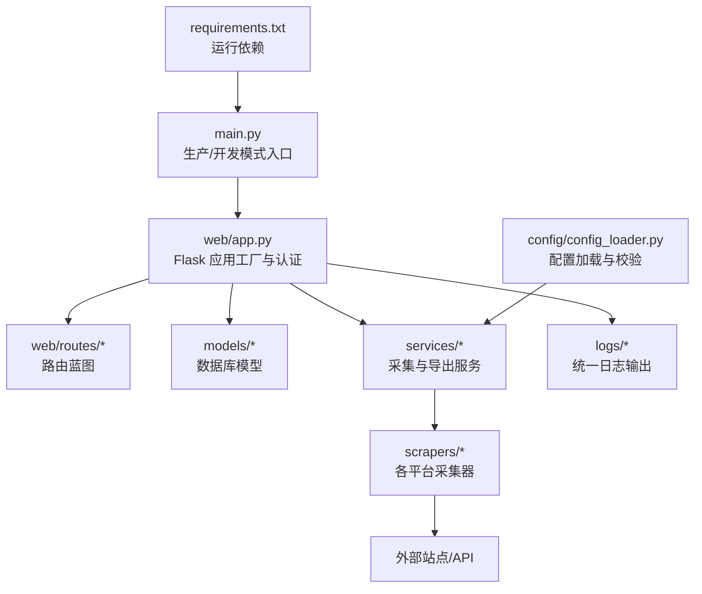
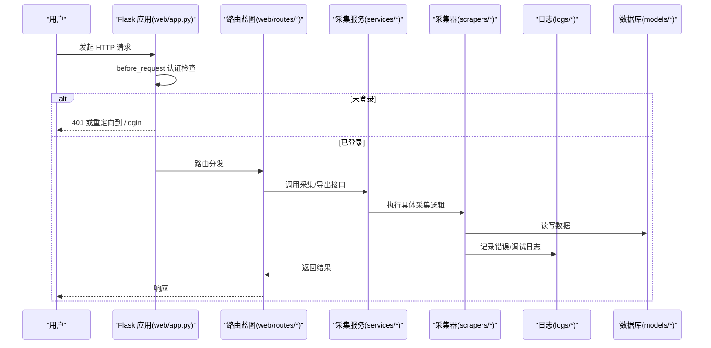
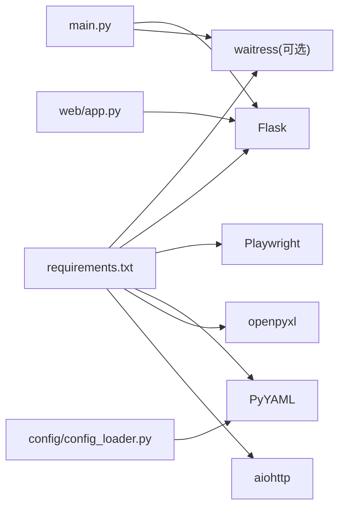
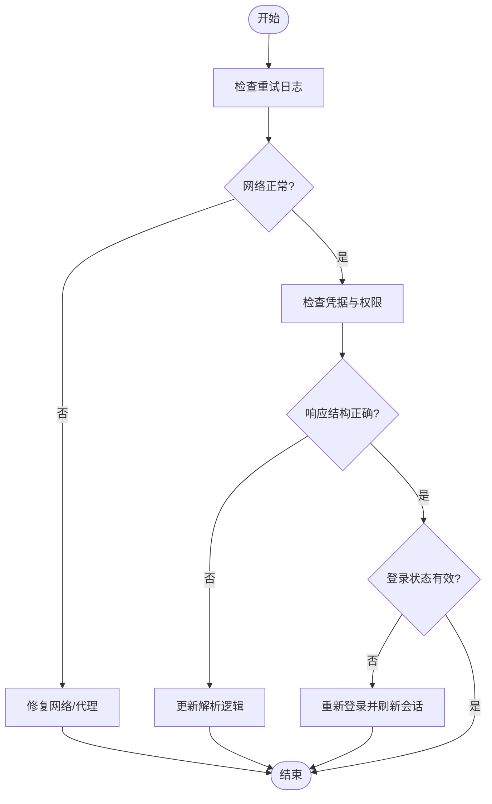

# 故障排查

<cite>
**本文引用的文件**   
- [main.py](file://main.py)
- [run_dev.py](file://run_dev.py)
- [requirements.txt](file://requirements.txt)
- [config_loader.py](file://config/config_loader.py)
- [app.py](file://web/app.py)
- [retry.py](file://scrapers/retry.py)
- [grafana_scraper.py](file://scrapers/grafana_scraper.py)
- [history.html](file://web/templates/history.html)
</cite>

## 目录
1. [简介](#简介)
2. [项目结构](#项目结构)
3. [核心组件](#核心组件)
4. [架构总览](#架构总览)
5. [详细组件分析](#详细组件分析)
6. [依赖关系分析](#依赖关系分析)
7. [性能与稳定性](#性能与稳定性)
8. [故障排查指南](#故障排查指南)
9. [健康检查清单](#健康检查清单)
10. [应急预案与恢复流程](#应急预案与恢复流程)
11. [结论](#结论)

## 简介
本指南面向数据采集系统的运维与开发人员，聚焦于常见故障类型（网络连接、认证失败、数据解析错误、浏览器自动化异常）的识别与定位方法，提供日志分析方法、调试工具与技巧、数据采集失败的排查流程、系统健康检查清单以及应急预案与恢复步骤。文档内容基于仓库中的实际实现进行梳理，确保可操作性与可追溯性。

## 项目结构
系统采用 Flask Web 应用作为入口，结合爬虫采集器、配置加载器、数据库模型与导出模块，形成“Web 服务 + 采集任务 + 数据存储”的整体架构。关键入口与启动脚本位于根目录，Web 蓝图按功能拆分，配置集中管理，日志统一输出到 logs 目录。

图表来源
- [main.py:1-42](file://main.py#L1-L42)
- [app.py:1-337](file://web/app.py#L1-L337)
- [config_loader.py:1-147](file://config/config_loader.py#L1-L147)
- [requirements.txt:1-7](file://requirements.txt#L1-L7)

章节来源
- [main.py:1-42](file://main.py#L1-L42)
- [run_dev.py:1-15](file://run_dev.py#L1-L15)
- [requirements.txt:1-7](file://requirements.txt#L1-L7)
- [config_loader.py:1-147](file://config/config_loader.py#L1-L147)
- [app.py:1-337](file://web/app.py#L1-L337)

## 核心组件
- 应用入口与服务器选择：支持开发模式（Flask dev server）与生产模式（waitress），便于本地调试与稳定部署。
- 认证与会话：基于会话的用户登录校验，拦截未登录访问并返回相应状态码或重定向。
- 配置加载与校验：集中读取 YAML 配置，校验必填字段并提供用户级凭证覆盖机制。
- 重试与容错：通用重试装饰器，支持同步/异步函数，指数退避与可重试异常类型配置。
- 数据解析与日志：针对 JSON 响应解析失败进行调试日志记录，辅助快速定位数据结构变更问题。
- 前端历史展示：在历史记录页面中汇总各平台采集结果与错误信息，便于可视化排查。

章节来源
- [main.py:10-37](file://main.py#L10-L37)
- [app.py:253-304](file://web/app.py#L253-L304)
- [config_loader.py:21-74](file://config/config_loader.py#L21-L74)
- [retry.py:1-81](file://scrapers/retry.py#L1-L81)
- [grafana_scraper.py:604-619](file://scrapers/grafana_scraper.py#L604-L619)
- [history.html:429-458](file://web/templates/history.html#L429-L458)

## 架构总览
下图展示了从请求进入、认证校验、路由分发到采集执行与日志输出的整体流程。

图表来源
- [app.py:253-304](file://web/app.py#L253-L304)
- [app.py:306-337](file://web/app.py#L306-L337)

## 详细组件分析

### 认证与会话
- 行为说明：所有非静态资源与非登录页的请求在进入前会检查会话；若未登录，API 返回 401，页面跳转至登录页并携带 next 参数。
- 常见问题：
  - 未设置 SECRET_KEY 或会话失效导致频繁登出。
  - 跨域或代理环境下 Cookie 丢失。
- 定位方法：
  - 查看登录页渲染与提交逻辑，确认 next 参数传递是否正确。
  - 检查 before_request 拦截路径与返回状态码。
- 修复建议：
  - 确认应用初始化时设置了 SECRET_KEY。
  - 在生产环境使用稳定的会话存储与安全的 Cookie 策略。

章节来源
- [app.py:253-304](file://web/app.py#L253-L304)

### 配置加载与校验
- 行为说明：优先从缓存加载配置，不存在则读取 YAML 并校验必填字段；支持用户级凭证覆盖；提供 Metabase 数据库路径优先级策略。
- 常见问题：
  - 配置文件缺失或字段不完整导致启动失败。
  - 用户覆盖未生效或覆盖键名不一致。
- 定位方法：
  - 捕获 FileNotFoundError 与 ValueError 的具体提示，核对 config.yaml 与 credentials 字段。
  - 检查 get_credentials 的覆盖逻辑是否命中。
- 修复建议：
  - 确保存在示例配置并正确复制为真实配置。
  - 明确 platform 名称与键名一致，避免覆盖失败。

章节来源
- [config_loader.py:21-74](file://config/config_loader.py#L21-L74)
- [config_loader.py:89-119](file://config/config_loader.py#L89-L119)
- [config_loader.py:122-147](file://config/config_loader.py#L122-L147)

### 重试与容错
- 行为说明：通用重试装饰器对超时、连接错误等异常进行指数退避重试，支持同步/异步函数，并在最后一次失败时记录错误日志。
- 常见问题：
  - 网络抖动导致多次重试仍失败。
  - 可重试异常类型未包含目标异常，导致不重试直接失败。
- 定位方法：
  - 关注装饰器日志中的尝试次数、等待时间与异常信息。
  - 根据 on_retry 回调统计重试分布。
- 修复建议：
  - 调整 max_attempts 与 backoff_base 以匹配目标服务的稳定性。
  - 扩展 retryable_errors 以覆盖更多临时性错误。

章节来源
- [retry.py:1-81](file://scrapers/retry.py#L1-L81)

### 数据解析错误
- 行为说明：针对 JSON 响应解析失败进行调试日志记录，打印响应长度与顶层键集合，帮助判断服务端返回结构变化。
- 常见问题：
  - 上游 API 返回格式变更导致解析失败。
  - 空响应或非 JSON 文本导致解码异常。
- 定位方法：
  - 查看解析失败的调试日志，比对预期结构与实际 keys。
  - 在前端历史记录中查看错误消息聚合。
- 修复建议：
  - 增加健壮的结构校验与降级处理。
  - 对异常响应做告警与人工复核。

章节来源
- [grafana_scraper.py:604-619](file://scrapers/grafana_scraper.py#L604-L619)
- [history.html:429-458](file://web/templates/history.html#L429-L458)

### 浏览器自动化异常
- 行为说明：通过 Playwright 驱动浏览器进行自动化采集，受 headless 模式、超时、慢动作等配置影响。
- 常见问题：
  - headless 模式下页面元素不可见或反爬检测。
  - 默认超时过短导致页面未加载完成。
- 定位方法：
  - 切换为非 headless 模式观察页面渲染过程。
  - 调整 default_timeout 与 slow_mo 提升稳定性。
- 修复建议：
  - 针对不同站点定制等待策略与选择器。
  - 增加截图与 DOM 快照用于离线分析。

章节来源
- [config_loader.py:39-47](file://config/config_loader.py#L39-L47)

## 依赖关系分析
- 运行依赖：Playwright、Flask、PyYAML、openpyxl、aiohttp、waitress。
- 启动依赖：生产模式优先使用 waitress，未安装则回退到 Flask dev server。
- 配置依赖：YAML 配置文件必须存在且包含必要字段。

图表来源
- [requirements.txt:1-7](file://requirements.txt#L1-L7)
- [main.py:20-37](file://main.py#L20-L37)
- [app.py:306-337](file://web/app.py#L306-L337)
- [config_loader.py:1-18](file://config/config_loader.py#L1-L18)

章节来源
- [requirements.txt:1-7](file://requirements.txt#L1-L7)
- [main.py:20-37](file://main.py#L20-L37)

## 性能与稳定性
- 服务器线程数：生产模式 waitress 默认线程数为 8，可根据 CPU 与 IO 负载调整。
- 通道超时：channel_timeout 设置为 120 秒，避免长耗时请求被提前断开。
- 重试策略：指数退避可有效缓解瞬时拥塞，但需平衡最大尝试次数与总体耗时。
- 浏览器性能：headless 模式更省资源，但可能遇到渲染差异；适当增大超时与降低并发有助于稳定。

章节来源
- [main.py:32-33](file://main.py#L32-L33)
- [retry.py:13-27](file://scrapers/retry.py#L13-L27)

## 故障排查指南

### 常见故障类型与解决方法
- 网络连接问题
  - 现象：采集任务频繁超时或连接失败。
  - 定位：查看重试装饰器的警告与错误日志，确认网络可达性与 DNS 解析。
  - 解决：调整 backoff_base 与 max_attempts；检查防火墙与代理设置；必要时切换到备用网络。
- 认证失败
  - 现象：访问 /api/* 返回 401 或被重定向到 /login。
  - 定位：检查 before_request 拦截逻辑与会话状态；确认 SECRET_KEY 与 Cookie 策略。
  - 解决：重新登录并确保 next 参数正确；在生产环境启用安全 Cookie 与 HTTPS。
- 数据解析错误
  - 现象：JSON 解析失败或字段缺失。
  - 定位：查看解析失败的调试日志与响应 keys；在前端历史记录中查看错误消息聚合。
  - 解决：适配新的响应结构；增加健壮校验与降级处理；对异常响应告警。
- 浏览器自动化异常
  - 现象：页面元素找不到、渲染异常或超时。
  - 定位：切换为非 headless 模式观察；调整 default_timeout 与 slow_mo。
  - 解决：更新选择器与等待策略；增加截图与 DOM 快照；限制并发。

章节来源
- [retry.py:1-81](file://scrapers/retry.py#L1-L81)
- [app.py:253-304](file://web/app.py#L253-L304)
- [grafana_scraper.py:604-619](file://scrapers/grafana_scraper.py#L604-L619)
- [history.html:429-458](file://web/templates/history.html#L429-L458)
- [config_loader.py:39-47](file://config/config_loader.py#L39-L47)

### 日志分析方法
- 错误日志定位
  - 位置：logs/app.log。
  - 关键字：搜索 “第 N/M 次尝试失败”、“JSON 解析失败”、“未登录” 等。
- 调试信息提取
  - 采集器：关注响应长度与顶层 keys，用于判断结构变更。
  - 重试装饰器：记录每次尝试的异常与等待时间，便于评估网络质量。
- 问题根因分析
  - 将前端历史记录的错误消息与后端日志关联，定位具体平台与时间点。
  - 结合配置项（如 default_timeout、headless）评估是否为环境因素导致。

章节来源
- [app.py:14-24](file://web/app.py#L14-L24)
- [grafana_scraper.py:604-619](file://scrapers/grafana_scraper.py#L604-L619)
- [retry.py:40-77](file://scrapers/retry.py#L40-L77)
- [history.html:429-458](file://web/templates/history.html#L429-L458)

### 调试工具与技巧
- 断点调试
  - 使用 run_dev.py 启动开发模式（端口 5001），配合 IDE 断点逐步验证登录与采集流程。
- 性能分析
  - 调整 waitress threads 与 channel_timeout，观察吞吐与时延变化。
  - 使用浏览器开发者工具对比 headless 与非 headless 渲染差异。
- 内存泄漏检测
  - 长时间运行后监控进程内存增长，结合 GC 统计与对象引用分析定位潜在泄漏。
  - 对浏览器实例与数据库连接进行显式释放与复用优化。

章节来源
- [run_dev.py:1-15](file://run_dev.py#L1-L15)
- [main.py:20-37](file://main.py#L20-L37)

### 数据采集失败排查流程
- API 调用失败
  - 步骤：检查重试日志 → 确认网络连通 → 验证凭据与权限 → 查看响应结构与解析日志。
- 页面结构变更
  - 步骤：在非 headless 模式复现 → 更新选择器与等待策略 → 增加结构快照与告警。
- 登录状态失效
  - 步骤：检查会话与会话有效期 → 确认 next 参数传递 → 重新登录并验证后续请求。

[此图为概念流程图，无需图表来源]

## 健康检查清单
- 依赖服务验证
  - 确认 Playwright 浏览器可用。
  - 验证外部 API 可达性与鉴权。
- 配置完整性检查
  - 检查 config.yaml 是否存在且包含 credentials 与 browser 必填字段。
  - 确认用户级凭证覆盖是否生效。
- 资源使用监控
  - 监控 CPU、内存、磁盘与网络带宽。
  - 关注 waitress 线程池与队列积压情况。

章节来源
- [config_loader.py:21-74](file://config/config_loader.py#L21-L74)
- [config_loader.py:89-119](file://config/config_loader.py#L89-L119)
- [main.py:32-33](file://main.py#L32-L33)

## 应急预案与恢复流程
- 数据一致性校验
  - 对比采集前后记录数量与关键字段，发现缺失或重复立即告警。
  - 对关键指标进行抽样校验，确保数值范围合理。
- 灾难恢复操作步骤
  - 停止采集任务，防止错误扩散。
  - 回滚最近一次稳定版本或配置。
  - 重建会话与凭据，重新执行增量采集。
  - 验证数据完整性与业务报表一致性。
- 恢复后验证
  - 运行最小化采集任务，确认端到端链路畅通。
  - 持续观察日志与监控指标至少一个完整周期。

[本节为通用指导，不直接分析具体文件，故无章节来源]

## 结论
通过统一的日志输出、健壮的重试机制、严格的配置校验与可视化的历史记录，系统具备较强的可观测性与可维护性。在实际运维中，建议结合健康检查清单与应急预案，建立常态化的巡检与演练机制，确保数据采集链路的稳定与可靠。