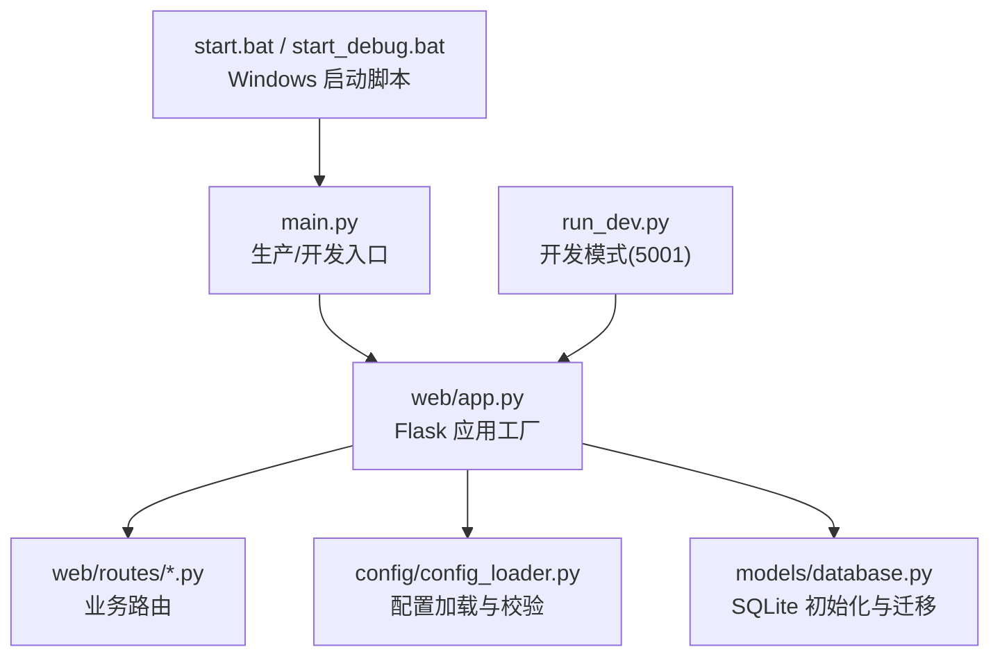
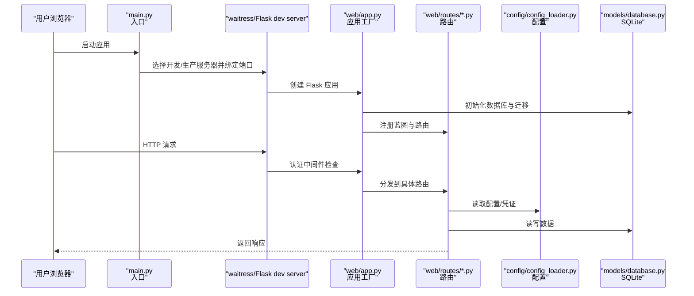
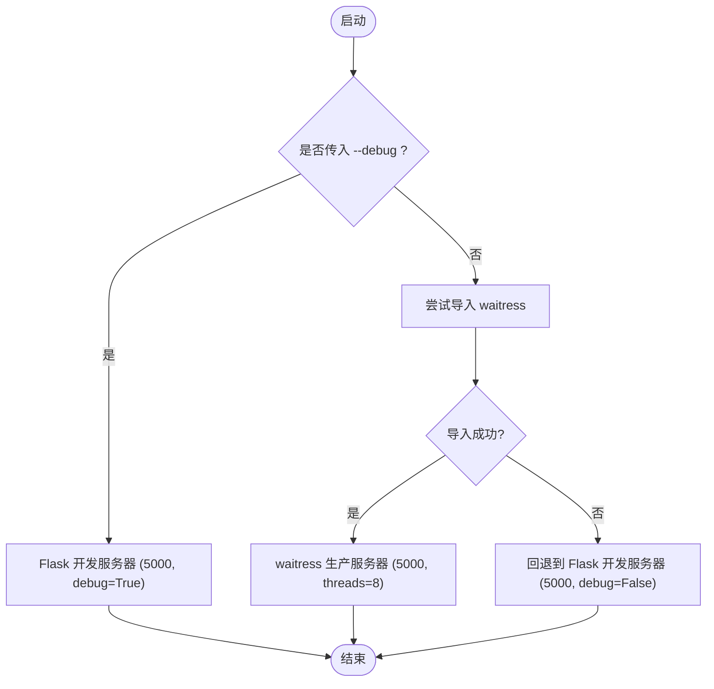
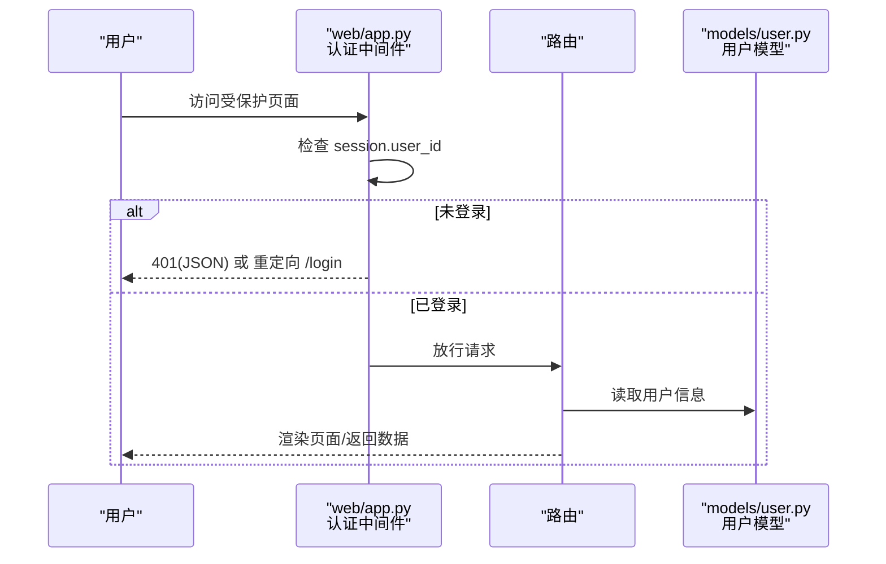
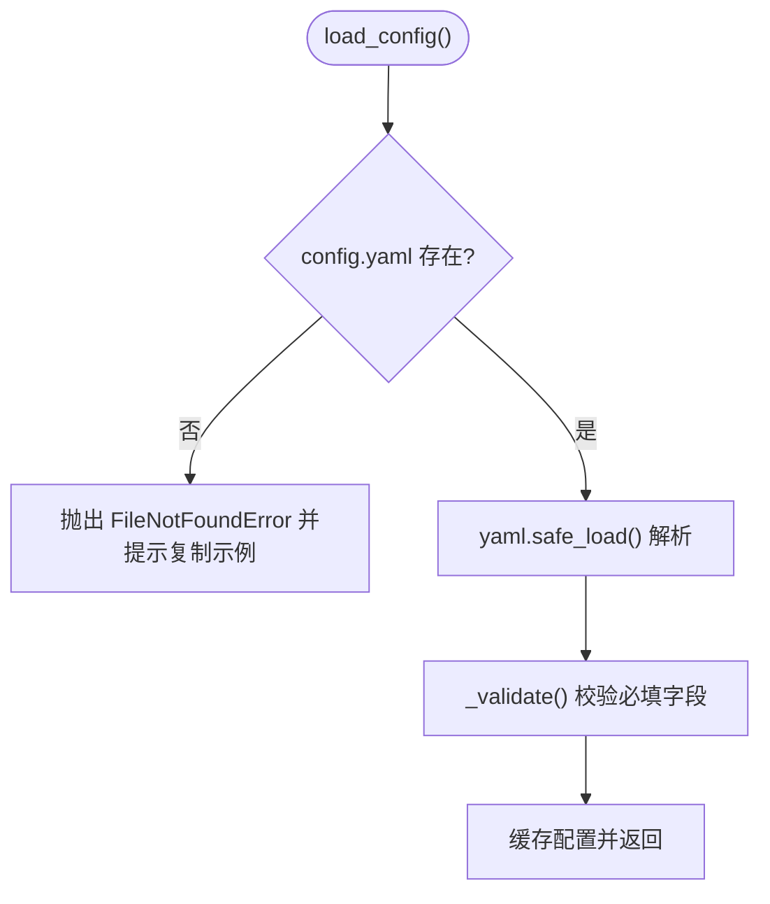
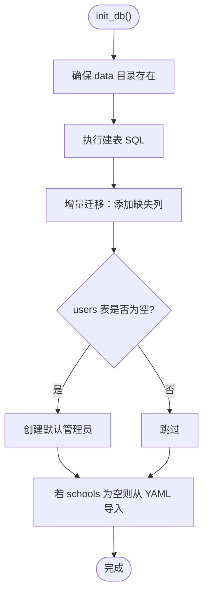
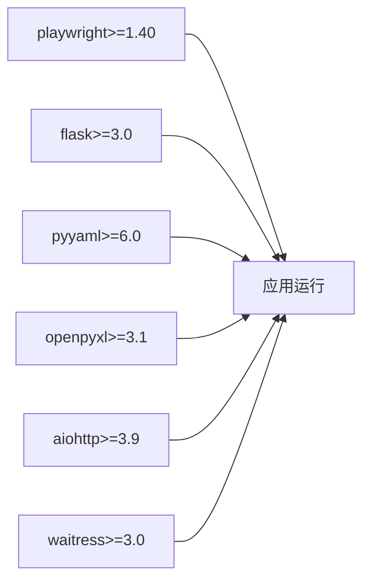

# 环境部署

<cite>
**本文引用的文件**   
- [requirements.txt](file://middle-platform-data-collector-master/requirements.txt)
- [main.py](file://middle-platform-data-collector-master/main.py)
- [run_dev.py](file://middle-platform-data-collector-master/run_dev.py)
- [start.bat](file://middle-platform-data-collector-master/start.bat)
- [start_debug.bat](file://middle-platform-data-collector-master/start_debug.bat)
- [web/app.py](file://middle-platform-data-collector-master/web/app.py)
- [config/config_loader.py](file://middle-platform-data-collector-master/config/config_loader.py)
- [models/database.py](file://middle-platform-data-collector-master/models/database.py)
- [web/routes/main.py](file://middle-platform-data-collector-master/web/routes/main.py)
- [.gitignore](file://middle-platform-data-collector-master/.gitignore)
</cite>

## 目录
1. [简介](#简介)
2. [项目结构](#项目结构)
3. [核心组件](#核心组件)
4. [架构总览](#架构总览)
5. [详细组件分析](#详细组件分析)
6. [依赖关系分析](#依赖关系分析)
7. [性能与运行特性](#性能与运行特性)
8. [故障排查指南](#故障排查指南)
9. [结论](#结论)
10. [附录：配置与环境变量清单](#附录配置与环境变量清单)

## 简介
本指南面向开发者与运维人员，提供“教育平台数据自动采集系统”的完整环境搭建与启动说明。内容覆盖多操作系统（Windows、Linux、macOS）的环境准备、Python 版本与系统依赖、虚拟环境创建与依赖安装、浏览器驱动初始化（Playwright）、配置文件结构与参数含义、数据库连接与用户凭证管理、启动脚本与环境变量、端口与服务配置，以及常见问题定位与解决建议。

## 项目结构
本项目采用分层组织方式：
- 入口与启动：主入口 main.py、开发模式 run_dev.py、Windows 快捷脚本 start.bat 与 start_debug.bat
- Web 服务：基于 Flask 的应用工厂 web/app.py 与各功能蓝图路由
- 配置加载：YAML 配置加载与校验 config/config_loader.py
- 数据持久化：SQLite 数据库初始化与迁移 models/database.py
- 数据采集：scrapers 模块（浏览器与 API 抓取）
- 工具与测试：tools 目录下的辅助脚本
- 静态资源与模板：web/static、web/templates

图表来源
- [main.py:1-42](file://middle-platform-data-collector-master/main.py#L1-L42)
- [web/app.py:306-337](file://middle-platform-data-collector-master/web/app.py#L306-L337)
- [config/config_loader.py:21-36](file://middle-platform-data-collector-master/config/config_loader.py#L21-L36)
- [models/database.py:201-372](file://middle-platform-data-collector-master/models/database.py#L201-L372)
- [run_dev.py:1-15](file://middle-platform-data-collector-master/run_dev.py#L1-L15)
- [start.bat:1-11](file://middle-platform-data-collector-master/start.bat#L1-L11)
- [start_debug.bat:1-8](file://middle-platform-data-collector-master/start_debug.bat#L1-L8)

章节来源
- [main.py:1-42](file://middle-platform-data-collector-master/main.py#L1-L42)
- [web/app.py:306-337](file://middle-platform-data-collector-master/web/app.py#L306-L337)
- [config/config_loader.py:21-36](file://middle-platform-data-collector-master/config/config_loader.py#L21-L36)
- [models/database.py:201-372](file://middle-platform-data-collector-master/models/database.py#L201-L372)
- [run_dev.py:1-15](file://middle-platform-data-collector-master/run_dev.py#L1-L15)
- [start.bat:1-11](file://middle-platform-data-collector-master/start.bat#L1-L11)
- [start_debug.bat:1-8](file://middle-platform-data-collector-master/start_debug.bat#L1-L8)

## 核心组件
- 应用工厂与认证：web/app.py 负责日志、Flask 实例化、蓝图注册、登录鉴权中间件与上下文注入
- 配置加载器：config/config_loader.py 负责 YAML 配置读取、必填字段校验、浏览器与凭证获取、Metabase 数据库路径解析
- 数据库层：models/database.py 负责 SQLite 连接、表结构初始化、增量迁移、默认管理员账户创建、首次从 YAML 导入学校数据
- 启动入口：main.py 支持开发/生产两种运行模式；run_dev.py 固定开发端口；Windows 批处理脚本封装激活虚拟环境与启动流程

章节来源
- [web/app.py:14-337](file://middle-platform-data-collector-master/web/app.py#L14-L337)
- [config/config_loader.py:1-147](file://middle-platform-data-collector-master/config/config_loader.py#L1-L147)
- [models/database.py:1-372](file://middle-platform-data-collector-master/models/database.py#L1-L372)
- [main.py:1-42](file://middle-platform-data-collector-master/main.py#L1-L42)
- [run_dev.py:1-15](file://middle-platform-data-collector-master/run_dev.py#L1-L15)
- [start.bat:1-11](file://middle-platform-data-collector-master/start.bat#L1-L11)
- [start_debug.bat:1-8](file://middle-platform-data-collector-master/start_debug.bat#L1-L8)

## 架构总览
下图展示了请求进入后的关键路径：入口选择服务器类型（开发或生产），Flask 应用工厂完成初始化与蓝图注册，认证中间件拦截未登录访问，路由调用模型与配置模块进行数据处理与返回。

图表来源
- [main.py:10-41](file://middle-platform-data-collector-master/main.py#L10-L41)
- [web/app.py:306-337](file://middle-platform-data-collector-master/web/app.py#L306-L337)
- [config/config_loader.py:21-36](file://middle-platform-data-collector-master/config/config_loader.py#L21-L36)
- [models/database.py:201-372](file://middle-platform-data-collector-master/models/database.py#L201-L372)

## 详细组件分析

### 启动与运行模式
- 生产模式：main.py 优先使用 waitress 作为 WSGI 服务器，监听 0.0.0.0:5000，多线程并发；若未安装 waitress 则回退到 Flask 内置服务器
- 开发模式：main.py 通过 --debug 参数启用调试模式；run_dev.py 固定使用 5001 端口便于本地开发避免冲突
- Windows 快捷脚本：start.bat 与 start_debug.bat 自动激活 venv 并调用 main.py

图表来源
- [main.py:10-41](file://middle-platform-data-collector-master/main.py#L10-L41)
- [run_dev.py:1-15](file://middle-platform-data-collector-master/run_dev.py#L1-L15)
- [start.bat:1-11](file://middle-platform-data-collector-master/start.bat#L1-L11)
- [start_debug.bat:1-8](file://middle-platform-data-collector-master/start_debug.bat#L1-L8)

章节来源
- [main.py:10-41](file://middle-platform-data-collector-master/main.py#L10-L41)
- [run_dev.py:1-15](file://middle-platform-data-collector-master/run_dev.py#L1-L15)
- [start.bat:1-11](file://middle-platform-data-collector-master/start.bat#L1-L11)
- [start_debug.bat:1-8](file://middle-platform-data-collector-master/start_debug.bat#L1-L8)

### 认证与权限控制
- 应用工厂在 before_request 中检查 session 中的 user_id，未登录时：
  - 对 /api/* 接口返回 401 JSON
  - 对其他页面重定向至 /login?next=...
- 登录页为内嵌 HTML 模板，提交后根据用户名查询用户记录，设置 session 并返回重定向地址
- 上下文处理器将当前用户信息注入模板

图表来源
- [web/app.py:253-304](file://middle-platform-data-collector-master/web/app.py#L253-L304)

章节来源
- [web/app.py:253-304](file://middle-platform-data-collector-master/web/app.py#L253-L304)

### 配置加载与校验
- 配置文件位置：config/config.yaml（示例参考 config/config.yaml.example）
- 加载流程：
  - 若不存在配置文件，抛出明确错误提示复制示例文件并填写真实信息
  - 校验 browser、credentials 等必填字段
  - 支持用户级凭证覆盖机制（set_user_creds_override/get_credentials）
- Metabase 数据库路径优先级：环境变量 METABASE_DB_PATH > config.yaml 中 database.metabase_db_path > 默认 data/metabase.db

图表来源
- [config/config_loader.py:21-36](file://middle-platform-data-collector-master/config/config_loader.py#L21-L36)
- [config/config_loader.py:39-74](file://middle-platform-data-collector-master/config/config_loader.py#L39-L74)
- [config/config_loader.py:122-147](file://middle-platform-data-collector-master/config/config_loader.py#L122-L147)

章节来源
- [config/config_loader.py:21-36](file://middle-platform-data-collector-master/config/config_loader.py#L21-L36)
- [config/config_loader.py:39-74](file://middle-platform-data-collector-master/config/config_loader.py#L39-L74)
- [config/config_loader.py:122-147](file://middle-platform-data-collector-master/config/config_loader.py#L122-L147)

### 数据库初始化与迁移
- 数据库文件：data/app.db（SQLite）
- 初始化流程：
  - 确保 data 目录存在
  - 执行表结构建表语句（weekly_records、collect_tasks、schools、monthly_records、users）
  - 增量迁移：检测并添加缺失列（如 platform_elapsed、record_type、display_name、type、data_source 等）
  - 首次启动时若 users 表为空，创建默认管理员账户
  - 若 schools 表为空且存在 config.yaml 的学校列表，则从 YAML 导入
- 连接参数：开启 WAL 模式与外键约束

图表来源
- [models/database.py:201-372](file://middle-platform-data-collector-master/models/database.py#L201-L372)

章节来源
- [models/database.py:201-372](file://middle-platform-data-collector-master/models/database.py#L201-L372)

### 路由与首页逻辑
- 首页仪表盘：web/routes/main.py 提供 index、collect、history 页面与 dashboard/history API
- 权限过滤：根据当前用户角色（管理员/普通用户）限制可见学校范围
- 数据聚合：按周/月维度查询最近记录并返回前端渲染

章节来源
- [web/routes/main.py:1-143](file://middle-platform-data-collector-master/web/routes/main.py#L1-L143)

## 依赖关系分析
- Python 包依赖：playwright、flask、pyyaml、openpyxl、aiohttp、waitress
- 运行时依赖：
  - Playwright 需要安装浏览器二进制（见下文“浏览器驱动初始化”）
  - 生产环境推荐安装 waitress 以获得稳定多线程服务
- 忽略规则：.gitignore 排除了敏感配置、数据库文件、日志与虚拟环境目录

图表来源
- [requirements.txt:1-7](file://middle-platform-data-collector-master/requirements.txt#L1-L7)

章节来源
- [requirements.txt:1-7](file://middle-platform-data-collector-master/requirements.txt#L1-L7)
- [.gitignore:1-48](file://middle-platform-data-collector-master/.gitignore#L1-L48)

## 性能与运行特性
- 生产模式使用 waitress，默认线程数 8，通道超时 120 秒，适合 Windows 原生多线程场景
- 开发模式使用 Flask 内置服务器，支持热重载，便于快速迭代
- SQLite 使用 WAL 模式提升并发读性能，同时开启外键约束保证数据一致性

章节来源
- [main.py:20-37](file://middle-platform-data-collector-master/main.py#L20-L37)
- [models/database.py:24-48](file://middle-platform-data-collector-master/models/database.py#L24-L48)

## 故障排查指南
- 配置文件缺失
  - 现象：启动时报错提示配置文件不存在
  - 处理：复制 config/config.yaml.example 为 config/config.yaml，并按需填写 credentials、browser、database 等字段
  - 参考：[config/config_loader.py:27-31](file://middle-platform-data-collector-master/config/config_loader.py#L27-L31)
- 必填字段校验失败
  - 现象：启动时报错缺少 credentials.lida/grafana/main_site 或 username/password
  - 处理：补齐对应平台的 url、username、password（grafana 可选 api_token）
  - 参考：[config/config_loader.py:52-74](file://middle-platform-data-collector-master/config/config_loader.py#L52-L74)
- 端口占用
  - 现象：启动失败提示端口被占用
  - 处理：修改 main.py 或 run_dev.py 中的端口号，或释放占用进程
  - 参考：[main.py:18-33](file://middle-platform-data-collector-master/main.py#L18-L33)、[run_dev.py:14](file://middle-platform-data-collector-master/run_dev.py#L14)
- 虚拟环境问题
  - 现象：命令找不到或依赖未安装
  - 处理：确认已创建并激活 venv，再执行 pip install -r requirements.txt
  - 参考：[start.bat:8-9](file://middle-platform-data-collector-master/start.bat#L8-L9)
- 浏览器驱动未安装
  - 现象：Playwright 报错无法找到浏览器
  - 处理：在项目根目录执行 playwright install（可加 --with-deps 安装系统依赖）
  - 参考：[requirements.txt:1](file://middle-platform-data-collector-master/requirements.txt#L1)
- 权限问题（Linux/macOS）
  - 现象：写入 data/logs 或 data 目录失败
  - 处理：赋予运行用户对 data 与 logs 目录的写权限
  - 参考：[web/app.py:14-24](file://middle-platform-data-collector-master/web/app.py#L14-L24)
- 路径配置错误
  - 现象：Metabase 数据库路径不正确
  - 处理：设置环境变量 METABASE_DB_PATH 或在 config.yaml 的 database.metabase_db_path 指定正确路径
  - 参考：[config/config_loader.py:122-147](file://middle-platform-data-collector-master/config/config_loader.py#L122-L147)
- 依赖冲突
  - 现象：pip 安装失败或版本不兼容
  - 处理：使用独立虚拟环境，锁定 Python 版本（建议 3.10+），重新安装依赖
  - 参考：[requirements.txt:1-7](file://middle-platform-data-collector-master/requirements.txt#L1-L7)

章节来源
- [config/config_loader.py:27-31](file://middle-platform-data-collector-master/config/config_loader.py#L27-L31)
- [config/config_loader.py:52-74](file://middle-platform-data-collector-master/config/config_loader.py#L52-L74)
- [main.py:18-33](file://middle-platform-data-collector-master/main.py#L18-L33)
- [run_dev.py:14](file://middle-platform-data-collector-master/run_dev.py#L14)
- [start.bat:8-9](file://middle-platform-data-collector-master/start.bat#L8-L9)
- [requirements.txt:1](file://middle-platform-data-collector-master/requirements.txt#L1)
- [web/app.py:14-24](file://middle-platform-data-collector-master/web/app.py#L14-L24)
- [config/config_loader.py:122-147](file://middle-platform-data-collector-master/config/config_loader.py#L122-L147)

## 结论
通过遵循本指南完成环境准备、依赖安装、配置与数据库初始化后，即可在不同操作系统上稳定运行该数据采集系统。生产环境建议使用 waitress 并提供合理的线程与超时配置；开发环境可使用 run_dev.py 快速验证。遇到配置或权限问题时，依据故障排查章节逐项定位与修复。

## 附录：配置与环境变量清单
- 配置文件
  - 路径：config/config.yaml（示例：config/config.yaml.example）
  - 关键字段：
    - browser.headless：无头模式开关
    - browser.slow_mo：浏览器操作延迟（毫秒）
    - browser.default_timeout：默认超时（毫秒）
    - credentials.lida/grafana/main_site：各平台 URL、用户名、密码（grafana 的 api_token 可选）
    - database.metabase_db_path：Metabase 数据库路径（也可通过环境变量覆盖）
- 环境变量
  - METABASE_DB_PATH：覆盖 Metabase 数据库路径
- 启动参数
  - main.py --debug：启用开发模式
  - run_dev.py：固定使用 5001 端口
- 端口与服务
  - 默认监听 0.0.0.0:5000（生产/开发）；开发专用 5001
- 忽略规则
  - .gitignore 排除敏感配置、数据库、日志与虚拟环境目录，避免误提交

章节来源
- [config/config_loader.py:39-74](file://middle-platform-data-collector-master/config/config_loader.py#L39-L74)
- [config/config_loader.py:122-147](file://middle-platform-data-collector-master/config/config_loader.py#L122-L147)
- [main.py:10-41](file://middle-platform-data-collector-master/main.py#L10-L41)
- [run_dev.py:1-15](file://middle-platform-data-collector-master/run_dev.py#L1-L15)
- [.gitignore:1-48](file://middle-platform-data-collector-master/.gitignore#L1-L48)