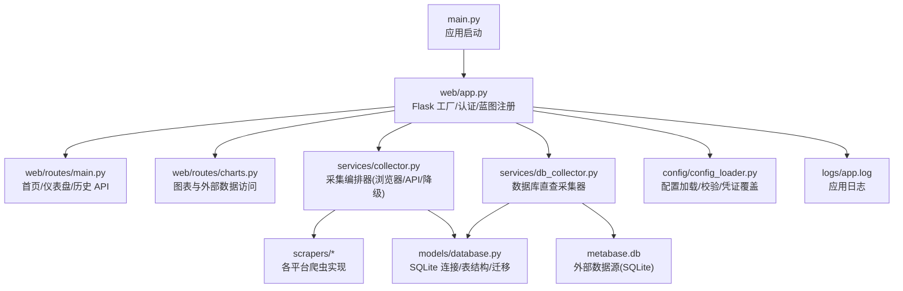
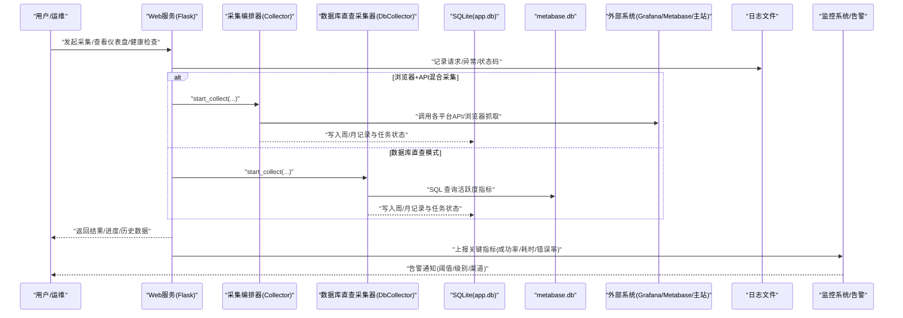
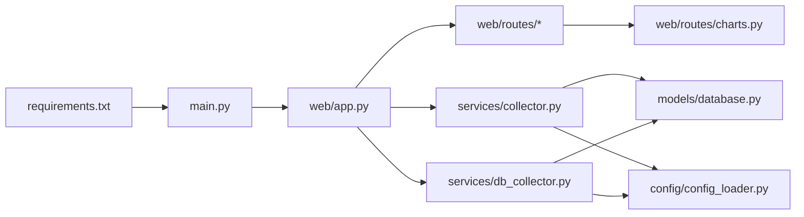

# 监控告警

<cite>
**本文引用的文件**   
- [main.py](file://main.py)
- [web/app.py](file://web/app.py)
- [services/collector.py](file://services/collector.py)
- [services/db_collector.py](file://services/db_collector.py)
- [config/config_loader.py](file://config/config_loader.py)
- [models/database.py](file://models/database.py)
- [requirements.txt](file://requirements.txt)
- [web/routes/main.py](file://web/routes/main.py)
- [web/routes/charts.py](file://web/routes/charts.py)
</cite>

## 目录
1. [引言](#引言)
2. [项目结构](#项目结构)
3. [核心组件](#核心组件)
4. [架构总览](#架构总览)
5. [详细组件分析](#详细组件分析)
6. [依赖分析](#依赖分析)
7. [性能考虑](#性能考虑)
8. [故障排查指南](#故障排查指南)
9. [结论](#结论)
10. [附录](#附录)

## 引言
本方案面向“教育平台数据自动采集系统”的监控与告警体系建设，覆盖日志收集与分析、健康检查接口设计、关键指标监控、告警规则配置、可视化面板搭建、备份归档策略以及扩展性考量。方案以现有代码为基础，结合生产化最佳实践，给出可落地的实施步骤与规范。

## 项目结构
系统采用 Flask Web 应用作为入口，提供数据采集编排、数据库直查模式、仪表盘与历史记录查询等能力。日志在应用启动时初始化并写入本地文件；采集任务通过后台线程执行，支持进度事件推送；数据库使用 SQLite，具备基础迁移与默认管理员初始化逻辑。

图示来源
- [main.py:1-42](file://main.py#L1-L42)
- [web/app.py:1-337](file://web/app.py#L1-L337)
- [services/collector.py:1-862](file://services/collector.py#L1-L862)
- [services/db_collector.py:1-332](file://services/db_collector.py#L1-L332)
- [models/database.py:1-372](file://models/database.py#L1-L372)
- [config/config_loader.py:1-147](file://config/config_loader.py#L1-L147)
- [web/routes/main.py:1-143](file://web/routes/main.py#L1-L143)
- [web/routes/charts.py:1038-1069](file://web/routes/charts.py#L1038-L1069)

章节来源
- [main.py:1-42](file://main.py#L1-L42)
- [web/app.py:1-337](file://web/app.py#L1-L337)
- [models/database.py:1-372](file://models/database.py#L1-L372)
- [config/config_loader.py:1-147](file://config/config_loader.py#L1-L147)

## 核心组件
- 应用启动与运行环境：根据参数选择开发或生产服务器（waitress），监听端口与线程数可配置。
- 日志系统：应用启动时初始化日志，输出到文件与标准输出，便于本地调试与集中收集。
- 采集编排器：支持多平台（Grafana、Metabase/Lida、主站）并行/串行采集，API 失败自动降级至浏览器模式，记录耗时与错误信息。
- 数据库直查采集器：直接读取 metabase.db 计算活跃度指标，避免浏览器开销，适合轻量快速采集。
- 配置管理：YAML 配置文件加载与校验，支持用户级凭证覆盖，环境变量优先。
- 数据模型与迁移：SQLite 表结构定义、增量迁移、默认管理员创建、学校数据导入。

章节来源
- [main.py:10-41](file://main.py#L10-L41)
- [web/app.py:14-24](file://web/app.py#L14-L24)
- [services/collector.py:65-176](file://services/collector.py#L65-L176)
- [services/db_collector.py:51-116](file://services/db_collector.py#L51-L116)
- [config/config_loader.py:21-36](file://config/config_loader.py#L21-L36)
- [models/database.py:201-372](file://models/database.py#L201-L372)

## 架构总览
下图展示从请求到采集、存储与可视化的整体流程，包括健康检查、指标采集与告警触发点。

图示来源
- [web/app.py:306-336](file://web/app.py#L306-L336)
- [services/collector.py:133-176](file://services/collector.py#L133-L176)
- [services/db_collector.py:91-116](file://services/db_collector.py#L91-L116)
- [models/database.py:201-372](file://models/database.py#L201-L372)
- [web/routes/main.py:87-105](file://web/routes/main.py#L87-L105)

## 详细组件分析

### 日志收集与分析方案
- 日志格式规范
  - 统一时间戳、模块名、级别、消息体，便于解析与聚合。
  - 建议为结构化 JSON 输出，包含字段：timestamp、level、logger、message、task_id、school、platform、elapsed_seconds、status。
- 日志轮转配置
  - 按天或大小轮转，保留周期建议 30-90 天，压缩归档。
  - 分离应用日志与采集日志，便于定位问题。
- 日志聚合存储
  - 本地 logs/app.log 已启用，生产建议接入集中式日志系统（如 ELK/SLS）。
  - 对敏感信息脱敏（用户名、密码、token）。
- 采集相关日志要点
  - 记录每个平台的开始/完成/失败事件与耗时，便于计算成功率与瓶颈。
  - 记录降级路径（API→浏览器）与原因，辅助稳定性评估。

章节来源
- [web/app.py:14-24](file://web/app.py#L14-L24)
- [services/collector.py:247-405](file://services/collector.py#L247-L405)
- [services/db_collector.py:157-215](file://services/db_collector.py#L157-L215)

### 健康检查接口设计
- 服务状态监控
  - 提供 /health 或 /api/health 接口，返回服务存活、依赖可用性与版本信息。
  - 返回示例字段：status、uptime、version、checks。
- 数据库连接检查
  - 尝试打开 app.db 连接并执行简单查询，验证读写能力。
  - 若失败，标记 db_status=error 并附带错误信息。
- 外部 API 可用性检测
  - 针对 Grafana/Metabase/主站进行连通性探测（HTTP HEAD 或最小请求），记录响应时间与状态码。
  - 对外部不可用设置超时与重试上限，避免阻塞健康检查。
- 集成方式
  - 将健康检查结果暴露给监控系统（Prometheus textfile、SLS 指标或自定义探针）。
  - 前端仪表盘显示健康状态卡片，点击可查看明细。

章节来源
- [web/app.py:306-336](file://web/app.py#L306-L336)
- [models/database.py:24-48](file://models/database.py#L24-L48)
- [web/routes/charts.py:1038-1069](file://web/routes/charts.py#L1038-L1069)

### 关键指标监控
- 采集任务成功率
  - 指标：success_rate = completed_tasks / total_tasks。
  - 维度：按学校、平台、record_type（weekly/monthly）、data_source（grafana/database）。
  - 数据来源：collect_tasks 表 status 字段与 weekly_records/monthly_records 表 status 字段。
- 数据质量指标
  - 空值比例：关键字段为空的比例（如 overall_usage_rate、daily_active_ratio）。
  - 异常波动：环比/同比变化超过阈值的记录数量。
  - 数据来源一致性：grafana vs database 差异对比。
- 系统资源使用情况
  - CPU/内存/磁盘/网络：进程级指标（psutil 或系统探针）。
  - 数据库：app.db WAL 模式下的并发写入与锁等待情况。
  - 外部依赖：Grafana/Metabase/主站的响应时间与错误率。
- 指标采集与上报
  - 定时任务拉取 collect_tasks 与 records 表统计，生成指标并上报监控系统。
  - 对关键错误（如外部 API 不可用、数据库连接失败）立即触发告警。

章节来源
- [models/database.py:75-87](file://models/database.py#L75-L87)
- [models/database.py:51-73](file://models/database.py#L51-L73)
- [models/database.py:254-282](file://models/database.py#L254-L282)
- [services/collector.py:732-800](file://services/collector.py#L732-L800)
- [services/db_collector.py:217-332](file://services/db_collector.py#L217-L332)

### 告警规则配置
- 阈值设置
  - 采集成功率低于 95% 持续 10 分钟触发警告。
  - 单学校连续失败次数超过 3 次触发严重告警。
  - 外部 API 响应时间 P95 > 5s 或错误率 > 5% 触发警告。
  - 数据库连接失败或长时间无更新触发严重告警。
- 告警级别定义
  - 提示（info）：轻微异常或趋势预警。
  - 警告（warning）：影响部分功能或用户体验。
  - 严重（critical）：核心功能不可用或数据缺失。
- 通知渠道集成
  - 邮件、企业微信/钉钉机器人、短信、电话。
  - 去重与抑制：同一规则短时间重复告警合并处理。
  - 升级策略：未确认告警在 N 分钟后自动升级。
- 规则管理
  - 规则配置化（YAML/JSON），支持热加载与灰度发布。
  - 记录告警历史与处置闭环（工单/变更关联）。

章节来源
- [services/collector.py:247-405](file://services/collector.py#L247-L405)
- [services/db_collector.py:157-215](file://services/db_collector.py#L157-L215)
- [web/routes/main.py:87-105](file://web/routes/main.py#L87-L105)

### 监控面板搭建指南
- 可视化图表配置
  - 仪表盘：采集成功率趋势、失败原因分布、平台耗时对比、数据质量指标。
  - 实时数据：当前任务状态、进度事件流、最近错误列表。
  - 历史趋势：按学校/平台/日期维度的成功率与活跃度指标。
- 实时数据展示
  - 基于 SSE 或 WebSocket 推送进度事件，前端实时更新。
  - 支持暂停/继续控制与任务详情展开。
- 历史趋势分析
  - 按月/周聚合，对比不同来源（grafana/database）的一致性。
  - 异常检测：Z-score 或移动平均法识别突变。
- 工具建议
  - Grafana + Prometheus/InfluxDB 或 SLS + Logtail。
  - 前端使用 Vue/React 构建交互式看板。

章节来源
- [services/collector.py:102-118](file://services/collector.py#L102-L118)
- [services/db_collector.py:74-85](file://services/db_collector.py#L74-L85)
- [web/routes/main.py:87-105](file://web/routes/main.py#L87-L105)

### 监控数据的备份和归档策略
- 备份范围
  - app.db（SQLite，WAL 模式）、logs 目录、配置文件（config.yaml）。
- 备份频率
  - 全量每日一次，增量每小时一次（基于 WAL 切换或文件变化）。
- 归档策略
  - 冷数据按季度归档至对象存储，保留 1-3 年。
  - 日志按天压缩，保留 30-90 天，超期清理。
- 恢复演练
  - 定期验证备份完整性与恢复流程，确保 RTO/RPO 达标。

章节来源
- [models/database.py:24-48](file://models/database.py#L24-L48)
- [web/app.py:14-24](file://web/app.py#L14-L24)
- [config/config_loader.py:21-36](file://config/config_loader.py#L21-L36)

### 监控系统的扩展性考虑
- 水平扩展
  - 多实例部署，共享外部存储（S3/OSS）与日志中心。
  - 采集任务分片（按学校/平台）并行执行，避免单点瓶颈。
- 垂直优化
  - 调整 waitress 线程数与超时参数，匹配硬件资源。
  - 数据库索引优化（按 school_name、year、week_number/month_number）。
- 插件化
  - 新增平台爬虫或数据源时，遵循统一接口与事件协议。
  - 指标与告警规则配置化，支持动态加载。

章节来源
- [main.py:20-37](file://main.py#L20-L37)
- [services/collector.py:247-729](file://services/collector.py#L247-L729)
- [services/db_collector.py:143-215](file://services/db_collector.py#L143-L215)

## 依赖分析
系统依赖关系如下：Web 层依赖路由与业务服务；采集服务依赖爬虫与数据库；配置管理贯穿全局；外部依赖包括 Playwright、aiohttp、waitress 等。

图示来源
- [requirements.txt:1-7](file://requirements.txt#L1-L7)
- [main.py:1-42](file://main.py#L1-L42)
- [web/app.py:1-337](file://web/app.py#L1-L337)
- [services/collector.py:1-862](file://services/collector.py#L1-L862)
- [services/db_collector.py:1-332](file://services/db_collector.py#L1-L332)
- [models/database.py:1-372](file://models/database.py#L1-L372)
- [config/config_loader.py:1-147](file://config/config_loader.py#L1-L147)
- [web/routes/charts.py:1038-1069](file://web/routes/charts.py#L1038-L1069)

章节来源
- [requirements.txt:1-7](file://requirements.txt#L1-L7)
- [main.py:1-42](file://main.py#L1-L42)
- [web/app.py:1-337](file://web/app.py#L1-L337)

## 性能考虑
- 采集并发与降级
  - 合理设置并行度，避免外部系统限流；API 失败自动降级至浏览器模式，保障成功率。
- 数据库优化
  - SQLite WAL 模式提升并发读性能；按需添加索引；批量写入减少事务开销。
- 资源限制
  - 限制浏览器上下文数量与页面生命周期；设置合理的超时与重试策略。
- 监控开销
  - 指标采集与日志写入异步化，避免阻塞主流程；采样高频日志降低 IO 压力。

章节来源
- [services/collector.py:247-729](file://services/collector.py#L247-L729)
- [services/db_collector.py:143-215](file://services/db_collector.py#L143-L215)
- [models/database.py:24-48](file://models/database.py#L24-L48)

## 故障排查指南
- 常见问题定位
  - 采集失败：查看 collect_tasks 与 weekly/monthly records 的 error_message 与 platform_elapsed。
  - 外部 API 不可用：检查 credentials 配置与网络连通性，关注 charts 中鉴权头获取逻辑。
  - 数据库直查失败：确认 metabase.db 路径与权限，核对 SQL 条件与字段映射。
- 日志与指标
  - 应用日志位于 logs/app.log，采集过程有详细事件记录。
  - 通过仪表盘 API 获取最近记录与学校列表，辅助快速定位。
- 恢复措施
  - 重启服务或采集任务；清理浏览器上下文；回滚配置变更；恢复备份数据。

章节来源
- [services/collector.py:247-405](file://services/collector.py#L247-L405)
- [services/db_collector.py:157-215](file://services/db_collector.py#L157-L215)
- [web/routes/charts.py:1038-1069](file://web/routes/charts.py#L1038-L1069)
- [web/routes/main.py:87-105](file://web/routes/main.py#L87-L105)

## 结论
本方案围绕现有代码提供了完整的监控告警实施路径，涵盖日志、健康检查、指标、告警、面板、备份与扩展性。通过配置化与插件化设计，系统可在保持稳定的同时快速演进，满足生产环境的可靠性与可观测性要求。

## 附录
- 术语说明
  - 采集编排器：负责串联多个平台爬虫，协调 API 与浏览器模式，记录进度与结果。
  - 数据库直查采集器：直接查询 metabase.db 计算活跃度指标，避免浏览器开销。
  - 健康检查：对外暴露服务与依赖可用性状态的接口。
- 参考实现路径
  - 健康检查接口：建议在 web/app.py 中新增 /health 路由，返回服务与依赖状态。
  - 指标上报：在 services/collector.py 与 services/db_collector.py 中增加指标采集与上报逻辑。
  - 告警规则：在配置文件中定义阈值与渠道，结合监控系统实现自动化通知。