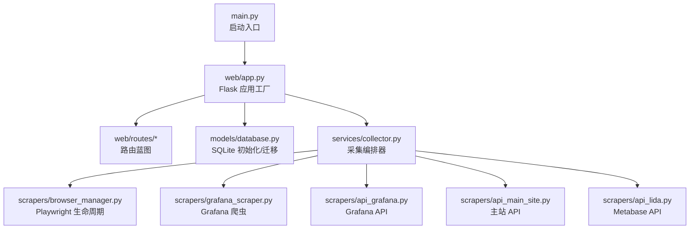
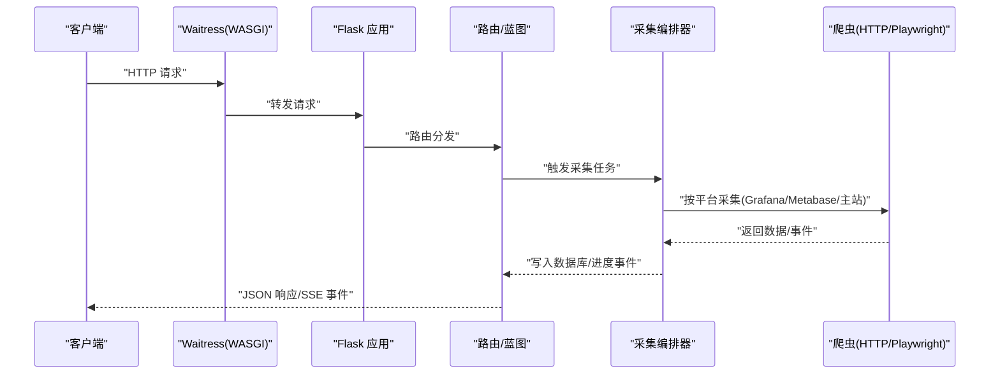
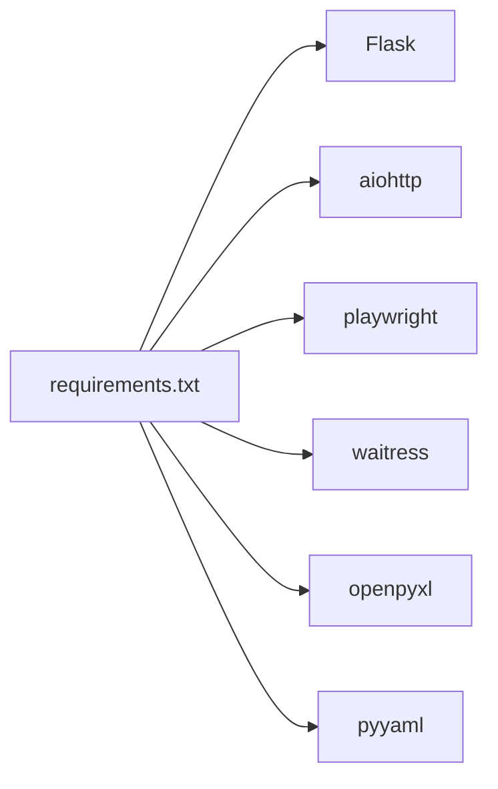

# 部署运维

<cite>
**本文引用的文件**   
- [main.py](file://main.py)
- [requirements.txt](file://requirements.txt)
- [config_loader.py](file://config/config_loader.py)
- [app.py](file://web/app.py)
- [collector.py](file://services/collector.py)
- [database.py](file://models/database.py)
- [browser_manager.py](file://scrapers/browser_manager.py)
- [grafana_scraper.py](file://scrapers/grafana_scraper.py)
- [api_grafana.py](file://scrapers/api_grafana.py)
- [api_main_site.py](file://scrapers/api_main_site.py)
- [api_lida.py](file://scrapers/api_lida.py)
</cite>

## 目录
1. [简介](#简介)
2. [项目结构](#项目结构)
3. [核心组件](#核心组件)
4. [架构总览](#架构总览)
5. [详细组件分析](#详细组件分析)
6. [依赖关系分析](#依赖关系分析)
7. [性能考虑](#性能考虑)
8. [故障排查指南](#故障排查指南)
9. [结论](#结论)
10. [附录](#附录)

## 简介
本操作指南面向生产环境部署与运维，涵盖以下主题：
- 不同操作系统环境的部署要求（Python 环境、系统依赖、浏览器驱动）
- 容器化部署方案（Docker 镜像构建、Kubernetes 编排）
- 性能调优参数（并发、线程、内存、数据库连接池）
- 监控告警与日志、健康检查接口
- 备份恢复、数据迁移与灾难恢复
- 故障排查、常见问题诊断与性能瓶颈分析
- 安全加固与访问控制、审计日志

## 项目结构
项目采用“Web 应用 + 采集服务 + 爬虫层 + 数据模型”的分层设计，核心目录与职责如下：
- config：配置加载与校验（YAML/环境变量）
- models：SQLite 数据模型与初始化、迁移
- services：采集编排器（Collector）、导出服务
- scrapers：爬虫层（浏览器自动化 Playwright + HTTP API）
- web：Flask Web 应用、路由与认证
- data/logs：应用数据与日志目录
- 根目录：启动入口、依赖清单、批处理脚本

**图表来源**
- [main.py:1-42](file://main.py#L1-L42)
- [app.py:306-337](file://web/app.py#L306-L337)
- [collector.py:65-85](file://services/collector.py#L65-L85)
- [browser_manager.py:11-76](file://scrapers/browser_manager.py#L11-L76)
- [grafana_scraper.py:48-143](file://scrapers/grafana_scraper.py#L48-L143)
- [api_grafana.py:43-82](file://scrapers/api_grafana.py#L43-L82)
- [api_main_site.py:35-67](file://scrapers/api_main_site.py#L35-L67)
- [api_lida.py:107-134](file://scrapers/api_lida.py#L107-L134)

**章节来源**
- [main.py:1-42](file://main.py#L1-L42)
- [app.py:306-337](file://web/app.py#L306-L337)

## 核心组件
- 启动入口与运行模式
  - 开发模式：Flask 内置服务器（热重载）
  - 生产模式：waitress WSGI 服务器（多线程、Windows 原生支持）
- Web 应用与认证
  - 基于 Flask 的会话认证，未登录访问 /api/* 返回 401
  - 登录页模板与前后端交互
- 采集编排器
  - 支持 API 模式与浏览器模式，API 失败自动降级
  - 并行采集 Grafana/Metabase/主站，按平台优先策略
  - 进度事件通过队列广播（SSE 客户端订阅）
- 数据库与模型
  - SQLite WAL 模式、外键开启、自动迁移
  - weekly/monthly records、users、schools 等表结构
- 爬虫层
  - Playwright 异步自动化（BrowserManager）
  - Metabase/Grafana/主站 HTTP API 直连采集器

**章节来源**
- [main.py:10-38](file://main.py#L10-L38)
- [app.py:253-293](file://web/app.py#L253-L293)
- [collector.py:65-177](file://services/collector.py#L65-L177)
- [database.py:24-48](file://models/database.py#L24-L48)
- [browser_manager.py:11-76](file://scrapers/browser_manager.py#L11-L76)

## 架构总览
系统运行时序（生产模式）：

**图表来源**
- [main.py:21-33](file://main.py#L21-L33)
- [app.py:319-333](file://web/app.py#L319-L333)
- [collector.py:133-177](file://services/collector.py#L133-L177)

## 详细组件分析

### 启动与运行模式
- 开发模式
  - 使用 Flask 内置服务器，支持热重载
  - 适合本地开发与调试
- 生产模式
  - 使用 waitress，多线程、稳定、Windows 原生支持
  - 未安装 waitress 时回退到 Flask（不建议生产使用）

**章节来源**
- [main.py:10-38](file://main.py#L10-L38)

### Web 应用与认证
- 认证机制
  - 未登录访问 /api/* 返回 401
  - 登录页模板与提交接口，成功后写入会话
- 日志
  - 日志目录 logs，文件与控制台双输出

**章节来源**
- [app.py:253-293](file://web/app.py#L253-L293)
- [app.py:14-24](file://web/app.py#L14-L24)

### 采集编排器
- 功能特性
  - API 模式与浏览器模式自动切换
  - 并行采集 Grafana/Metabase/主站
  - 进度事件广播（SSE）
  - 暂停/继续/订阅/取消订阅
- 数据落库
  - weekly/monthly records、collect_tasks 表
  - 支持 data_source 字段区分数据来源

**图表来源**
- [collector.py:237-244](file://services/collector.py#L237-L244)
- [collector.py:631-730](file://services/collector.py#L631-L730)

**章节来源**
- [collector.py:65-177](file://services/collector.py#L65-L177)
- [collector.py:732-800](file://services/collector.py#L732-L800)

### 数据库与模型
- 初始化与迁移
  - WAL 模式、外键开启
  - 自动迁移：week_number 类型修正、新增列（platform_elapsed、record_type 等）
  - 首次启动从 config.yaml 导入学校数据
- 表结构
  - weekly_records、monthly_records、users、schools、collect_tasks

**章节来源**
- [database.py:24-48](file://models/database.py#L24-L48)
- [database.py:201-372](file://models/database.py#L201-L372)

### 爬虫层与浏览器管理
- Playwright 管理
  - 启动/停止、上下文/页面创建、超时与视口配置
  - 无头/有头模式、清理缓存与存储
- Grafana 爬虫
  - 登录、时间/学校筛选、面板数据提取
  - API 与 UI 双通道，失败自动降级
- API 采集器
  - Metabase、Grafana、主站 HTTP API 直连
  - Grafana API 通过 ds/query 获取面板数据
  - 主站 API 通过 Cloud Token + KS Cookie 获取作业数据

**章节来源**
- [browser_manager.py:11-76](file://scrapers/browser_manager.py#L11-L76)
- [grafana_scraper.py:48-143](file://scrapers/grafana_scraper.py#L48-L143)
- [api_grafana.py:43-82](file://scrapers/api_grafana.py#L43-L82)
- [api_main_site.py:35-67](file://scrapers/api_main_site.py#L35-L67)
- [api_lida.py:107-134](file://scrapers/api_lida.py#L107-L134)

## 依赖关系分析
- Python 依赖
  - Flask、aiohttp、playwright、waitress、openpyxl、pyyaml
- 运行时依赖
  - Playwright Chromium 浏览器（自动化）
  - waitress WSGI 服务器（生产）

**图表来源**
- [requirements.txt:1-7](file://requirements.txt#L1-L7)

**章节来源**
- [requirements.txt:1-7](file://requirements.txt#L1-L7)

## 性能考虑
- 并发与线程
  - waitress 线程数：默认 8，可通过 serve(...) 参数调整
  - 采集线程：Collector 使用后台线程执行任务
- 浏览器资源
  - BrowserManager 控制 headless、slow_mo、视口与超时
  - 无头模式建议设置 viewport，避免页面渲染异常
- 数据库
  - SQLite WAL 模式提升并发写入能力
  - 外键约束开启，保证数据一致性
- API 采集
  - Grafana API 优先，失败自动降级 UI
  - Metabase/主站 API 直连减少浏览器成本

**章节来源**
- [main.py:32-33](file://main.py#L32-L33)
- [browser_manager.py:18-56](file://scrapers/browser_manager.py#L18-L56)
- [database.py:30-31](file://models/database.py#L30-L31)
- [collector.py:237-244](file://services/collector.py#L237-L244)

## 故障排查指南
- 启动与运行
  - waitress 未安装：回退到 Flask，建议安装 waitress 以获得稳定生产环境
  - 端口占用：确认 5000 端口可用或修改启动参数
- 认证与会话
  - 未登录访问 /api/* 返回 401：检查登录流程与会话写入
  - 默认管理员账户：admin/admin123（首次启动创建）
- 爬虫与浏览器
  - 登录失败：检查 credentials 配置（用户名/密码/API Token）
  - Grafana 登录检测：多策略（CSS/URL/表单）确认登录状态
  - 主站一键登录：确认 Cloud 会话与 KS Cookie 获取流程
- 数据库
  - 表结构异常：检查迁移逻辑与 WAL/外键设置
  - 首次导入学校：确认 config.yaml 存在且格式正确
- API 采集
  - Metabase/Grafana/主站 API 返回空：检查凭据、时间范围与筛选参数
  - 401 会话失效：清理缓存 Cookie，重新获取会话与 Cookie

**章节来源**
- [main.py:34-37](file://main.py#L34-L37)
- [app.py:253-293](file://web/app.py#L253-L293)
- [grafana_scraper.py:56-143](file://scrapers/grafana_scraper.py#L56-L143)
- [api_main_site.py:290-350](file://scrapers/api_main_site.py#L290-L350)
- [database.py:201-372](file://models/database.py#L201-L372)
- [api_grafana.py:72-82](file://scrapers/api_grafana.py#L72-L82)

## 结论
本项目提供了从 Web 界面到数据采集与存储的完整链路，具备 API 与浏览器双采集模式、完善的日志与认证机制，并针对生产环境提供 waitress 与 Playwright 的最佳实践。通过合理的并发与数据库配置，可在多平台环境下稳定运行。

## 附录

### A. 操作系统与环境准备
- Windows
  - 安装 Python 3.8+
  - 安装依赖：pip install -r requirements.txt
  - 安装 Playwright 浏览器：playwright install chromium
  - 安装 waitress：pip install waitress
- Linux/macOS
  - 同上，确保系统满足 Playwright 依赖（无头浏览器、字体等）

**章节来源**
- [requirements.txt:1-7](file://requirements.txt#L1-L7)
- [browser_manager.py:29-35](file://scrapers/browser_manager.py#L29-L35)

### B. 配置文件与凭证
- 配置加载
  - 优先使用 config.yaml，不存在时报错提示复制示例文件
  - 校验 credentials：lida/grafana/main_site 必填字段
  - 浏览器配置：headless、slow_mo、default_timeout
- 凭证覆盖
  - 支持用户级别凭证覆盖（set_user_creds_override）
- Metabase DB 路径
  - 优先环境变量 METABASE_DB_PATH，其次 config.yaml，最后 data/metabase.db

**章节来源**
- [config_loader.py:21-36](file://config/config_loader.py#L21-L36)
- [config_loader.py:39-74](file://config/config_loader.py#L39-L74)
- [config_loader.py:94-96](file://config/config_loader.py#L94-L96)
- [config_loader.py:109-119](file://config/config_loader.py#L109-L119)
- [config_loader.py:122-147](file://config/config_loader.py#L122-L147)

### C. 容器化部署（Docker/Kubernetes）
- Docker 镜像构建建议
  - 基础镜像：python:3.x-alpine 或 python:3.x-slim
  - 安装系统依赖（无头浏览器字体等）
  - 复制代码与依赖，安装 requirements.txt
  - 安装 Playwright 浏览器：RUN playwright install chromium
  - 暴露端口 5000，CMD 运行 main.py（生产模式）
- Kubernetes 编排建议
  - Deployment：副本数、资源限制（CPU/内存）、探针（Liveness/Readiness）
  - Service：ClusterIP/NodePort/LoadBalancer
  - ConfigMap：存放 config.yaml
  - Secret：存放敏感凭证（credentials）
  - PersistentVolume：挂载 data 与 logs 目录，确保数据持久化

[本节为概念性内容，不直接分析具体文件，故不附“章节来源”]

### D. 监控告警与日志
- 日志
  - 日志目录 logs，文件与控制台双输出
  - 建议结合系统日志收集（如 Filebeat/Fluent Bit）统一采集
- 健康检查
  - 可在 Web 层增加 /health 接口返回 200/500
  - K8s 探针：HTTP GET /health
- 监控指标
  - 采集任务状态、耗时、错误率
  - waitress 线程池使用率、数据库连接数

[本节为通用运维建议，不直接分析具体文件，故不附“章节来源”]

### E. 备份恢复与灾难恢复
- 备份
  - SQLite 文件 app.db 与 data/metabase.db
  - 建议定期导出数据库（.backup 或拷贝文件）
- 恢复
  - 停止服务，替换数据库文件，启动服务
- 灾难恢复
  - 多副本部署，配置自动故障转移
  - 外部存储（NFS/S3）持久化 data 与 logs

[本节为通用运维建议，不直接分析具体文件，故不附“章节来源”]

### F. 安全加固与访问控制
- 访问控制
  - 会话认证，未登录禁止 /api/*
  - 默认管理员账户仅用于初始配置，尽快修改密码
- 审计日志
  - 记录登录、采集任务状态变更
  - 建议接入集中式审计系统（如 SIEM）
- 凭证管理
  - 使用 Secret 管理 credentials
  - 定期轮换 API Token 与密码

**章节来源**
- [app.py:253-293](file://web/app.py#L253-L293)
- [database.py:364-370](file://models/database.py#L364-L370)