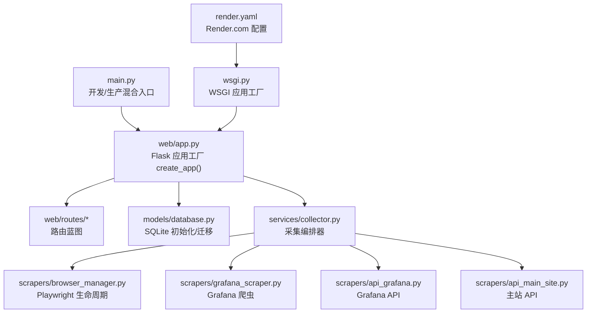
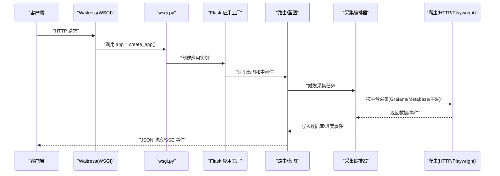
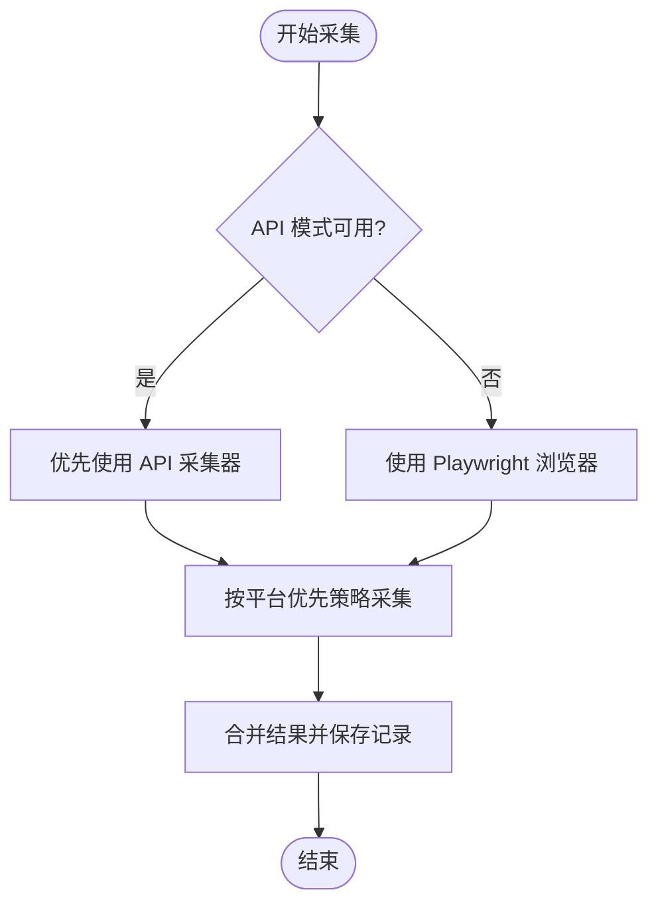
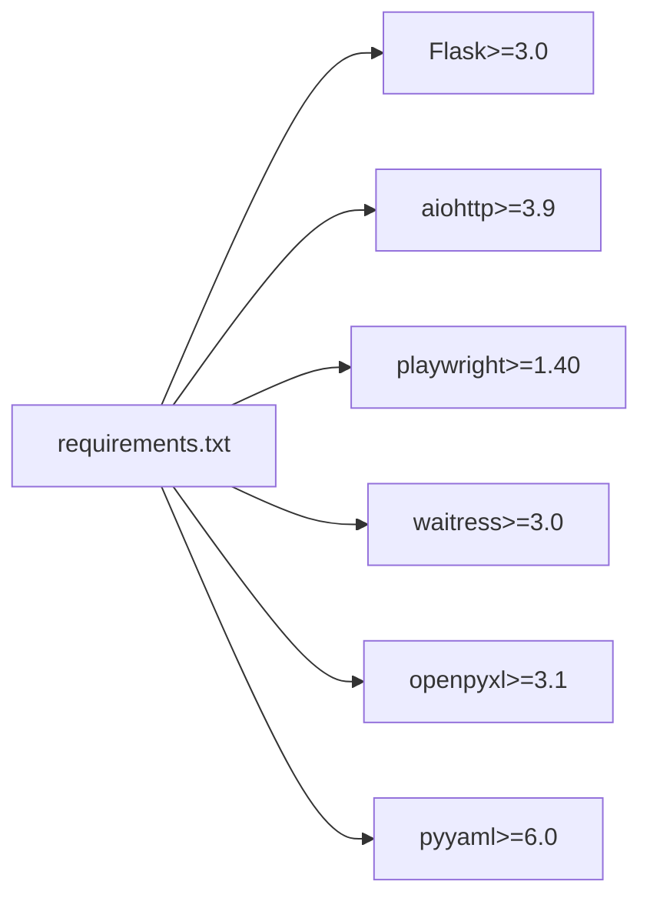

# 部署运维

<cite>
**本文引用的文件**   
- [main.py](file://middle-platform-data-collector-master/main.py)
- [wsgi.py](file://middle-platform-data-collector-master/wsgi.py)
- [render.yaml](file://middle-platform-data-collector-master/render.yaml)
- [requirements.txt](file://middle-platform-data-collector-master/requirements.txt)
- [config_loader.py](file://middle-platform-data-collector-master/config/config_loader.py)
- [app.py](file://middle-platform-data-collector-master/web/app.py)
- [collector.py](file://middle-platform-data-collector-master/services/collector.py)
- [database.py](file://middle-platform-data-collector-master/models/database.py)
- [browser_manager.py](file://middle-platform-data-collector-master/scrapers/browser_manager.py)
- [grafana_scraper.py](file://middle-platform-data-collector-master/scrapers/grafana_scraper.py)
- [api_grafana.py](file://middle-platform-data-collector-master/scrapers/api_grafana.py)
- [api_main_site.py](file://middle-platform-data-collector-master/scrapers/api_main_site.py)
- [run_dev.py](file://middle-platform-data-collector-master/run_dev.py)
- [start.bat](file://middle-platform-data-collector-master/start.bat)
</cite>

## 更新摘要
**所做更改**   
- 新增WSGI应用工厂模式章节，详细说明生产环境部署架构
- 添加Render.com云平台部署配置说明
- 增强日志系统配置和监控指南
- 更新环境配置管理和密钥管理最佳实践
- 完善容器化部署和环境变量配置

## 目录
1. [简介](#简介)
2. [项目结构](#项目结构)
3. [核心组件](#核心组件)
4. [架构总览](#架构总览)
5. [详细组件分析](#详细组件分析)
6. [依赖关系分析](#依赖关系分析)
7. [性能考虑](#性能考虑)
8. [故障排查指南](#故障排查指南)
9. [结论](#结论)
10. [附录](#附录)

## 简介
本操作指南面向生产环境部署与运维，涵盖以下主题：
- 不同操作系统环境的部署要求（Python 环境、系统依赖、浏览器驱动）
- WSGI应用工厂模式和多种部署方式（本地、云平台、容器化）
- Render.com等云平台的零配置部署方案
- 性能调优参数（并发、线程、内存、数据库连接池）
- 监控告警与日志、健康检查接口
- 备份恢复、数据迁移与灾难恢复
- 故障排查、常见问题诊断与性能瓶颈分析
- 安全加固与访问控制、审计日志

## 项目结构
项目采用"Web 应用 + 采集服务 + 爬虫层 + 数据模型"的分层设计，核心目录与职责如下：
- config：配置加载与校验（YAML/环境变量）
- models：SQLite 数据模型与初始化、迁移
- services：采集编排器（Collector）、导出服务
- scrapers：爬虫层（浏览器自动化 Playwright + HTTP API）
- web：Flask Web 应用、路由与认证
- data/logs：应用数据与日志目录
- 根目录：启动入口、WSGI应用工厂、云平台配置、依赖清单、批处理脚本

**图表来源**
- [main.py:1-42](file://middle-platform-data-collector-master/main.py#L1-L42)
- [wsgi.py:1-10](file://middle-platform-data-collector-master/wsgi.py#L1-L10)
- [render.yaml:1-12](file://middle-platform-data-collector-master/render.yaml#L1-L12)
- [app.py:348-379](file://middle-platform-data-collector-master/web/app.py#L348-L379)
- [collector.py:65-85](file://middle-platform-data-collector-master/services/collector.py#L65-L85)
- [browser_manager.py:11-76](file://middle-platform-data-collector-master/scrapers/browser_manager.py#L11-L76)
- [grafana_scraper.py:48-143](file://middle-platform-data-collector-master/scrapers/grafana_scraper.py#L48-L143)
- [api_grafana.py:43-82](file://middle-platform-data-collector-master/scrapers/api_grafana.py#L43-L82)
- [api_main_site.py:35-67](file://middle-platform-data-collector-master/scrapers/api_main_site.py#L35-L67)

**章节来源**
- [main.py:1-42](file://middle-platform-data-collector-master/main.py#L1-L42)
- [wsgi.py:1-10](file://middle-platform-data-collector-master/wsgi.py#L1-L10)
- [render.yaml:1-12](file://middle-platform-data-collector-master/render.yaml#L1-L12)
- [app.py:348-379](file://middle-platform-data-collector-master/web/app.py#L348-L379)

## 核心组件
- **WSGI应用工厂模式**
  - 统一的create_app()工厂函数，支持多环境部署
  - wsgi.py作为标准WSGI入口点，兼容waitress/gunicorn
  - 自动初始化日志系统、数据库、路由蓝图
- **启动与运行模式**
  - 开发模式：Flask 内置服务器（热重载，端口5001）
  - 生产模式：waitress WSGI 服务器（多线程、Windows 原生支持）
  - 云平台模式：Render.com自动配置和部署
- **Web 应用与认证**
  - 基于 Flask 的会话认证，未登录访问 /api/* 返回 401
  - 登录页模板与前后端交互
- **采集编排器**
  - 支持 API 模式与浏览器模式，API 失败自动降级
  - 并行采集 Grafana/Metabase/主站，按平台优先策略
  - 进度事件通过队列广播（SSE 客户端订阅）
- **数据库与模型**
  - SQLite WAL 模式、外键开启、自动迁移
  - weekly/monthly records、users、schools 等表结构
- **爬虫层**
  - Playwright 异步自动化（BrowserManager）
  - Metabase/Grafana/主站 HTTP API 直连采集器

**章节来源**
- [main.py:10-38](file://middle-platform-data-collector-master/main.py#L10-L38)
- [wsgi.py:1-10](file://middle-platform-data-collector-master/wsgi.py#L1-L10)
- [app.py:348-379](file://middle-platform-data-collector-master/web/app.py#L348-L379)
- [run_dev.py:1-15](file://middle-platform-data-collector-master/run_dev.py#L1-L15)

## 架构总览
系统运行时序（生产模式）：

**图表来源**
- [main.py:21-33](file://middle-platform-data-collector-master/main.py#L21-L33)
- [wsgi.py:7-10](file://middle-platform-data-collector-master/wsgi.py#L7-L10)
- [app.py:348-379](file://middle-platform-data-collector-master/web/app.py#L348-L379)
- [collector.py:133-177](file://middle-platform-data-collector-master/services/collector.py#L133-L177)

## 详细组件分析

### WSGI应用工厂模式
**新增** 项目采用标准的WSGI应用工厂模式，提供统一的应用创建接口：

- **应用工厂函数**
  - `create_app()` 函数集中管理应用初始化
  - 自动设置日志系统、模板路径、静态资源路径
  - 注册所有路由蓝图和认证中间件
  - 支持环境变量配置SECRET_KEY
- **WSGI入口点**
  - `wsgi.py` 提供标准WSGI应用对象
  - 兼容waitress、gunicorn等WSGI服务器
  - 自动处理Python路径和模块导入
- **多环境支持**
  - 开发环境：直接调用create_app()使用Flask开发服务器
  - 生产环境：通过WSGI服务器托管应用
  - 云平台：Render.com自动识别wsgi:app入口

**章节来源**
- [wsgi.py:1-10](file://middle-platform-data-collector-master/wsgi.py#L1-L10)
- [app.py:348-379](file://middle-platform-data-collector-master/web/app.py#L348-L379)

### 启动与运行模式
- **开发模式**
  - 使用 Flask 内置服务器，支持热重载
  - 默认端口5001，避免AirPlay冲突
  - 适合本地开发与调试
- **生产模式**
  - 使用 waitress，多线程、稳定、Windows 原生支持
  - 默认端口5000，线程数8，超时120秒
  - 未安装 waitress 时回退到 Flask（不建议生产使用）
- **云平台模式**
  - Render.com自动检测wsgi:app入口
  - 自动生成SECRET_KEY环境变量
  - 自动安装依赖和配置Python版本

**章节来源**
- [main.py:10-38](file://middle-platform-data-collector-master/main.py#L10-L38)
- [run_dev.py:1-15](file://middle-platform-data-collector-master/run_dev.py#L1-L15)
- [render.yaml:1-12](file://middle-platform-data-collector-master/render.yaml#L1-L12)

### Render.com云平台部署
**新增** 项目提供完整的Render.com部署配置：

- **配置文件**
  - `render.yaml` 定义Web服务和构建配置
  - 指定Python运行时和版本（3.11）
  - 自动安装requirements.txt依赖
- **环境变量管理**
  - SECRET_KEY自动生成，确保安全性
  - PORT环境变量由平台动态分配
  - PYTHON_VERSION固定为3.11保证兼容性
- **启动命令**
  - 使用waitress-serve启动WSGI应用
  - 自动监听平台分配的端口
  - 支持HTTPS和域名绑定

**章节来源**
- [render.yaml:1-12](file://middle-platform-data-collector-master/render.yaml#L1-L12)

### 日志系统增强
**新增** 完善的日志收集和管理系统：

- **日志配置**
  - 自动创建logs目录
  - 同时输出到文件和控制台
  - UTF-8编码支持中文日志
  - 结构化日志格式包含时间戳、模块名、级别
- **日志轮转**
  - 建议配合logrotate或云平台日志服务
  - 定期清理历史日志文件
  - 支持日志压缩和归档
- **监控集成**
  - 结构化日志便于ELK栈解析
  - 支持错误追踪和性能分析
  - 可接入APM工具进行链路追踪

**章节来源**
- [app.py:14-24](file://middle-platform-data-collector-master/web/app.py#L14-L24)

### Web 应用与认证
- **认证机制**
  - 未登录访问 /api/* 返回 401
  - 登录页模板与提交接口，成功后写入会话
- **安全配置**
  - SECRET_KEY从环境变量读取，支持动态配置
  - 会话加密存储用户信息
  - 密码修改功能支持用户自助管理

**章节来源**
- [app.py:253-293](file://middle-platform-data-collector-master/web/app.py#L253-L293)
- [app.py:355](file://middle-platform-data-collector-master/web/app.py#L355)

### 采集编排器
- **功能特性**
  - API 模式与浏览器模式自动切换
  - 并行采集 Grafana/Metabase/主站
  - 进度事件广播（SSE）
  - 暂停/继续/订阅/取消订阅
- **数据落库**
  - weekly/monthly records、collect_tasks 表
  - 支持 data_source 字段区分数据来源

**图表来源**
- [collector.py:237-244](file://middle-platform-data-collector-master/services/collector.py#L237-L244)
- [collector.py:631-730](file://middle-platform-data-collector-master/services/collector.py#L631-L730)

**章节来源**
- [collector.py:65-177](file://middle-platform-data-collector-master/services/collector.py#L65-L177)
- [collector.py:732-800](file://middle-platform-data-collector-master/services/collector.py#L732-L800)

### 数据库与模型
- **初始化与迁移**
  - WAL 模式、外键开启
  - 自动迁移：week_number 类型修正、新增列（platform_elapsed、record_type 等）
  - 首次启动从 config.yaml 导入学校数据
- **表结构**
  - weekly_records、monthly_records、users、schools、collect_tasks

**章节来源**
- [database.py:24-48](file://middle-platform-data-collector-master/models/database.py#L24-L48)
- [database.py:201-372](file://middle-platform-data-collector-master/models/database.py#L201-L372)

### 爬虫层与浏览器管理
- **Playwright 管理**
  - 启动/停止、上下文/页面创建、超时与视口配置
  - 无头/有头模式、清理缓存与存储
- **Grafana 爬虫**
  - 登录、时间/学校筛选、面板数据提取
  - API 与 UI 双通道，失败自动降级
- **API 采集器**
  - Metabase、Grafana、主站 HTTP API 直连
  - Grafana API 通过 ds/query 获取面板数据
  - 主站 API 通过 Cloud Token + KS Cookie 获取作业数据

**章节来源**
- [browser_manager.py:11-76](file://middle-platform-data-collector-master/scrapers/browser_manager.py#L11-L76)
- [grafana_scraper.py:48-143](file://middle-platform-data-collector-master/scrapers/grafana_scraper.py#L48-L143)
- [api_grafana.py:43-82](file://middle-platform-data-collector-master/scrapers/api_grafana.py#L43-L82)
- [api_main_site.py:35-67](file://middle-platform-data-collector-master/scrapers/api_main_site.py#L35-L67)
- [api_lida.py:107-134](file://middle-platform-data-collector-master/scrapers/api_lida.py#L107-L134)

## 依赖关系分析
- **Python 依赖**
  - Flask、aiohttp、playwright、waitress、openpyxl、pyyaml
- **运行时依赖**
  - Playwright Chromium 浏览器（自动化）
  - waitress WSGI 服务器（生产）

**图表来源**
- [requirements.txt:1-7](file://middle-platform-data-collector-master/requirements.txt#L1-L7)

**章节来源**
- [requirements.txt:1-7](file://middle-platform-data-collector-master/requirements.txt#L1-L7)

## 性能考虑
- **并发与线程**
  - waitress 线程数：默认 8，可通过 serve(...) 参数调整
  - 采集线程：Collector 使用后台线程执行任务
- **浏览器资源**
  - BrowserManager 控制 headless、slow_mo、视口与超时
  - 无头模式建议设置 viewport，避免页面渲染异常
- **数据库**
  - SQLite WAL 模式提升并发写入能力
  - 外键约束开启，保证数据一致性
- **API 采集**
  - Grafana API 优先，失败自动降级 UI
  - Metabase/主站 API 直连减少浏览器成本
- **WSGI服务器优化**
  - 根据服务器资源配置threads参数
  - 合理设置channel_timeout避免连接泄漏
  - 启用keepalive提高连接复用效率

**章节来源**
- [main.py:32-33](file://middle-platform-data-collector-master/main.py#L32-L33)
- [browser_manager.py:18-56](file://middle-platform-data-collector-master/scrapers/browser_manager.py#L18-L56)
- [database.py:30-31](file://middle-platform-data-collector-master/models/database.py#L30-L31)
- [collector.py:237-244](file://middle-platform-data-collector-master/services/collector.py#L237-L244)

## 故障排查指南
- **启动与运行**
  - waitress 未安装：回退到 Flask，建议安装 waitress 以获得稳定生产环境
  - 端口占用：确认 5000 端口可用或修改启动参数
  - WSGI导入错误：检查wsgi.py路径和模块导入
- **认证与会话**
  - 未登录访问 /api/* 返回 401：检查登录流程与会话写入
  - 默认管理员账户：admin/admin123（首次启动创建）
  - SECRET_KEY配置错误：检查环境变量设置
- **云平台部署**
  - Render.com构建失败：检查requirements.txt依赖版本
  - 环境变量缺失：确认SECRET_KEY已自动生成
  - 端口绑定错误：使用$PORT环境变量而非硬编码
- **日志系统**
  - logs目录权限问题：确保应用有写入权限
  - 日志文件过大：配置日志轮转策略
  - 中文乱码：检查UTF-8编码设置
- **爬虫与浏览器**
  - 登录失败：检查 credentials 配置（用户名/密码/API Token）
  - Grafana 登录检测：多策略（CSS/URL/表单）确认登录状态
  - 主站一键登录：确认 Cloud 会话与 KS Cookie 获取流程
- **数据库**
  - 表结构异常：检查迁移逻辑与 WAL/外键设置
  - 首次导入学校：确认 config.yaml 存在且格式正确
- **API 采集**
  - Metabase/Grafana/主站 API 返回空：检查凭据、时间范围与筛选参数
  - 401 会话失效：清理缓存 Cookie，重新获取会话与 Cookie

**章节来源**
- [main.py:34-37](file://middle-platform-data-collector-master/main.py#L34-L37)
- [app.py:253-293](file://middle-platform-data-collector-master/web/app.py#L253-L293)
- [app.py:355](file://middle-platform-data-collector-master/web/app.py#L355)
- [render.yaml:7-11](file://middle-platform-data-collector-master/render.yaml#L7-L11)
- [app.py:14-24](file://middle-platform-data-collector-master/web/app.py#L14-L24)
- [grafana_scraper.py:56-143](file://middle-platform-data-collector-master/scrapers/grafana_scraper.py#L56-L143)
- [api_main_site.py:290-350](file://middle-platform-data-collector-master/scrapers/api_main_site.py#L290-L350)
- [database.py:201-372](file://middle-platform-data-collector-master/models/database.py#L201-L372)
- [api_grafana.py:72-82](file://middle-platform-data-collector-master/scrapers/api_grafana.py#L72-L82)

## 结论
本项目提供了从 Web 界面到数据采集与存储的完整链路，具备API 与浏览器双采集模式、完善的日志与认证机制，并针对生产环境提供waitress与Playwright的最佳实践。通过WSGI应用工厂模式和云平台配置支持，可在多种环境下稳定运行。通过合理的并发与数据库配置，以及增强的日志监控系统，能够在多平台环境下实现高可用的生产部署。

## 附录

### A. 操作系统与环境准备
- **Windows**
  - 安装 Python 3.8+
  - 安装依赖：pip install -r requirements.txt
  - 安装 Playwright 浏览器：playwright install chromium
  - 安装 waitress：pip install waitress
- **Linux/macOS**
  - 同上，确保系统满足 Playwright 依赖（无头浏览器、字体等）
- **云平台环境**
  - Render.com：自动配置Python 3.11环境
  - 其他平台：确保支持WSGI应用和waitress服务器

**章节来源**
- [requirements.txt:1-7](file://middle-platform-data-collector-master/requirements.txt#L1-L7)
- [browser_manager.py:29-35](file://middle-platform-data-collector-master/scrapers/browser_manager.py#L29-L35)
- [render.yaml:10-11](file://middle-platform-data-collector-master/render.yaml#L10-L11)

### B. 配置文件与凭证
- **配置加载**
  - 优先使用 config.yaml，不存在时报错提示复制示例文件
  - 校验 credentials：lida/grafana/main_site 必填字段
  - 浏览器配置：headless、slow_mo、default_timeout
- **凭证覆盖**
  - 支持用户级别凭证覆盖（set_user_creds_override）
- **Metabase DB 路径**
  - 优先环境变量 METABASE_DB_PATH，其次 config.yaml，最后 data/metabase.db
- **环境变量管理**
  - SECRET_KEY：应用密钥，必须设置
  - PORT：Web服务端口，云平台自动分配
  - PYTHON_VERSION：Python版本，推荐3.11

**章节来源**
- [config_loader.py:21-36](file://middle-platform-data-collector-master/config/config_loader.py#L21-36)
- [config_loader.py:39-74](file://middle-platform-data-collector-master/config/config_loader.py#L39-74)
- [config_loader.py:94-96](file://middle-platform-data-collector-master/config/config_loader.py#L94-96)
- [config_loader.py:109-119](file://middle-platform-data-collector-master/config/config_loader.py#L109-119)
- [config_loader.py:122-147](file://middle-platform-data-collector-master/config/config_loader.py#L122-147)
- [app.py:355](file://middle-platform-data-collector-master/web/app.py#L355)
- [render.yaml:7-11](file://middle-platform-data-collector-master/render.yaml#L7-L11)

### C. 容器化部署（Docker/Kubernetes）
- **Docker 镜像构建建议**
  - 基础镜像：python:3.11-slim
  - 安装系统依赖（无头浏览器字体等）
  - 复制代码与依赖，安装 requirements.txt
  - 安装 Playwright 浏览器：RUN playwright install chromium
  - 暴露端口 5000，CMD 运行 main.py（生产模式）
  - 或使用wsgi:app作为WSGI入口
- **Kubernetes 编排建议**
  - Deployment：副本数、资源限制（CPU/内存）、探针（Liveness/Readiness）
  - Service：ClusterIP/NodePort/LoadBalancer
  - ConfigMap：存放 config.yaml
  - Secret：存放敏感凭证（credentials、SECRET_KEY）
  - PersistentVolume：挂载 data 与 logs 目录，确保数据持久化
- **环境变量配置**
  - SECRET_KEY：生成随机密钥
  - PORT：容器内监听端口
  - PYTHON_VERSION：固定Python版本

[本节为概念性内容，不直接分析具体文件，故不附"章节来源"]

### D. 监控告警与日志
- **日志系统**
  - 日志目录 logs，文件与控制台双输出
  - UTF-8编码支持中文日志
  - 建议结合系统日志收集（如 Filebeat/Fluent Bit）统一采集
  - 云平台自动收集stdout/stderr日志
- **健康检查**
  - 可在 Web 层增加 /health 接口返回 200/500
  - K8s 探针：HTTP GET /health
  - Render.com自动健康检查
- **监控指标**
  - 采集任务状态、耗时、错误率
  - waitress 线程池使用率、数据库连接数
  - 应用启动时间和内存使用情况

[本节为通用运维建议，不直接分析具体文件，故不附"章节来源"]

### E. 备份恢复与灾难恢复
- **备份**
  - SQLite 文件 app.db 与 data/metabase.db
  - 建议定期导出数据库（.backup 或拷贝文件）
  - 配置文件和日志文件的定期归档
- **恢复**
  - 停止服务，替换数据库文件，启动服务
  - 验证数据完整性和应用可用性
- **灾难恢复**
  - 多副本部署，配置自动故障转移
  - 外部存储（NFS/S3）持久化 data 与 logs
  - 云平台自动备份和恢复机制

[本节为通用运维建议，不直接分析具体文件，故不附"章节来源"]

### F. 安全加固与访问控制
- **访问控制**
  - 会话认证，未登录禁止 /api/*
  - 默认管理员账户仅用于初始配置，尽快修改密码
- **密钥管理**
  - SECRET_KEY通过环境变量管理，避免硬编码
  - 云平台自动生成安全密钥
  - 定期轮换敏感配置
- **审计日志**
  - 记录登录、采集任务状态变更
  - 建议接入集中式审计系统（如 SIEM）
- **网络安全**
  - 使用HTTPS终止代理
  - 配置防火墙规则限制访问
  - 定期安全扫描和漏洞修复

**章节来源**
- [app.py:253-293](file://middle-platform-data-collector-master/web/app.py#L253-L293)
- [app.py:355](file://middle-platform-data-collector-master/web/app.py#L355)
- [database.py:364-370](file://middle-platform-data-collector-master/models/database.py#L364-L370)
- [render.yaml:8-9](file://middle-platform-data-collector-master/render.yaml#L8-L9)

### G. 云平台部署指南
- **Render.com部署**
  - 推送代码到Git仓库
  - 在Render.com创建Web服务
  - 自动检测render.yaml配置文件
  - 配置环境变量和域名绑定
  - 自动HTTPS和CDN加速
- **其他云平台**
  - Heroku：使用Procfile替代render.yaml
  - AWS ECS：使用ECS任务定义
  - Google Cloud Run：使用Cloud Build配置
  - Azure App Service：使用application settings

[本节为通用部署建议，不直接分析具体文件，故不附"章节来源"]

### H. 启动脚本和工具
- **Windows批处理脚本**
  - start.bat：自动激活虚拟环境并启动应用
  - start_debug.bat：调试模式启动
- **开发辅助脚本**
  - run_dev.py：开发模式专用启动脚本
  - 端口5001避免与AirPlay冲突
  - 支持热重载和调试功能

**章节来源**
- [start.bat:1-11](file://middle-platform-data-collector-master/start.bat#L1-L11)
- [run_dev.py:1-15](file://middle-platform-data-collector-master/run_dev.py#L1-L15)