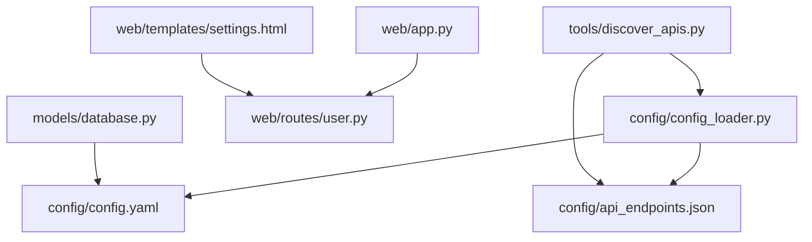
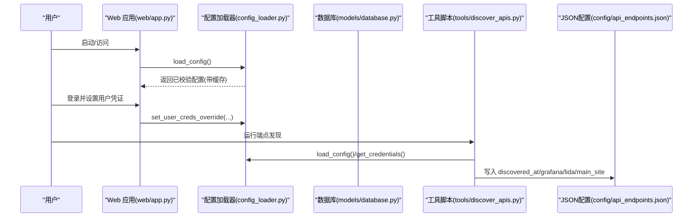
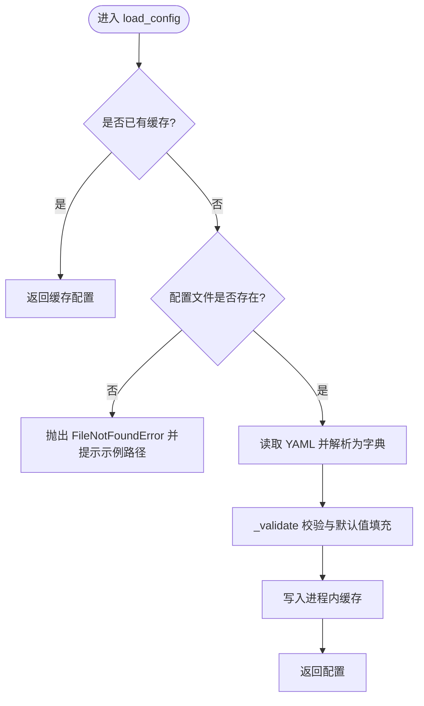
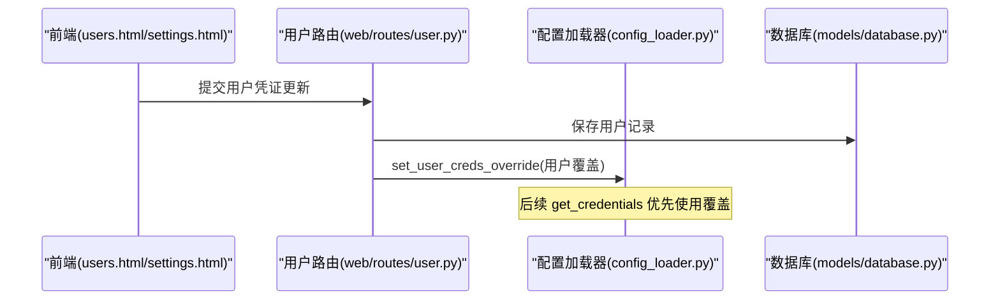
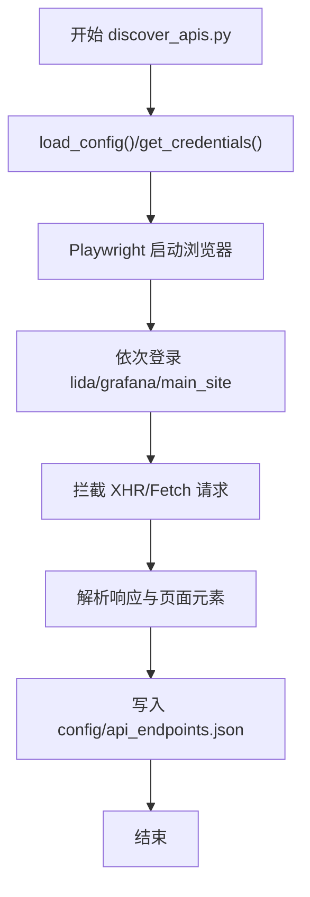
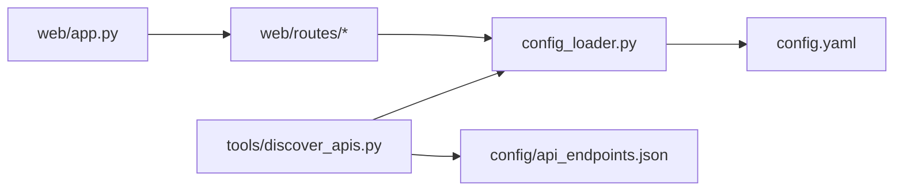

# 配置管理

<cite>
**本文引用的文件**   
- [config_loader.py](file://config/config_loader.py)
- [config.yaml](file://config/config.yaml)
- [api_endpoints.json](file://config/api_endpoints.json)
- [discover_apis.py](file://tools/discover_apis.py)
- [app.py](file://web/app.py)
- [main.py](file://main.py)
- [database.py](file://models/database.py)
- [user.py](file://web/routes/user.py)
- [users.html](file://web/templates/users.html)
- [settings.html](file://web/templates/settings.html)
</cite>

## 目录
1. [简介](#简介)
2. [项目结构](#项目结构)
3. [核心组件](#核心组件)
4. [架构总览](#架构总览)
5. [详细组件分析](#详细组件分析)
6. [依赖关系分析](#依赖关系分析)
7. [性能与可扩展性](#性能与可扩展性)
8. [运维操作手册](#运维操作手册)
9. [故障排除指南](#故障排除指南)
10. [结论](#结论)
11. [附录：最佳实践与迁移指南](#附录最佳实践与迁移指南)

## 简介
本技术文档围绕项目的“配置管理系统”展开，覆盖 YAML 配置文件结构与语法、平台特定配置、用户凭证覆盖机制、配置加载器实现原理、环境变量支持、配置验证与默认值处理、API 端点配置文件的动态发现与版本兼容策略、用户级覆盖优先级与安全考虑、热重载与回滚策略、以及面向运维的配置管理与排障方法。

## 项目结构
配置相关的关键位置与职责如下：
- config/config_loader.py：配置加载、校验、缓存、用户覆盖与环境变量解析
- config/config.yaml：全局配置（浏览器、数据库路径、平台凭证等）
- config/api_endpoints.json：由工具脚本发现的 API 端点与仪表盘/面板元数据
- tools/discover_apis.py：基于 Playwright 的端点发现脚本，读取配置并输出 JSON
- web/app.py：应用工厂，注册路由与认证中间件
- models/database.py：数据库初始化与首次导入逻辑（从 YAML 导入学校到数据库）
- web/routes/user.py 与模板：用户级别凭证维护与展示

图表来源
- [config_loader.py:1-147](file://config/config_loader.py#L1-L147)
- [config.yaml:1-59](file://config/config.yaml#L1-L59)
- [discover_apis.py:1-693](file://tools/discover_apis.py#L1-L693)
- [app.py:306-337](file://web/app.py#L306-L337)
- [database.py:284-371](file://models/database.py#L284-L371)
- [settings.html:97-115](file://web/templates/settings.html#L97-L115)

章节来源
- [config_loader.py:1-147](file://config/config_loader.py#L1-L147)
- [config.yaml:1-59](file://config/config.yaml#L1-L59)
- [discover_apis.py:1-693](file://tools/discover_apis.py#L1-L693)
- [app.py:306-337](file://web/app.py#L306-L337)
- [database.py:284-371](file://models/database.py#L284-L371)
- [settings.html:97-115](file://web/templates/settings.html#L97-L115)

## 核心组件
- 配置加载器（config_loader.py）
  - 提供 load_config(force_reload=False) 进行一次性加载与内存缓存
  - _validate(cfg) 负责必填字段校验与默认值填充
  - get_credentials(platform) 支持用户级覆盖优先于全局配置
  - get_metabase_db_path() 支持环境变量 METABASE_DB_PATH 覆盖
- 全局配置（config.yaml）
  - browser：浏览器行为参数（headless、slow_mo、default_timeout）
  - database：数据库路径（metabase.db），可被环境变量覆盖
  - credentials：平台登录凭证（lida、grafana、main_site、可选 metabase）
- API 端点配置（api_endpoints.json）
  - 由 discover_apis.py 自动发现并持久化，包含 Grafana 仪表盘 UID、面板信息、查询目标等
- 用户级覆盖（web/routes/user.py + templates）
  - 用户可在界面设置自身平台的用户名/密码，运行时通过 set_user_creds_override 注入覆盖

章节来源
- [config_loader.py:21-74](file://config/config_loader.py#L21-L74)
- [config_loader.py:89-119](file://config/config_loader.py#L89-L119)
- [config_loader.py:122-146](file://config/config_loader.py#L122-L146)
- [config.yaml:5-59](file://config/config.yaml#L5-L59)
- [discover_apis.py:26-36](file://tools/discover_apis.py#L26-L36)
- [user.py:47-84](file://web/routes/user.py#L47-L84)
- [users.html:67-101](file://web/templates/users.html#L67-L101)
- [settings.html:97-115](file://web/templates/settings.html#L97-L115)

## 架构总览
配置系统整体流程：
- 启动时或首次访问时加载 config.yaml，执行校验并缓存
- 业务模块通过 get_credentials/get_browser_config 获取配置
- 用户登录后，将用户级凭证注入为覆盖层，get_credentials 优先使用覆盖
- 环境变量 METABASE_DB_PATH 可覆盖数据库路径
- 工具脚本 discover_apis.py 读取配置后驱动浏览器抓取并生成 api_endpoints.json

图表来源
- [app.py:306-337](file://web/app.py#L306-L337)
- [config_loader.py:21-119](file://config/config_loader.py#L21-L119)
- [discover_apis.py:26-36](file://tools/discover_apis.py#L26-L36)
- [database.py:284-371](file://models/database.py#L284-L371)

## 详细组件分析

### 配置加载器与校验
- 加载与缓存
  - load_config(force_reload=False) 在进程内缓存配置，避免重复 IO
  - 若未找到配置文件，抛出明确错误提示示例文件路径
- 校验与默认值
  - browser 段：headless/slow_mo/default_timeout 具备默认值
  - credentials 段：lida/grafana/main_site 必须存在且 url 非空；除 grafana 外需 username/password
  - metabase 为可选，但存在时需满足 url 与用户名/密码
- 用户级覆盖
  - set_user_creds_override(creds) 设置覆盖字典
  - get_credentials(platform) 若覆盖中存在 username/password，则合并覆盖到基础配置
- 环境变量
  - get_metabase_db_path() 优先级：环境变量 > config.yaml > 默认 data/metabase.db

图表来源
- [config_loader.py:21-36](file://config/config_loader.py#L21-L36)
- [config_loader.py:39-74](file://config/config_loader.py#L39-L74)

章节来源
- [config_loader.py:21-74](file://config/config_loader.py#L21-L74)
- [config_loader.py:89-119](file://config/config_loader.py#L89-L119)
- [config_loader.py:122-146](file://config/config_loader.py#L122-L146)

### 全局配置（YAML）结构说明
- browser
  - headless：布尔值，控制无头模式
  - slow_mo：整数毫秒，控制操作间隔便于调试
  - default_timeout：整数毫秒，页面等待超时
- database
  - metabase_db_path：可选，指定 Metabase 本地数据库路径；可通过环境变量 METABASE_DB_PATH 覆盖
- credentials
  - lida/grafana/main_site：每个平台包含 url，部分含 api_token；除 grafana 外需要 username/password
  - metabase：可选，包含 url/username/password/dashboard_id 等

章节来源
- [config.yaml:5-59](file://config/config.yaml#L5-L59)
- [config_loader.py:39-74](file://config/config_loader.py#L39-L74)

### 用户级凭证覆盖机制与优先级
- 存储位置
  - 用户表 users 中保存各平台用户名/密码字段（lida/grafana/main_site）
- 覆盖流程
  - 用户在界面更新自身凭证后，后端调用 set_user_creds_override 注入覆盖
  - 后续 get_credentials(platform) 会优先使用覆盖中的 username/password
- 优先级规则
  - 用户覆盖 > 全局配置（config.yaml）
- 安全考虑
  - 仅允许普通用户修改自己的凭证
  - 建议对敏感字段进行最小权限与审计（当前实现按用户隔离）

图表来源
- [users.html:67-101](file://web/templates/users.html#L67-L101)
- [settings.html:97-115](file://web/templates/settings.html#L97-L115)
- [user.py:47-84](file://web/routes/user.py#L47-L84)
- [config_loader.py:103-119](file://config/config_loader.py#L103-L119)

章节来源
- [user.py:47-84](file://web/routes/user.py#L47-L84)
- [config_loader.py:103-119](file://config/config_loader.py#L103-L119)
- [users.html:67-101](file://web/templates/users.html#L67-L101)
- [settings.html:97-115](file://web/templates/settings.html#L97-L115)

### API 端点配置文件与动态发现
- 发现脚本
  - tools/discover_apis.py 使用 Playwright 打开浏览器，依据配置登录多平台，拦截网络请求，收集 API 端点与仪表盘/面板信息
  - 结果写入 config/api_endpoints.json，包含 discovered_at 时间戳与平台分类数据
- 版本兼容性
  - 通过 discovered_at 标记发现时间，便于对比变更
  - 对新增/缺失字段采用容错读取，避免破坏既有流程
- 使用方式
  - 在开发或部署环境运行脚本以刷新端点清单，供采集器或报表工具使用

图表来源
- [discover_apis.py:26-36](file://tools/discover_apis.py#L26-L36)
- [discover_apis.py:667-693](file://tools/discover_apis.py#L667-L693)
- [config/api_endpoints.json:1-20](file://config/api_endpoints.json#L1-L20)

章节来源
- [discover_apis.py:1-693](file://tools/discover_apis.py#L1-L693)
- [config/api_endpoints.json:1-20](file://config/api_endpoints.json#L1-L20)

### 环境变量支持与数据库路径解析
- 环境变量
  - METABASE_DB_PATH：最高优先级，直接决定 Metabase 本地数据库路径
- 配置回退
  - 若未设置环境变量，则读取 config.yaml 的 database.metabase_db_path
  - 若仍未设置，回退到项目 data/metabase.db
- 适用场景
  - 容器化部署时通过环境变量注入不同环境的数据库路径

章节来源
- [config_loader.py:122-146](file://config/config_loader.py#L122-L146)
- [config.yaml:30-35](file://config/config.yaml#L30-L35)

### 首次启动与学校数据导入
- 首次启动时，若数据库为空，会从 config.yaml 的 schools 列表导入学校数据到数据库
- 该步骤仅在初始阶段有效，后续学校配置应通过数据库管理

章节来源
- [database.py:284-371](file://models/database.py#L284-L371)
- [config.yaml:10-28](file://config/config.yaml#L10-L28)

## 依赖关系分析
- 模块耦合
  - web/app.py 注册蓝图与认证中间件，不直接依赖配置加载器，但在业务路由中可能间接使用
  - tools/discover_apis.py 强依赖 config_loader.py 提供的配置与凭证
  - scrapers 模块通过 get_credentials 获取平台凭证，受用户覆盖影响
- 外部依赖
  - PyYAML：解析 YAML
  - Playwright：浏览器自动化用于端点发现
  - Flask：Web 服务与路由

图表来源
- [config_loader.py:1-147](file://config/config_loader.py#L1-L147)
- [discover_apis.py:1-693](file://tools/discover_apis.py#L1-L693)
- [app.py:306-337](file://web/app.py#L306-L337)

章节来源
- [config_loader.py:1-147](file://config/config_loader.py#L1-L147)
- [discover_apis.py:1-693](file://tools/discover_apis.py#L1-L693)
- [app.py:306-337](file://web/app.py#L306-L337)

## 性能与可扩展性
- 配置缓存
  - 进程内缓存减少频繁 IO，适合高并发读取
- 热重载
  - 当前未实现配置热重载；如需支持，可在 load_config 增加文件监听与缓存失效策略
- 扩展点
  - 新增平台：在 credentials 校验与默认值填充处扩展
  - 新增环境变量：在 get_metabase_db_path 风格函数中统一处理优先级

[本节为通用指导，无需源码引用]

## 运维操作手册
- 初始化配置
  - 复制 config.yaml.example 为 config.yaml，填写真实 URL、用户名、密码
  - 如需自定义 Metabase 数据库路径，设置环境变量 METABASE_DB_PATH 或在 config.yaml 中配置
- 首次启动
  - 启动应用 main.py，确保数据库初始化完成
  - 若 config.yaml 中包含 schools，将自动导入至数据库
- 刷新 API 端点清单
  - 运行 tools/discover_apis.py，生成/更新 config/api_endpoints.json
- 用户凭证管理
  - 管理员创建用户后，用户可在“我的设置”页面更新自身平台凭证
  - 注意：普通用户仅能修改自己的凭证

章节来源
- [config.yaml:1-59](file://config/config.yaml#L1-L59)
- [config_loader.py:122-146](file://config/config_loader.py#L122-L146)
- [discover_apis.py:1-693](file://tools/discover_apis.py#L1-L693)
- [database.py:284-371](file://models/database.py#L284-L371)
- [user.py:47-84](file://web/routes/user.py#L47-L84)

## 故障排除指南
- 常见错误
  - 配置文件不存在：检查 config.yaml 是否存在，并确保从示例文件复制而来
  - 缺少必填字段：credentials 中各平台 url 必填，除 grafana 外需 username/password
  - 用户覆盖无效：确认 set_user_creds_override 已被调用，且覆盖字典包含 username/password
  - 数据库路径异常：检查环境变量 METABASE_DB_PATH 与 config.yaml 的 database.metabase_db_path
- 定位方法
  - 查看应用日志 logs/app.log
  - 使用 discover_apis.py 的输出判断端点是否可用
  - 在用户设置页面确认凭证是否正确保存

章节来源
- [config_loader.py:27-36](file://config/config_loader.py#L27-L36)
- [config_loader.py:39-74](file://config/config_loader.py#L39-L74)
- [config_loader.py:122-146](file://config/config_loader.py#L122-L146)
- [app.py:14-24](file://web/app.py#L14-L24)

## 结论
本项目配置管理系统以 YAML 为核心，结合进程内缓存、用户级覆盖与环境变量优先级，实现了灵活而安全的配置管理。通过工具脚本动态发现 API 端点并持久化为 JSON，提升了系统的可维护性与适应性。建议在后续迭代中引入配置热重载与更完善的变更审计能力，以满足更高可用性要求。

[本节为总结性内容，无需源码引用]

## 附录：最佳实践与迁移指南
- 最佳实践
  - 将敏感信息放入环境变量（如 METABASE_DB_PATH），避免硬编码
  - 定期运行 discover_apis.py 以保持端点清单最新
  - 对用户覆盖进行最小权限控制与审计
- 常见配置场景
  - 切换有头/无头模式：调整 browser.headless
  - 调试抓包：增大 browser.slow_mo 与 default_timeout
  - 多环境部署：通过环境变量覆盖数据库路径
- 迁移指南
  - 从 YAML 的学校配置迁移到数据库：首次启动会自动导入，后续请在数据库中维护
  - 新增平台：在 credentials 校验与默认值填充处扩展，并在用户覆盖逻辑中保持一致

[本节为通用指导，无需源码引用]