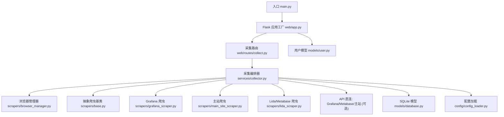
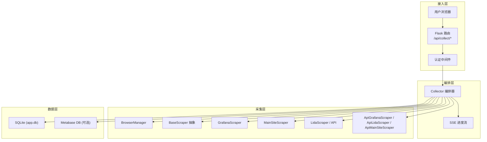
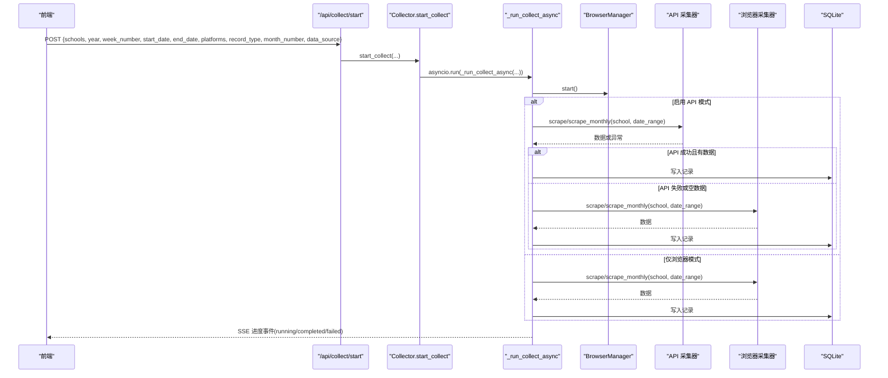
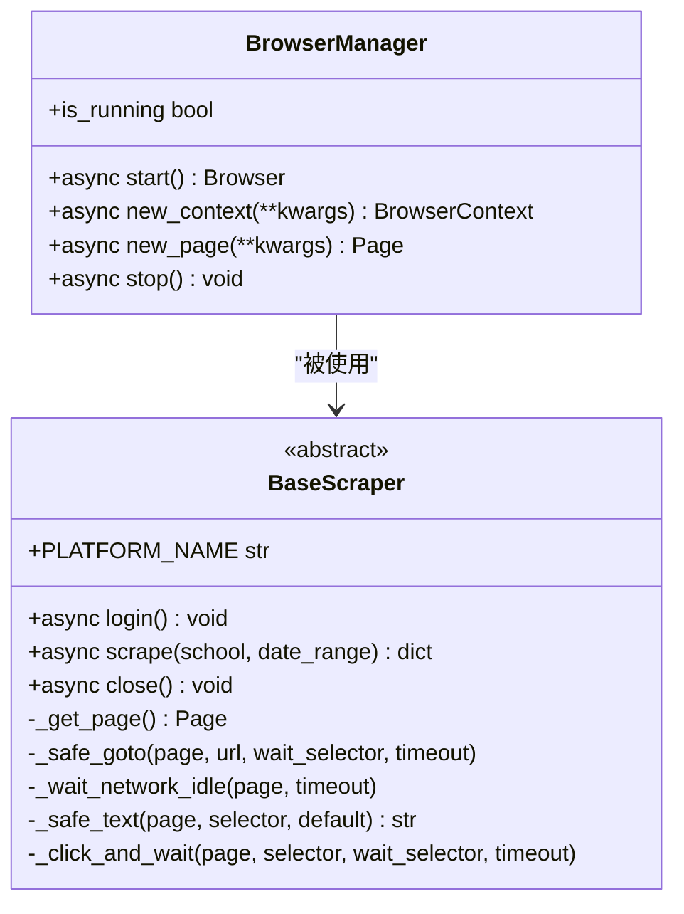
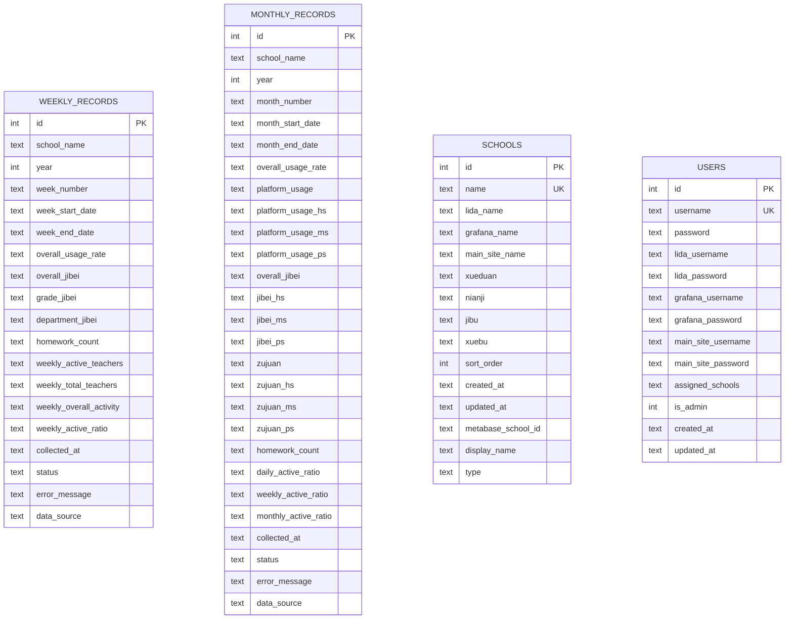
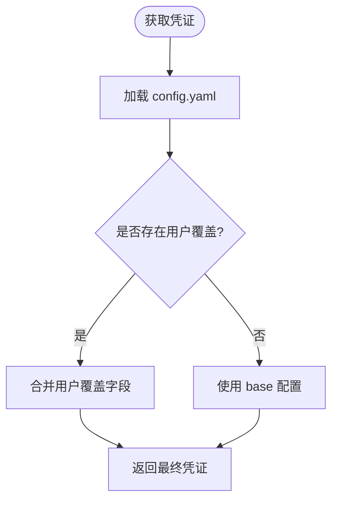
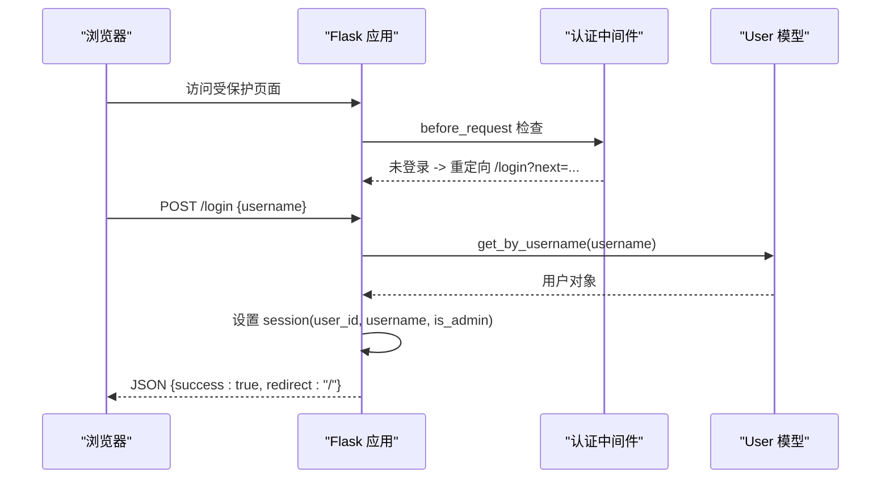
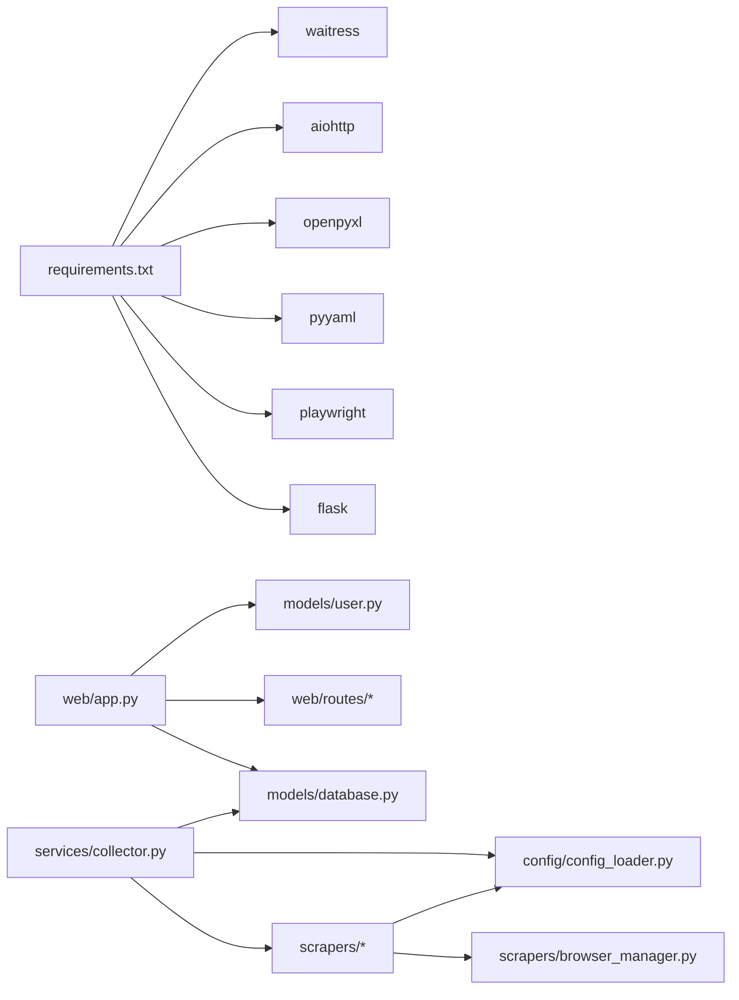

# 项目概述

<cite>
**本文引用的文件**   
- [main.py](file://main.py)
- [run_dev.py](file://run_dev.py)
- [start.bat](file://start.bat)
- [requirements.txt](file://requirements.txt)
- [web/app.py](file://web/app.py)
- [services/collector.py](file://services/collector.py)
- [scrapers/base.py](file://scrapers/base.py)
- [scrapers/browser_manager.py](file://scrapers/browser_manager.py)
- [models/database.py](file://models/database.py)
- [config/config_loader.py](file://config/config_loader.py)
- [web/routes/collect.py](file://web/routes/collect.py)
- [models/user.py](file://models/user.py)
</cite>

## 目录
1. [简介](#简介)
2. [项目结构](#项目结构)
3. [核心组件](#核心组件)
4. [架构总览](#架构总览)
5. [详细组件分析](#详细组件分析)
6. [依赖关系分析](#依赖关系分析)
7. [性能与可扩展性](#性能与可扩展性)
8. [故障排查指南](#故障排查指南)
9. [快速开始](#快速开始)
10. [结论](#结论)

## 简介
本项目是一个面向教育平台的数据自动采集系统，目标是从多个教育平台（Grafana、Metabase、主站等）自动化采集教师使用数据与活跃度统计，并以统一的周表/月表形式持久化到本地数据库，同时提供 Web 界面进行任务编排、进度监控与结果导出。系统具备以下关键特性：
- 多源采集：支持 Grafana、Metabase、主站等多平台数据汇聚
- 智能降级：优先 API 直连，失败自动回退至浏览器自动化
- 实时进度：基于 SSE 的进度事件推送，支持暂停/继续控制
- 用户权限：登录鉴权、用户级凭证覆盖、管理员默认账户
- 可观测性：结构化日志、任务状态与耗时统计

## 项目结构
仓库采用分层组织方式：入口与启动脚本位于根目录；Web 层负责路由与认证；服务层编排采集流程；爬虫层封装各平台访问逻辑；模型层管理 SQLite 数据与迁移；配置层加载 YAML 与校验；工具与测试脚本位于 tools 目录。

图表来源
- [main.py:1-42](file://main.py#L1-L42)
- [web/app.py:306-337](file://web/app.py#L306-L337)
- [web/routes/collect.py:1-170](file://web/routes/collect.py#L1-L170)
- [services/collector.py:1-862](file://services/collector.py#L1-L862)
- [scrapers/browser_manager.py:1-76](file://scrapers/browser_manager.py#L1-L76)
- [scrapers/base.py:1-104](file://scrapers/base.py#L1-L104)
- [models/database.py:1-372](file://models/database.py#L1-L372)
- [config/config_loader.py:1-147](file://config/config_loader.py#L1-L147)

章节来源
- [main.py:1-42](file://main.py#L1-L42)
- [run_dev.py:1-15](file://run_dev.py#L1-L15)
- [start.bat:1-11](file://start.bat#L1-L11)
- [requirements.txt:1-7](file://requirements.txt#L1-L7)

## 核心组件
- 启动与运行环境
  - 生产模式通过 waitress 提供 WSGI 服务，开发模式使用 Flask dev server
  - Windows 一键启动脚本激活虚拟环境并执行入口
- Web 应用与认证
  - 应用工厂初始化日志、蓝图注册、数据库初始化与认证中间件
  - 登录页面模板内嵌于应用工厂，统一拦截未登录请求
- 采集编排器
  - 按平台顺序与并行策略调度各平台爬虫
  - 支持 API 直连优先与浏览器降级，SSE 推送进度事件，支持暂停/继续
- 浏览器与爬虫
  - 浏览器生命周期由 BrowserManager 统一管理
  - BaseScraper 定义通用登录与采集接口，具体平台实现各自抓取逻辑
- 数据模型与迁移
  - SQLite 作为存储后端，包含周表、月表、任务表、学校表、用户表
  - 启动时自动建表与增量迁移，首次导入学校配置，创建默认管理员
- 配置与凭证
  - YAML 配置文件加载与校验，支持用户级凭证覆盖
  - Metabase 数据库路径可通过环境变量或配置指定

章节来源
- [main.py:10-41](file://main.py#L10-L41)
- [web/app.py:14-337](file://web/app.py#L14-L337)
- [services/collector.py:65-862](file://services/collector.py#L65-L862)
- [scrapers/base.py:12-104](file://scrapers/base.py#L12-L104)
- [scrapers/browser_manager.py:11-76](file://scrapers/browser_manager.py#L11-L76)
- [models/database.py:201-372](file://models/database.py#L201-L372)
- [config/config_loader.py:21-147](file://config/config_loader.py#L21-L147)
- [web/routes/collect.py:22-170](file://web/routes/collect.py#L22-L170)
- [models/user.py:9-113](file://models/user.py#L9-L113)

## 架构总览
系统整体分为四层：接入层（Flask + 认证）、编排层（Collector）、采集层（Browser + Scrapers）、数据层（SQLite + 模型）。采集过程中，编排器根据配置选择 API 直连或浏览器模式，并在失败时自动降级；所有进度事件通过 SSE 推送到前端，供实时监控。

图表来源
- [web/app.py:306-337](file://web/app.py#L306-L337)
- [web/routes/collect.py:137-170](file://web/routes/collect.py#L137-L170)
- [services/collector.py:214-730](file://services/collector.py#L214-L730)
- [scrapers/browser_manager.py:18-76](file://scrapers/browser_manager.py#L18-L76)
- [scrapers/base.py:12-73](file://scrapers/base.py#L12-L73)
- [models/database.py:201-372](file://models/database.py#L201-L372)

## 详细组件分析

### 采集编排器 Collector
- 职责
  - 接收任务参数（学校列表、时间范围、平台选择、记录类型、数据来源）
  - 按平台顺序与并行策略调度各平台采集函数
  - 维护任务状态、进度事件、暂停/继续控制
  - 合并结果并写入周表/月表
- 关键流程
  - 启动后台线程，进入异步主循环
  - 初始化浏览器上下文与各平台采集器（API 与浏览器）
  - Phase 1：Grafana 或数据库直查（替代 Grafana）
  - Phase 2+3：Metabase（Lida）与主站并行采集
  - 合并结果、计算耗时、保存记录、更新任务状态
- 智能降级
  - 若 API 返回空或异常，自动切换到浏览器模式
  - 主站 API 与浏览器共享同一 context，避免重复登录导致会话冲突
- SSE 进度
  - 每个客户端订阅独立队列，心跳保活，完成事件退出

图表来源
- [web/routes/collect.py:22-102](file://web/routes/collect.py#L22-L102)
- [services/collector.py:133-213](file://services/collector.py#L133-L213)
- [services/collector.py:214-730](file://services/collector.py#L214-L730)
- [scrapers/browser_manager.py:18-76](file://scrapers/browser_manager.py#L18-L76)
- [models/database.py:201-372](file://models/database.py#L201-L372)

章节来源
- [services/collector.py:65-862](file://services/collector.py#L65-L862)
- [web/routes/collect.py:22-170](file://web/routes/collect.py#L22-L170)

### 浏览器与爬虫基类
- BrowserManager
  - 管理 Playwright 实例生命周期，创建上下文与页面
  - 无头模式下设置标准视口，有头模式跟随窗口大小
  - 清理 Cookie 与超时配置，避免旧数据干扰
- BaseScraper
  - 定义 login 与 scrape 抽象方法
  - 提供 _safe_goto、_wait_network_idle、_safe_text、_click_and_wait 等通用辅助
  - 支持共享 context 标记，close 时区分是否关闭外部共享上下文

图表来源
- [scrapers/browser_manager.py:11-76](file://scrapers/browser_manager.py#L11-L76)
- [scrapers/base.py:12-104](file://scrapers/base.py#L12-L104)

章节来源
- [scrapers/browser_manager.py:1-76](file://scrapers/browser_manager.py#L1-L76)
- [scrapers/base.py:1-104](file://scrapers/base.py#L1-L104)

### 数据模型与迁移
- 表结构
  - weekly_records：周度记录，含使用率、活跃教师数、作业数等字段
  - monthly_records：月度记录，含平台使用率、计备、组卷等指标
  - collect_tasks：采集任务状态与汇总
  - schools：学校基础信息与元数据
  - users：用户与平台账号凭证
- 迁移机制
  - 启动时检测并补齐缺失列（如 platform_elapsed、data_source、display_name、type 等）
  - 首次从 config.yaml 导入学校数据到数据库
  - 创建默认管理员账户（admin/admin123）

图表来源
- [models/database.py:51-372](file://models/database.py#L51-L372)

章节来源
- [models/database.py:1-372](file://models/database.py#L1-L372)

### 配置与用户凭证覆盖
- 配置加载
  - 强制校验 credentials 中必填字段（url、username/password），grafana 的 api_token 可选
  - browser 配置提供 headless、slow_mo、default_timeout
- 用户级凭证覆盖
  - 通过 set_user_creds_override 注入当前用户的平台账号密码
  - get_credentials 优先使用用户覆盖，否则回退到 config.yaml
- Metabase 数据库路径
  - 优先级：环境变量 > config.yaml > 默认 data/metabase.db

图表来源
- [config/config_loader.py:89-119](file://config/config_loader.py#L89-L119)
- [config/config_loader.py:21-74](file://config/config_loader.py#L21-L74)
- [config/config_loader.py:122-147](file://config/config_loader.py#L122-L147)

章节来源
- [config/config_loader.py:1-147](file://config/config_loader.py#L1-L147)
- [web/routes/collect.py:67-83](file://web/routes/collect.py#L67-L83)
- [models/user.py:32-39](file://models/user.py#L32-L39)

### 认证与权限
- 认证中间件
  - before_request 检查 session.user_id，未登录则重定向到登录页或返回 401
- 登录流程
  - GET /login 渲染内嵌模板
  - POST /login 校验用户名，设置 session 信息
- 用户模型
  - 提供保存、删除、查询、认证等方法
  - to_dict 暴露非敏感字段，支持 has_*_creds 标志

图表来源
- [web/app.py:253-304](file://web/app.py#L253-L304)
- [models/user.py:60-77](file://models/user.py#L60-L77)

章节来源
- [web/app.py:253-304](file://web/app.py#L253-L304)
- [models/user.py:9-113](file://models/user.py#L9-L113)

## 依赖关系分析
- 外部依赖
  - playwright：浏览器自动化
  - flask：Web 框架
  - pyyaml：配置解析
  - openpyxl：Excel 导出（在 exporter 中使用）
  - aiohttp：API 直连采集（可选）
  - waitress：生产 WSGI 服务器
- 模块耦合
  - web/app.py 依赖 models/database.py、web/routes/*、models/user.py
  - services/collector.py 依赖 scrapers/*、models/*、config/config_loader.py
  - scrapers/* 依赖 scrapers/browser_manager.py 与 config/config_loader.py

图表来源
- [requirements.txt:1-7](file://requirements.txt#L1-L7)
- [web/app.py:306-337](file://web/app.py#L306-L337)
- [services/collector.py:1-862](file://services/collector.py#L1-L862)
- [scrapers/browser_manager.py:1-76](file://scrapers/browser_manager.py#L1-L76)
- [config/config_loader.py:1-147](file://config/config_loader.py#L1-L147)

章节来源
- [requirements.txt:1-7](file://requirements.txt#L1-L7)
- [web/app.py:306-337](file://web/app.py#L306-L337)
- [services/collector.py:1-862](file://services/collector.py#L1-L862)

## 性能与可扩展性
- 并发与并行
  - 采集编排器使用 asyncio.gather 并行执行 Lida 与主站两个平台
  - 每平台内部按学校顺序执行，避免跨平台资源竞争
- 浏览器复用
  - 主站 API 与浏览器共享同一 context，减少重复登录开销
  - 每校之间短暂延迟，降低安全验证触发概率
- 数据库优化
  - SQLite WAL 模式提升并发读写能力
  - 增量迁移避免全量重建
- 扩展建议
  - 引入分布式任务队列（如 Celery）以支持多进程/多机部署
  - 为 Grafana/Metabase 增加缓存层，减少重复查询
  - 将 Metabase 直查路径抽取为独立服务，便于横向扩展

[本节为通用指导，不直接分析具体文件]

## 故障排查指南
- 常见问题
  - 未安装 waitress：生产模式回退到 Flask dev server，建议安装 waitress
  - 浏览器启动失败：检查 headless 配置与系统依赖（Playwright 已安装）
  - API 不可用：确认 credentials.url 与用户名密码正确，必要时启用浏览器模式
  - 日期格式错误：确保 YYYY-MM-DD 格式
  - 未知学校：确认学校名称存在于数据库中
- 定位方法
  - 查看 logs/app.log 中的结构化日志
  - 通过 /api/collect/status 与 /api/collect/stream 观察任务状态与进度事件
  - 检查 collect_tasks 表的任务状态与 result_summary

章节来源
- [main.py:20-37](file://main.py#L20-L37)
- [web/routes/collect.py:104-134](file://web/routes/collect.py#L104-L134)
- [web/app.py:14-25](file://web/app.py#L14-L25)

## 快速开始
- 环境要求
  - Python 3.9+
  - 操作系统：Windows/Linux/macOS
  - 网络：可访问目标平台（Grafana、Metabase、主站）
- 安装步骤
  - 克隆仓库并进入项目目录
  - 创建并激活虚拟环境
  - 安装依赖：pip install -r requirements.txt
  - 准备配置文件：复制 config/config.yaml.example 为 config/config.yaml，填写 credentials 与 browser 配置
  - 首次启动会自动初始化数据库与默认管理员账户
- 基本使用方法
  - 启动服务：
    - 生产模式：python main.py
    - 开发模式：python run_dev.py（端口 5001）
    - Windows 批处理：start.bat
  - 访问地址：
    - 本机：http://localhost:5000（生产）或 http://localhost:5001（开发）
  - 登录：
    - 默认管理员：admin / admin123
  - 发起采集：
    - 调用 /api/collect/start，传入学校列表、年份、周次/月次、起止日期、平台选择、记录类型、数据来源等
  - 监控进度：
    - 连接 /api/collect/stream 获取 SSE 事件
    - 调用 /api/collect/status 查看任务状态
  - 导出数据：
    - 使用 /api/export 相关接口导出 Excel

章节来源
- [main.py:10-41](file://main.py#L10-L41)
- [run_dev.py:1-15](file://run_dev.py#L1-L15)
- [start.bat:1-11](file://start.bat#L1-L11)
- [requirements.txt:1-7](file://requirements.txt#L1-L7)
- [web/app.py:306-337](file://web/app.py#L306-L337)
- [web/routes/collect.py:22-170](file://web/routes/collect.py#L22-L170)
- [models/database.py:363-372](file://models/database.py#L363-L372)

## 结论
本系统通过“API 优先 + 浏览器降级”的智能策略，在多平台环境下稳定采集教师使用与活跃度数据，并以统一的周/月表形式沉淀到本地数据库。结合 SSE 实时进度、用户级凭证覆盖与完善的迁移机制，系统在易用性与可靠性方面达到良好平衡。后续可在并发扩展、缓存与分布式任务等方面进一步优化，以满足更大规模与更高吞吐的需求。